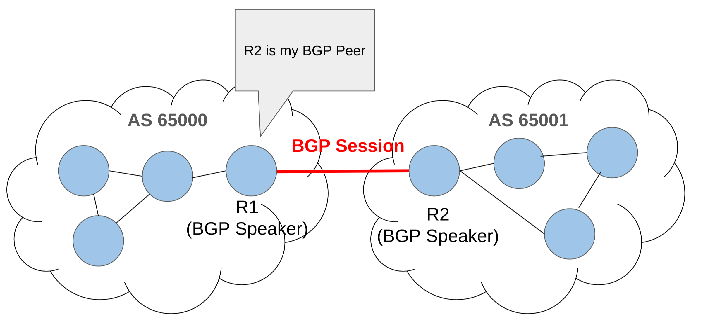
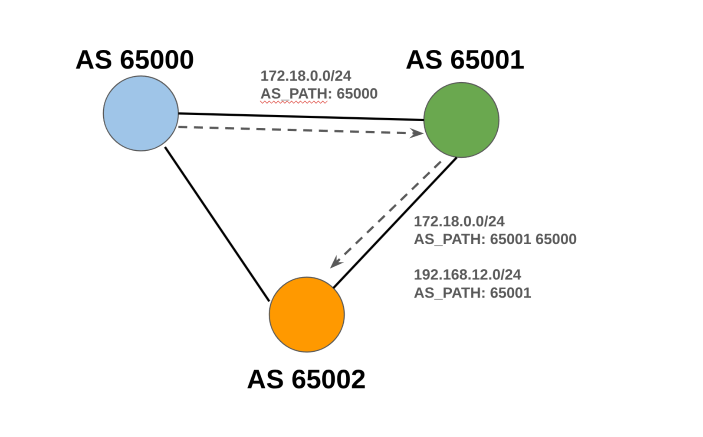
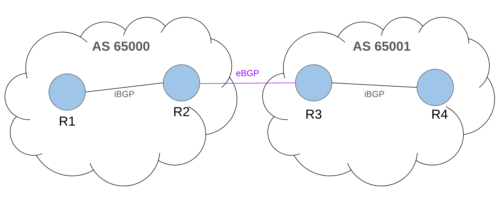
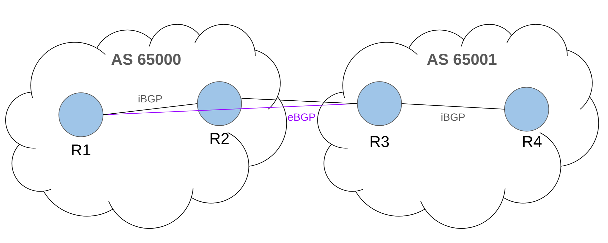
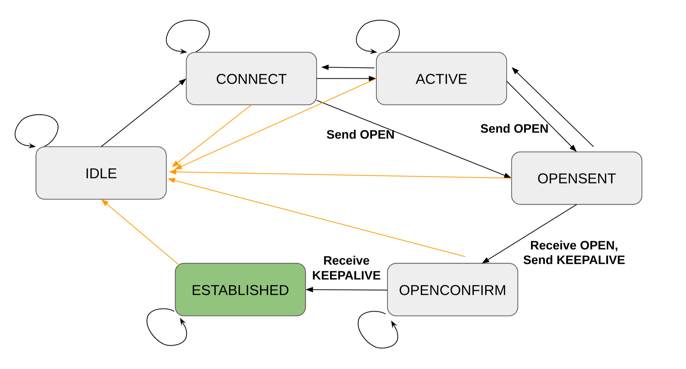
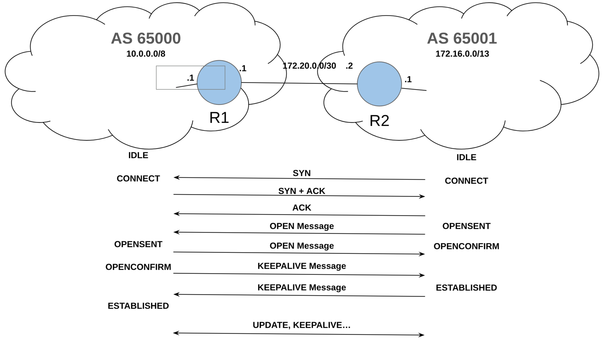

## 🌐 BGP란
**BGP(Border-Gateway Protocol, 경계 게이트웨이 프로토콜)** 는 자율 시스템들간의 라우팅 프로토콜이다.  
서로 다른 AS간에 라우팅 정보를 교환하는 데 쓰이도록 디자인되었다.

### 자율 시스템
**AS(Autonomous System, 자율 시스템)** 는 하나의 관리 주체가 운영하는 IP 네트워크들의 그룹이다.  
예를 들어, 통신사, 대형 기업, 클라우드 사업자 등이 하나의 AS를 가지고 운영한다.

보통 AS내부의 라우팅은 IGP(Interior Gateway Protocol)라고 하며, 보통 OSPF/IS-IS가 있다.  
AS간의 라우팅은 EGP(Exterior Gateway Protocol)라고 하며, BGP가 있다.

AS는 **ASN(AS number)** 이라는 고유의 식별번호를 가진다.  
AS의 식별자로써 쓰이며, EGP의 라우팅 정보 교환에도 쓰인다.  
ASN은 고유의 32비트 정수이다.    
처음에는 16비트로, "2-byte ASN"또는 "2-octet ASN"이라고 불렸다    
이제는 32비트로, 4byte 또는 4octet의 ASN을 가진다.  

ASN은 퍼블릭과 프라이빗이 존재한다.  
아래 범위는 내부 ASN으로만 사용되어야 한다:
- 2-byte ASN: 64,512 ~ 65,534
- 4-byte ASN: 4,200,000,000 ~ 2^32 -2  
나머지들은 모두 퍼블릭이다.   
끝번호들은 사용되지 않는다(0, 2^16-1, 2^32-1)

### BGP의 구성요소

- BGP Speaker: BGP 프로토콜을 실행하는 장비. 
- BGP Peer: 서로 BGP Peering을 맺은 상대방의 BGP Speaker를 말한다.
- BGP Session: 두 BGP Speaker간에 맺어진 논리적 통신 관계.   
  보통 TCP 179포트를 이용해서 세션을 맺는다.


### 경로-벡터 알고리즘
Prefix들은 ASN의 리스트로 광고되며, "AS Path"라고 불린다.   
즉, "그 목적지까지 가는동안 어떤 AS들을 거치는지"라는 경로 정보 자체를 들고다닌다.

```plaintext
172.18.0.0/24
AS_PATH: 65001 65000 
```
이 말은, `172.18.0.0`대역으로 가려면, 65001 -> 65000의 AS경로를 거쳐야 한다는 의미이다.   
BGP는 몇 홉 떨어져있나보다, 어떤 경로를 지나가는가를 보고 판단한다.   

이 방식 덕분에, 루프 방지가 가능하고, 정책 기반 라우팅이 가능하다.   
그래서 BGP가 인터넷처럼 큰 규모의 AS간 라우팅에 적합한 것이다.   


위 그림에서는, AS 65000에게 172.18.0.0의 경로 광고가 65002 -> 65000으로 이루어지지 않는다.  
AS 65000가 65002로부터 172.18.0.0의 광고를 받게 된다면, `AS_PATH: 65002 65001 65000`으로 받게 되는데, 자기 자신의 ASN이 있는 것을 보고, 기각될 것이다.

대신, `192.168.12.0/24`는 65000이 받을 수 있다.   
받으면, 다음과 같을 것이다:
```plaintext
192.168.12.0/24
AS_PATH: 65002 65001
```


### BGP-4와 MP-BGP
BGP는 1989년에 설명되어, 1994년부터 인터넷에 사용되었다.   
- version 1: RFC1105
- version 2: RFC1163
- version 3: RFC1267
- version 4: RFC1654 -> RFC4271(Jan 2006)

BGP는 처음에 IPv4만 지원되었다가, **Multiprotocol BGP(MP-BGP)** 부터는 여러 종류의 주소들을 지원한다.   
그래서, Address Family라는 단위를 사용하는데, 교환하는 라우팅 정보가 어떤 주소 종류를 쓰는지를 구분하는데 쓰인다.   
- AFI(Address Family Identifier)   
- SAFI(Subsequent Address Family Identifier)   
라는 식별자들의 조합으로 구분된다.

주요 AF는 다음과 같다:
- IPv4 Unicast
	- AFI = 1
	- SAFI = 1
- IPv6 Unicast
	- AFI = 2
	- SAFI = 1
- VPNv4 Unicast
	- AFI = 1
	- SAFI = 128
- VPNv6 Unicast
	- AFI = 2
	- SAFI = 128
- 이외에도 다양한 AF들이 존재한다.
- AFI와 SAFI들의 리스트는 IANA(인터넷 할당 번호 관리 기관)에서 관리된다.

### eBGP와 iBGP
- eBGP: 서로 다른 AS간의 BGP. 다른 ASN을 가진다.
- iBGP: AS내부의 BGP. 같은 ASN을 가진다.   


그러나 ,eBGP가 위 그림같지만은 않을 수 있다.   

대신, multihop 설정이 된다면, 아래 그림처럼도 가능하다:


전체적으로, 다음과 같이 동작한다:
 1. 경계 라우터가 eBGP로 외부 AS에게서 경로를 받음
 2. iBGP로 내부 라우터들에게 전파
 3. 내부 라우터들도 외부로 트래픽을 보낼 수 있게 됨

그러나, `AS_PATH`를 다룰 때, 조금은 다르다.
- eBGP는 광고 시, 자신의 ASN을 추가해서 Peer에게 prefix들을 전파하고,
- iBGP는 같은 AS내부이므로, 자신의 ASN을 추가하지 않는다.   
또한, iBGP로 경로를 전파받았다면, 다른 iBGP peer에게 다시 광고해서는 안된다.   
루프가 생기거나 운영에 복잡도가 오르기 때문이다.   
대신, 단순한 대안으로는 full mesh로, 모두 서로 연결되어 있기 때문에, eBGP를 광고받은 라우터가 내부 라우터들에게 직접 전달할 수가 있겠지만, 이러면 내부 세션 수가 너무 크게 늘어난다.
$$S = \frac{n(n-1)}{2}$$

대신, **Route Reflector / Confederation** 등의 대안을 사용할 수 있다.   
- Route Reflector: 일부 라우터가 중앙 허브로 작동하며, 반사(Reflect)함.   
- Confederation: 내부에 Sub-AS를 둬서 여러 작은 AS로 나눠서 관리   

### Real-world에서의 BGP
인터넷에서는 ISP, 기업, 클라우드, 콘텐츠 사업자 등등이 eBGP를 통해서 외부 AS와 경로를 주고받는다.   
오늘날의 인터넷은 수많은 AS들이 엉켜있다.   
현실에서는 연결성 확보, 장애 대응, 비용 절감, 트래픽 제어 등, 운영, 비용, 품질, 사업적 측면에서 각종 정책을 활용하기 위해 BGP를 사용한다.


#### Transit vs Peering

Transit은 한 AS가 다른 AS에게 인터넷으로 가는 경로를 제공하는 서비스이다.   
Transit Provider는 돈을 받고, 인터넷에 연결될 수 있도록 해준다.   
Transit Customer는 인터넷 연결성을 확보할 수 있다.   

Peering은 두 AS가 서로 연결되는 트래픽에 대해서는 직접 연결하여 저렴하게 트래픽을 교환한다.   


#### 회선 설계 개념 
- Single homed: 한 조직이 하나의 ISP에만 연결된다.   
단순하고 비용이 낮으며, 운영이 쉽다.    
대신, 장애 시 연결이 끊길 수 있으며, 경로 선택에 대한 유연성이 없다.     

- Dual-homed: 한 ISP에 대해 회선 연결을 이중화한다.   
단일 링크 장애를 견딜 수 있지만, ISP 자체 장애에는 취약하며, 다양성은 부족할 수 있다.

- Multi-homed: 둘 이상의 ISP에 연결된 상태를 말한다.   
ISP 장애에 대응할 수 있으며, 트래픽 정책을 세부적으로 제어할 수 있다.   
대신, 설계 및 정책 설정이 복잡해지며, 운영 난이도가 오른다.

#### 라우트 종류
- Full Route: 업스트림이 인터넷 전체의 BGP테이블을 제공하는 것을 말한다.   
  선택지가 많아지고 유연하지만, 라우터 성능에 대한 요구사항이 늘어나며, 운영 복잡도도 늘어난다.   
- Partial Route: 업스트림이 전체는 아니여도 일부 경로를 제공한다.   
  일부 정책을 설정할 수 있지만, 전체 정보는 알 수 없어서 최적화에 한계가 존재하긴 한다.   
- Default Route: 업스트림이 단순하게 `0.0.0.0/0`이다.   
  매우 단순하지만, 세밀한 제어는 불가능하다.   

---
## 🤝 BGP의 동작

### BGP 메시지

BGP 메시지는 BGP세션을 유지하며 라우팅 정보를 업데이트하는 정보를 가진다.   
BGP 메시지의 크기는 65535 octects까지 가능하다. (RFC 8654)

BGP 메시지에는 4가지 종류가 존재한다:
- **OPEN**  
  TCP연결이 맺어진 뒤, 바로 교환하는 메시지로, 메시지 헤더와 메시지 데이터로 이루어진다.   
  데이터에는 다음의 정보를 가진다:
	- BGP Version
	- ASN
	- Hold Time
	- BGP Router ID
	- Capability code(Optional)
- **KEEPALIVE**   
  메시지의 헤더만 전송하며, 메시지 데이터는 전송하지 않는다.   
  HoldTimer가 만료되지 않게 하기위해 전송된다.   
  RFC 4271에서는 Keepalice시간을 30초, Hold Time을 90초로 제안한다.   
  즉, 매 30초마다 KEEPALIVE메시지를 보내며, 90초이상 메시지를 받지 못한 피어는 상대방과 세션이 종료된 것으로 판단한다.   
  이 시간들은 조정가능하며, 벤더마다 구성이 다를 수 있다.
- **UPDATE**  
  경로 정보를 광고하거나 철회할 때 사용한다.   
  어떤 네트워크에 도달가능한지와, 더 이상 불가능한 경로에 대해서도 전달한다.   
- **NOTIFICATION**   
  오류가 발생했을때, 에러코드와 에서 서브코드를 전송한다.   
  에러코드는 1~6까지의 번호를 가진다.

### BGP의 유한 상태 머신(FSM)
BGP는 다음 여섯 개의 상태를 가진다:
- IDLE
- CONNECT
- ACTIVE
- OPENSENT
- OPENCONFIRM
- ESTABLISHED

1. 우선, 처음에는 **IDLE** 상태이다.
	- BGP자원을 초기화하고, `ConnectRetryTimer`를 초기값으로 시작한다.
	- Peer와 TCP연결을하기 위해 시도할 준비가 되면, CONNECT상태로 전이한다.
	- 다른 오류가 있다면, IDLE에 계속 있는다.
2. **CONNECT** 상태가 된다.
	- Peer와 TCP 연결을 시도하고, OPEN 메시지를 보낸다.
		- 성공하면, OpenSent로 이동한다.
		- 실패하면, Active로 이동한다.
	- `ConnectRetryTimer`가 만료되면, 계속 CONNECT 상태에서 있으며, `ConnectRetryTimer`를 초기화하고, 새로운 TCP연결을 시도한다.
	- 다른 문제가 생기면, 다시 IDLE로 돌아간다.
3. **ACTIVE** 상태는 현재 라우터가 TCP세션을 맺을 수 없다는 뜻이다.
	- Peer와 다시 TCP연결을 시도한다. 이후 OPEN메시지를 보낸다.
		- 성공하면, OpenSent로 이동한다.
		- 실패하면, IDLE로 돌아간다.
	- ConnectRetryTimer가 만료되면, CONNECT상태로 돌아가며, `ConnectRetryTimer`가 다시 초기화된다.
4. **OPENSENT** 는 OPEN 메시지가 Peer에게 전송되었으며, Peer로부터 OPEN메시지를 응답받기를 기다린다.
	- OPEN 메시지를 응답받으면, KEEPALIVE메시지를 보내면서, 상태를 OPENCONFIRM으로 둔다.
	- OPEN을 응답받고, 미스매치로 인한 에러가 발생하면, NOTIFICATION 메시지를 peer에게 전송하고, 상태를 IDLE상태로 돌린다.
	- TCP 연결이 실패하면, 다시 ACTIVE상태로 돌아간다.
5. **OPENCONFIRM** 상태에서는 라우터가 KEEPALICE 또는 NOTIFICATION 메시지를 Peer로부터 기다린다.
	- Peer의 KEEPALIVE를 받으면, ESTABLISHED로 상태를 바꾼다.
	- HoldTimer가 만료되거나, NOTIFICATION을 받으면, IDLE상태로 이동한다. 
6. **ESTABLISHED** 는 BGP Peer 연결이 성공적임을 나타낸다.
	- UPDATE, NOTIFICATION, KEEPALIVE를 주고받을 수 있다.
	- NOTIFICATION을 받으면 IDLE로 돌아간다.



### BGP 세션 맺기
각 라우터는 32비트의 고유한 숫자로, 점-십진법 표기로 작성된다.

두 라우터가 함께 있는 망은 `172.20.0.0/30`이라고 가정한다.   
R1(AS65000)
- 10.0.0.0/8
- 172.20.0.1   
Router ID는 10.0.0.1


R2(AS65001)
- 172.16.0.0/13
- 172.20.0.2   
Router ID는 172.16.0.1   
로 가정한다.

아래와 같은 흐름을 따른다:

OPEN 메시지를 교환하다가, 스펙 등이 호환되지 않는 경우, `NOTIFICATION` 메시지를 보낸 뒤, 재협상하기도 한다.  

아래 명령어들은 CISCO IOS기준이다.  

각각의 라우터에게 ASN을 할당하고, router-id를 넣어주자.  
R1
```shell
router bgp 65000
bgp router-id 10.0.0.1
```

R2
```shell
router bgp 65001
bgp router-id 172.16.0.1
```

이후, Peering 설정을 해준다.

R1
```shell
no bgp default ipv4-unicast # cisco ios의 기본설정을 제거
neighbor 172.20.0.2 remote-as 65001
address-family ipv4 unicast
neighbor 172.20.0.2 activate
```

R2
```shell
no bgp default ipv4-unicast
neighbor 172.20.0.1 remote-as 65000
address-family ipv4 unicast
neighbor 172.20.0.1 activate
```


### BGP 네트워크 광고
BGP 네트워크란, BGP 라우터에 의해 관리되는 네트워크 prefix를 말한다.      
Prefix들은 개별 호스트 라우트라기보단, 서브넷 또는 집계된 라우트이다.      
너무 긴 Prefix(longer than /24 in IPv4, /48 in IPv6)은 불가능하다.   

CISCO IOS에서 다음과 같이 하면 된다:   
R1
```shell
ip route 10.0.0.0 255.0.0.0 Null0 # 소유한 네트워크임을 명시

router bgp 65000
  bgp router-id 10.0.0.0
  no bgp default ipv4-unicast 
  neighbor 172.20.0.2 remote-as 65001
  address-family ipv4 unicast
  neighbor 172.20.0.2 activate
  network 10.0.0.0 mask 255.0.0.0 # 이 Prefix는 광고대상이다
```

R2
```shell
ip route 172.16.0.0 255.248.0.0 Null0 # 소유한 네트워크임을 명시

router bgp 65001
  bgp router-id 172.16.0.1
  no bgp default ipv4-unicast 
  neighbor 172.20.0.1 remote-as 65000
  address-family ipv4 unicast
  neighbor 172.20.0.1 activate
  network 172.16.0.0 mask 255.248.0.0 # 이 Prefix는 광고대상이다
```

BGP Best Path는 라우팅 정보 기반(RIB, Routing Information Base)에서 BGP가 선택하는 경로이다.  
BGP는 최고의 경로를 찾기 위해 path attrubute들을 이용한다.  
- 항상 최단경로가 최선이 아닐 수 있다. 정책에 기반한 최선의 경로가 생성될 뿐이다.  

기본적으로 BGP는 각 목적지별로 최고의 경로를 설치한다.  
BGP는 peer에게 최고의 경로만 광고한다.  

만약 최고의 경로가 여러 개가 있다면, BGP Multipath를 이용해서 여러 best path를 가질 수 있다.  
이를 통해 여러 nexthop에 부하를 분산시킬 수도 있다.   

BGP Session이 ESTABLISHED되면, 두 Peer는 서로 전체 정보를 교환하며, 이후 변경사항을 공유한다.   
그러나, 때로는 완전 새로고침을 또 받기를 원하는 경우가 있는데(정책변경, prefix-list 변경, 라우트맵 변경 등), Route Refresh는 BGP Session이 유지된 채로 많은양의 정보를 다시 받을 수 있게 해준다.


---
## 📚 References
- [Cloudflare - What is BGP](https://www.cloudflare.com/ko-kr/learning/security/glossary/what-is-bgp/)
- [APNIC - Introduction to BGP](https://academy.apnic.net/en/course/introduction-to-bgp)
