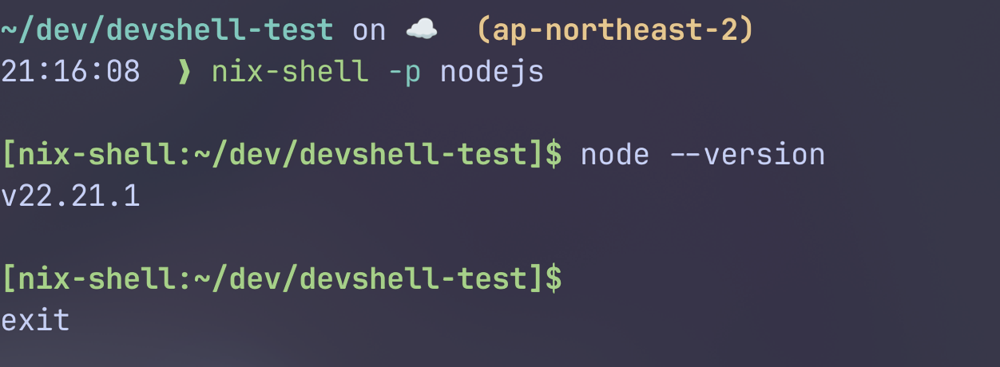
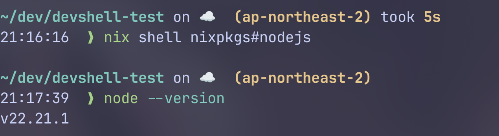
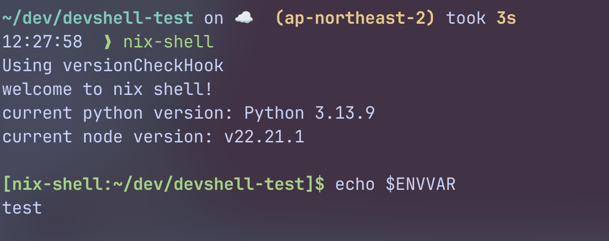
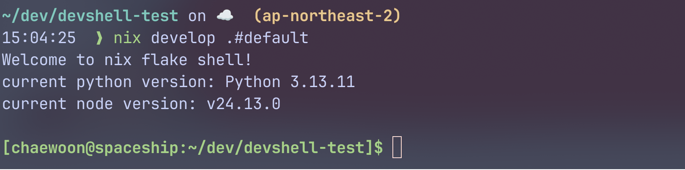
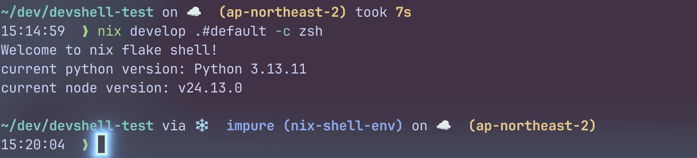
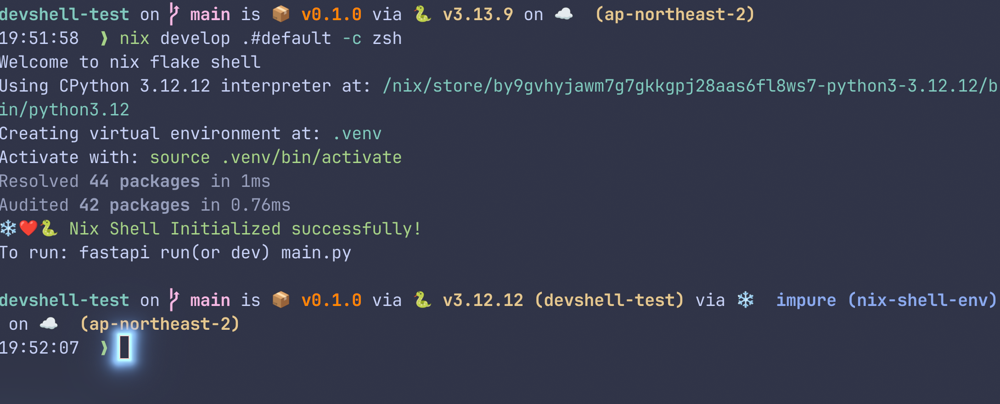
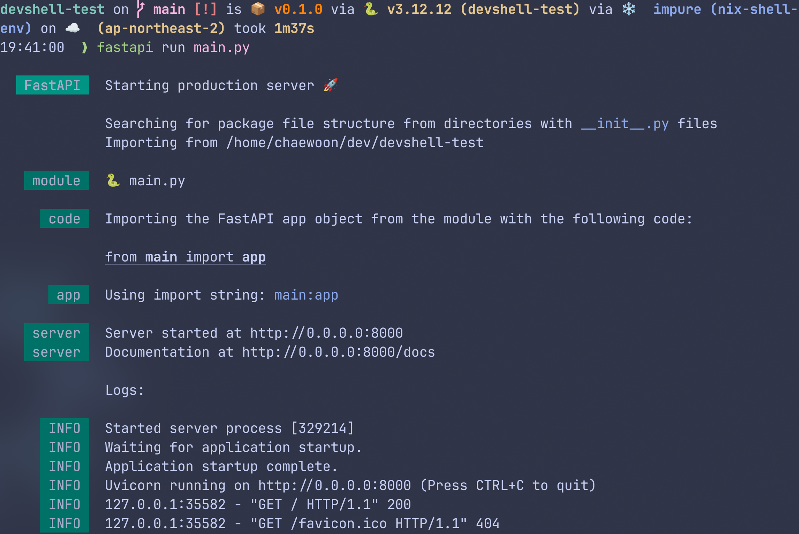
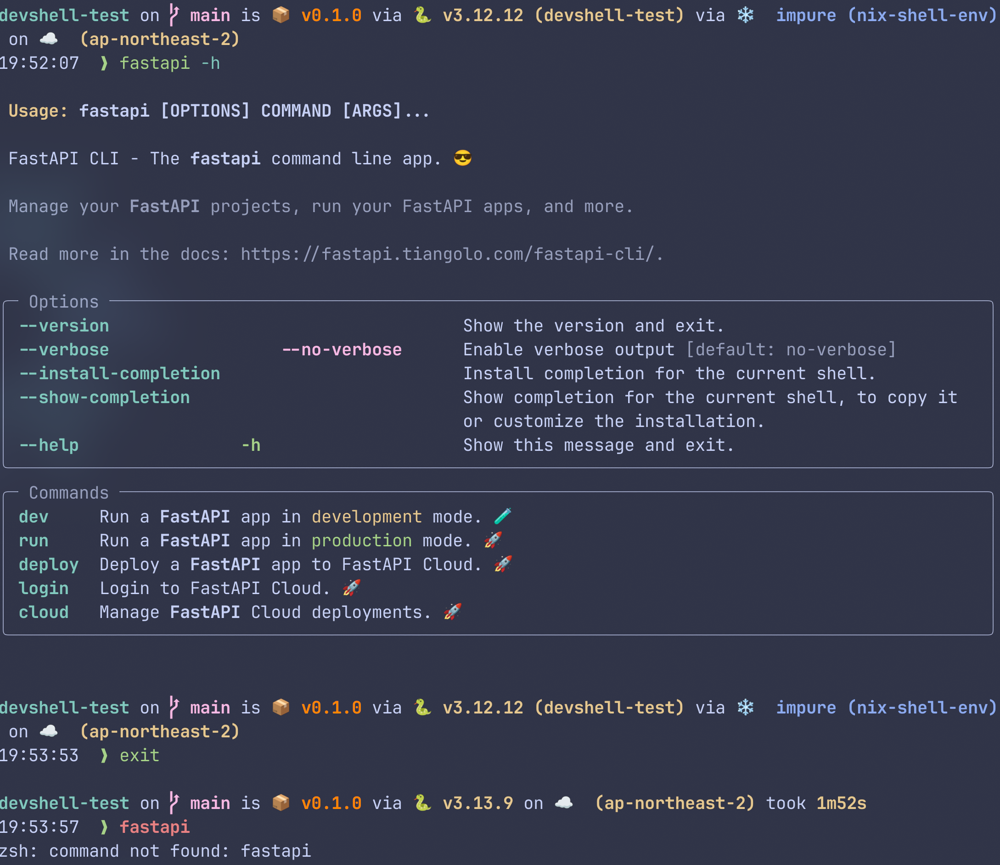

Nix Shell은 Nix 패키지 매니저를 기반으로 개발환경을 독립적이고 재현가능하게 구성해준다.    
Devcontainer기반의 개발 환경보다도 더욱 가볍고, 에디터 중립적이며 패키지 변경이 훨씬 간단하다.  

처음에는 단순한 임시 쉘을 열어볼 것이고, 이후, 레거시 방식인 `shell.nix`를 사용한 방법, 마지막으로 flake를 활용한 devShell을 만들어 볼 것이다.

---
## 🍿 임시로 Nix Shell 생성하기

`nix-shell`명령으로 Nix Shell을 생성할 수 있다.    
기본적인 방법과 flake를 이용하는 방법이 있다.  

아래 명령들은 각각 nodejs를 nixpkgs로부터 받아서 nix store에 설치하고, 해당 패키지와 함께 쉘을 실행한다.
```bash
# basic nix shell without flake
nix-shell -p nodejs

# basic nix shell with flake
nix shell -p nixpkgs#nodejs
```





그러나, 이 방법은 재현하기 불편하고, 선언적이지 못하다.

---
## 🚀 `shell.nix`를 통한 환경 구축

이번에는 선언적으로 관리해보자.    
`shell.nix`파일을 통해서 레거시 방법으로 개발용 쉘을 만들 수 있다. (보통 Nix에서 devShell이라는 말은 flake기반 환경을 말한다.) 
`shell.nix`파일을 생성한다.

```nix
{pkgs ? import <nixpkgs> {}}:
pkgs.mkShell {
  packages = with pkgs; [
    nodejs
    python3
    gnutar
  ];

  inputsFrom = [pkgs.bat];

  shellHook = ''
    echo "welcome to nix shell!"
    echo "current python version: $(python --version)"
    echo "current node version: $(node --version)"
  '';

  ENVVAR = "test";
}
```

`pkgs.mkShell`은 다음의 Attribute들을 가진다: 
- `name`: shell의 이름. 기본값은 `nix-shell-env`이다.
- `packages`: `nix-shell`환경에서 직접 실행하기 위한 실행가능 패키지들을 선언
- `inputsFrom`: 지정된 derivation들이 필요하다고 선언한 `buildInputs`/`nativeBuildInputs`를 `nix-shell`환경으로 재사용
	- 즉, 직접 실행할 명령이면 `packages`에, 빌드에 필요하면 `inputsFrom`이다.
- `shellHook`: `nix-shell`이 실행되고 나서의 쉘 스크립트.
  쉘 초기화를 담당
- 이외 `키=값`쌍의 쉘 환경 변수들을 선언할 수 있다.  
이외에도 `mkDerivation`의 특성들을 쓸 수는 있지만, 이 정도면 충분하다.

아래를 보면, `mkShell`이 내부적으로 `mkDerivation`을 사용함을 알 수 있다.

```nix
# pkgs.mkShell.nix
{ lib, stdenv, buildEnv }:

# A special kind of derivation that is only meant to be consumed by the
# nix-shell.
{ name ? "nix-shell"
, # a list of packages to add to the shell environment
  packages ? [ ]
, # propagate all the inputs from the given derivations
  inputsFrom ? [ ]
, buildInputs ? [ ]
, nativeBuildInputs ? [ ]
, propagatedBuildInputs ? [ ]
, propagatedNativeBuildInputs ? [ ]
, ...
}@attrs:
let
  mergeInputs = name:
    (attrs.${name} or [ ]) ++
    (lib.subtractLists inputsFrom (lib.flatten (lib.catAttrs name inputsFrom)));

  rest = builtins.removeAttrs attrs [
    "name"
    "packages"
    "inputsFrom"
    "buildInputs"
    "nativeBuildInputs"
    "propagatedBuildInputs"
    "propagatedNativeBuildInputs"
    "shellHook"
  ];
in

stdenv.mkDerivation ({
  inherit name;

  buildInputs = mergeInputs "buildInputs";
  nativeBuildInputs = packages ++ (mergeInputs "nativeBuildInputs");
  propagatedBuildInputs = mergeInputs "propagatedBuildInputs";
  propagatedNativeBuildInputs = mergeInputs "propagatedNativeBuildInputs";

  shellHook = lib.concatStringsSep "\n" (lib.catAttrs "shellHook"
    (lib.reverseList inputsFrom ++ [ attrs ]));

  phases = [ "buildPhase" ];

  # ......

  # when distributed building is enabled, prefer to build locally
  preferLocalBuild = true;
} // rest)
```



---
## ❄️ `flake.nix`를 통한 환경 구축

그러나, `shell.nix`만으로는 충분하지 않다.    
`nixpkgs`만 입력받고, 버전이 고정되지 못한다.  
우리는 flake기반의 현대적인 **devShell**을 만들 것이다.  
flake를 이용해서 다양한 입력을 받고, 패키지도 더 안정적인 구조를 만들 수 있다.

우선, `flake`를 초기화한다.
```bash
nix flake init
```

이후, `flake.nix`에 아래처럼 작성해보자:
```nix
{
  description = "A very basic flake";

  inputs = {
	nixpkgs.url = "github:nixos/nixpkgs/nixos-25.11";
  };

  outputs = {
    self,
    nixpkgs,
  }: let
    system = "x86_64-linux";
  in {
    devShells."${system}".default = let
      pkgs = import nixpkgs {inherit system;};
    in
      pkgs.mkShell {
        packages = with pkgs; [
          nodejs
          python3
          gnutar
        ];

        inputsFrom = [pkgs.bat];

        shellHook = ''
          echo "Welcome to nix flake shell!"
          echo "current python version: $(python --version)"
          echo "current node version: $(node --version)"
        '';

        ENVVAR = "test";
      };
  };
}

```

`nix develop` 또는 `nix develop .#default`로 쉘을 열어보자.



---
## 🐟 bash이외에 다른 쉘 사용

물론 리눅스에서 bash가 표준 쉘인것은 맞지만, 커스터마이징 가능하고 개발환경에서 더 선호되는 것은 `zsh/fish`등의 쉘일 것이다.

아래 명령으로 nix-shell에서 zsh쉘을 사용할 수 있다.
```bash
nix develop .#default -c zsh
```

기존에 깔아진 플러그인이나 설정 등은 모두 그대로 가져올 수 있다.  
devShell은 환경을 만들어 주입할 뿐, 쉘 자체를 만드는 것은 아니다.


또는,`shellHook`의 맨 끝에 `exec zsh`를 넣는 방법도 있지만, 이러면 팀원들 모두가 `zsh`가 기본이 되기에, 조심해야 한다.



---
## 🫧 Pure 쉘과 Impure 쉘

위의 zsh스크린샷을 보면, starship은 지금 shell을 impure하다고 평가하고 있다.  
왜 그런 것일까?

한번 pure한 쉘을 만들어보자.
```bash
nix-shell -p nodejs --pure
```

`kubectl`은 없어서 실행할 수 없지만, `node`는 실행할 수 있다.
```bash
[nix-shell:~/dev/devshell-test]$ kubectl
bash: kubectl: command not found

[nix-shell:~/dev/devshell-test]$ node --version
v22.21.1
```


이번엔 nix develop으로 쉘을 다시 열어보자.  
여기서도 `kubectl`을 설치한 적이 없지만, 실행되었다.  
현재 시스템의 `kubectl`을 실행한 것이다.

```bash
~/dev/devshell-test on ☁️  (ap-northeast-2) took 7s
15:40:52  ❯ nix-shell -p nodejs --pure

~/dev/devshell-test on ☁️  (ap-northeast-2)
15:40:55  ❯ nix develop .#default -c zsh
Welcome to nix flake shell!
current python version: Python 3.13.11
current node version: v24.13.0

~/dev/devshell-test via ❄️  impure (nix-shell-env) on ☁️  (ap-northeast-2)
15:40:58  ❯ kubectl
kubectl controls the Kubernetes cluster manager.

 Find more information at: https://kubernetes.io/docs/reference/kubectl/

...
```

왜 이런 것이 가능한 것일까?  
왜냐하면, impure 쉘은 시스템 환경에 대한 fallback이 있기 때문이다. 

Pure한것이 맞지 않느냐고 생각할 수 있지만, 현실적으로 우리는 불순함 투성이이다.  
같은 개발 환경을 공유해도, 이외의 유틸 도구는 각자 다르게 사용하고 싶을 수 있으며, 각자가 다른 credential을 가지는 경우가 대부분이다.  

그래도 개발에 관한 부분들이 nix-shell내에서 선언한 패키지들로 먼저 참조되므로, 무관한 부분들은 fallback되어도 상관없을 것이다.  
`nix develop`은 기본적으로 `--impure`이며, flake입력은 고정되지만 런타임 PATH는 시스템을 fallback한다.

---
## 🐍 Hands-On: Python 개발환경 구축

Python 3.12에서 uv를 이용하여 Fastapi 서버를 개발한다고 해보자.  
Python과 uv를 설치하는데에는 Nix,  
Python 패키지와 가상환경은 uv가 관리한다.  
기본적으로 Nix가 받은 Python버전을 따르면, uv에서는 별도로 Python버전을 명시하지 않아도 된다.

### Nix와 uv를 통한 개발환경 구축

```nix
{
  description = "Python Dev environment with Nix + UV";

  inputs = {
    nixpkgs.url = "github:nixos/nixpkgs?ref=nixos-unstable";
  };

  outputs = {
    self,
    nixpkgs,
  }: let
    system = "x86_64-linux";
  in {
    devShells."${system}".default = let
      pkgs = import nixpkgs {inherit system;};
    in
      pkgs.mkShell {
        name = "nix-shell-env"; # 원한다면 이름을 바꿔보기

        packages = with pkgs; [
          python312
          uv
        ];

        shellHook = ''
          echo "Welcome to nix flake shell"

          uv init 2>/dev/null

          uv venv --allow-existing
          source .venv/bin/activate

          uv sync

          echo -e "❄️❤️🐍 \e[32mNix Shell Initialized successfully!\e[0m"
          echo "Initialized successfully!"
          echo "To run, fastapi run(or dev) main.py"
        '';
      };
  };
}
```

이 flake는 Python 3.12와 uv를 설치한다.  
이후, uv가 쉘 초기화 시 자동으로 가상환경을 활성화하여 Python 패키지를 동기화한다.  


`uv`를 통해서 `fastapi[standard]`를 설치한다.  
```bash
uv add fastapi[standard] # zsh의 경우, "fastapi[standard]"
```

이후, `main.py`에 아래와 같이 해보자:
```python
from fastapi import FastAPI

app = FastAPI()

@app.get("/")
async def root():
    return {"message": "hello nix + uv!"}

```

성공적으로 FastAPI 서버가 열린다!


### 가상환경 Deactivate
Python가상환경은 해당 쉘에서만 활성화 되기에, devshell을 빠져나오면 같이 deactivate된다.    
아래 사진에서는 `fastapi`명령이 가상환경 + devshell에서는 가능하지만, devshell을 빠져나오고 나서는 가상환경도 같이 닫혔으므로 `fastapi`명령을 쓸 수 없다.
