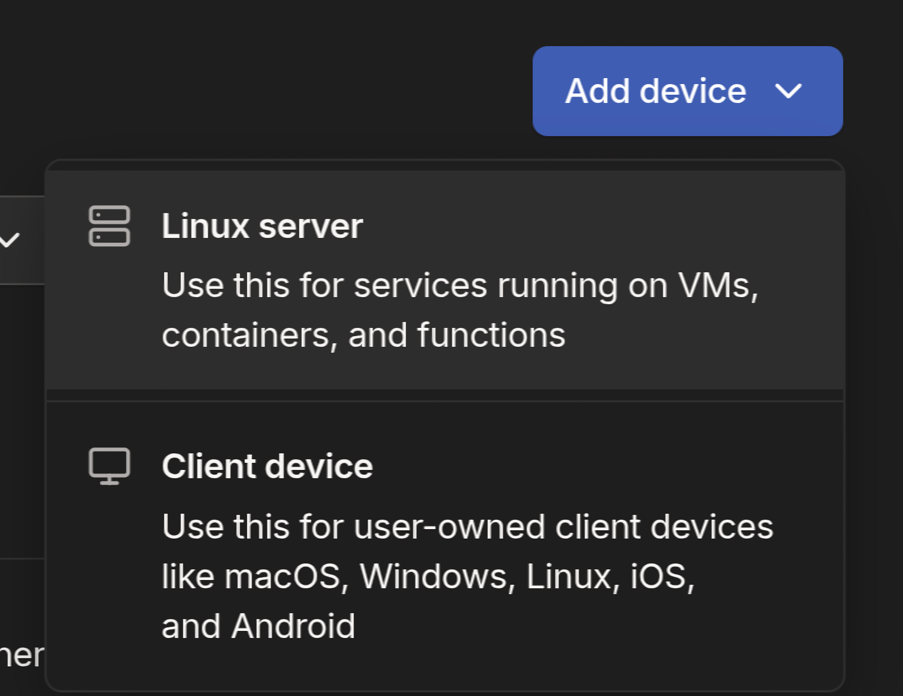
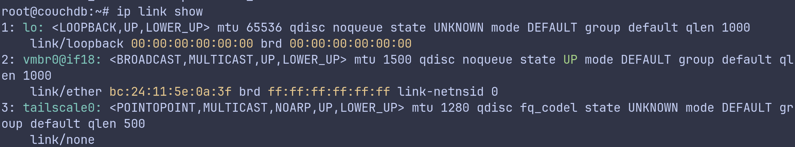

## 🧋 개요

### 나의 노트앱 여정

나는 Notion 대신에 Obsidian을 주로 쓰는데, 이유는 다음과 같다:
- 노션은 너무 무거움
- 불필요한 기능들이 많음
- 로딩이 김

Obsidian은 더 가볍고, 나의 사용에 적절해서 사용하고 있다. \
그리고 더 이쁘다

### Obsidian의 동기화 옵션들

여러 옵션들이 있어 많은 고민들 끝에 동기화 방식을 정하게 되었다.
- 공식
  - **Obsidian Sync**
    - 좋긴 할 것 같지만, 유료 구독제라 탈락
  - **iCloud**
    - 완전 애플생태계만 쓴다면 괜찮은 선택
    - 그러나, 나는 NixOS랩탑을 쓰는 등, 다른 환경도 사용하기에 부적절하다.
- 비공식
  - **Git & GitHub**
    - 내가 Obsidian을 쓰기 처음의 옵션이였지만, 레포지토리가 커지면서 모바일에서의 경험이 좋지 못했다.
    - iPhone에서 Working Copy앱이 Pull 및 Push 오류가 꽤 잦았다.
  - **Syncthing**
    - Peer-to-peer방식이 매력적이고, Tailscale과 연동하면 특히 강력해보인다.
    - 좋아보이긴 하지만, iPhone에서 공식 지원이 없어서 탈락..
  - **⭐ Self-hosted livesync(with CouchDB)**
    - 이걸로 정했다.

### Self-Hosted LiveSync를 고른 이유

결국, CouchDB기반의 **self-hosted LiveSync** 를 골랐는데, 이유는 다음과 같다:
- 이미 Proxmox 홈서버가 있음
- LiveSync 플러그인은 10k stars이상이며, 꽤 강력한 커뮤니티를 가지고있음
- 재밌을거같아서

이 포스트에서는, CouchDB + Caddy를 Proxmox LXC 컨테이너에서 운영하고, Tailscale로 기기들을 연결하여 Obsidian Sync 시스템을 만들 것이다.

---
## 🏗️ LXC Container 프로비저닝하기

우선, **LXC Container** 를 **Proxmox** Cluster에서 만들어줄 것이다. \

선언적 환경 구성을 위해, **Terraform** 으로 설치할 것이며, provider는 [bgp/proxmox](https://registry.terraform.io/providers/bpg/proxmox/latest)를 이용한다.

### Debian 13 LXC Image 다운로드

Terraform을 쓰긴 하지만, `proxmox_download_file`리소스가 현재 LXC이미지를 받을 때, 체크섬 확인에서 오류가 나서 매번 재설치를 진행한다. \
대신, 이미지는 수동 설치를 하자.

우선. SSH로 Proxmox 클러스터에 접속한다:
```bash
ssh <your-proxmox-cluster>
```

이후, 공식 지원 LXC 이미지를 검색한다:
```bash
pveam available
```

Debian13 이미지를 설치한다:
```bash
pveam download local debian-13-standard_13.1-2_amd64.tar.zst
```

### Terraform 모듈

코드의 재사용성을 위해, 모듈을 만들어준다.

```hcl
# ./modules/lxc_container/main.tf
terraform {
  required_providers {
    proxmox = {
      source  = "bpg/proxmox"
      version = "0.101.0"
    }
  }
}

resource "proxmox_virtual_environment_container" "container" {
  description = var.description

  node_name = var.node_name
  vm_id     = var.vm_id

  unprivileged = true
  # If true, it cannot be destoryed.
  protection   = var.protection

  features {
    nesting = true
  }

  # Required to turn on tailscaled on LXC container.
  device_passthrough {
    path = "/dev/net/tun"
  }

  # If you want you can make resource quotas to variables.
  cpu {
    cores = 2
    limit = 2
    units = 1024
  }

  memory {
    dedicated = 2048
    swap      = 512
  }

  initialization {
    hostname = var.hostname

    ip_config {
      ipv4 {
        address = "dhcp"
      }
    }

    user_account {
      keys     = var.ssh_keys
      password = random_password.container.result
    }
  }

  wait_for_ip {
    ipv4 = true
  }

  network_interface {
    name = var.network_interface
  }

  disk {
    datastore_id = var.datastore_id
    size         = var.disk_size
  }

  operating_system {
    template_file_id = var.template_file_id
    type             = var.os_type
  }

  startup {
    order      = "3"
    up_delay   = "60"
    down_delay = "60"
  }

  dynamic "mount_point" {
    for_each = var.mount_points

    content {
      path   = mount_point.value.path
      volume = mount_point.value.volume

      size          = try(mount_point.value.size, null)
      read_only     = try(mount_point.value.read_only, null)
      backup        = try(mount_point.value.backup, null)
      replicate     = try(mount_point.value.replicate, null)
      shared        = try(mount_point.value.shared, null)
      quota         = try(mount_point.value.quota, null)
      acl           = try(mount_point.value.acl, null)
      mount_options = try(mount_point.value.mount_options, null)
    }
  }

  tags = var.tags
}

resource "random_password" "container" {
  length           = 16
  override_special = "_%@"
  special          = true
}

output "container_password" {
  value     = random_password.container.result
  sensitive = true
}
```

아래는 모듈의 `variables.tf`이다.
```hcl
# ./module/lxc_container/variables.tf

variable "description" {
  type        = string
  description = "LXC description"
}

variable "node_name" {
  type        = string
  description = "Proxmox node name"
}

variable "vm_id" {
  type        = number
  description = "LXC VM ID"
}

variable "protection" {
  type        = bool
  description = "Whether to prevent data"
}

variable "hostname" {
  type        = string
  description = "Container hostname"
}

variable "ssh_keys" {
  type        = list(string)
  description = "SSH public keys for root account"
  default     = []
}

variable "network_interface" {
  type        = string
  description = "Container network interface name"
}

variable "datastore_id" {
  type        = string
  description = "Datastore ID for root disk"
}

variable "disk_size" {
  type        = number
  description = "Root disk size in GB"
}

variable "template_file_id" {
  type        = string
  description = "OS template file ID"
}

variable "os_type" {
  type        = string
  description = "Container OS type"

  validation {
    condition = contains([
      "alpine",
      "centos",
      "debian",
      "fedora",
      "ubuntu",
      "unmanaged"
    ], var.os_type)
    error_message = "os_type must be one of the supported Proxmox LXC OS types."
  }
}

variable "mount_points" {
  description = "Additional mount points for the container"
  type = list(object({
    path          = string
    volume        = string
    size          = optional(string)
    read_only     = optional(bool)
    backup        = optional(bool)
    replicate     = optional(bool)
    shared        = optional(bool)
    quota         = optional(bool)
    acl           = optional(bool)
    mount_options = optional(list(string))
  }))
  default = []
}

variable "tags" {
  description = "Tags"
  type        = list(string)
}
```

IPv4 주소를 output으로 꺼내주면, LXC 컨테이너에 접속하기 쉬워진다:
```hcl
# ./modules/lxc_container/outputs.tf
output "ipv4" {
  value = proxmox_virtual_environment_container.container.ipv4
}
```

### `provider.tf` 

디바이스 패스스루를 하려면, Proxmox에 관리자 계정 (`root@pam`)을 비밀번호 기반으로 접근해야 한다. \
토큰 기반으로는 안된다.
```hcl
terraform {
  required_providers {
    proxmox = {
      source  = "bpg/proxmox"
      version = "0.101.0"
    }
  }
}

provider "proxmox" {
  endpoint = <your_endpoint>
  username = var.proxmox_username
  password = var.proxmox_password
  insecure = true

  ssh {
    agent    = true
    username = "root"
  }
}
```

### `main.tf`
```hcl
# main.tf
locals {
  # Import your SSH public keys here
  ssh_keys = [
  ]
}

module "couchdb" {
  source       = "./modules/lxc_container"
  node_name    = <your-node-name>
  description  = "CouchDB LXC"
  datastore_id = <your-datastore-id>
  protection   = true # Recommended

  vm_id             = 500 # You can change if you want
  network_interface = <your-network-interface>
  disk_size         = 32 # You can change if you want
  hostname          = "couchdb" # You can change if you want

  # File ID format: `datasotre_id:type/<image>`
  template_file_id = "local:vztmpl/debian-13-standard_13.1-2_amd64.tar.zst"
  os_type          = "debian"
  ssh_keys         = local.ssh_keys

  # Example tags
  tags = ["debian", "couchdb", "obsidian"]
}

output "couchdb_ipv4" {
  value = module.couchdb.ipv4
}
```

### `variables.tf`

```variables.tf
# varialbes.tf
# `terraform.tfvars` should be ignored by Git.
# or, you can use environment variable: `export TF_VAR_<variable_name>`
variable "proxmox_username" {
  type    = string
  default = "root@pam"
}

variable "proxmox_password" {
  type      = string
  sensitive = true
}
```

### 적용 & 접속하기

이제, LXC 컨테이너를 만들 수 있다!

```bash
terraform init

terraform plan

terraform apply -auto-approve
```

이후, 컨테이너에 접속할 수 있다:
```bash
ssh root@<your-container-ip>
```

---
## 🪏 CouchDB + LiveSync 서버 세팅

### CouchDB 설치

우선, 패키지 매니저를 업데이트하고, 패키지를 업그레이드해준다. \
이후, 설치 매뉴얼에서 필요한 의존성들을 받아준다:
```bash
apt update
apt upgrade -y
apt install -y gpg curl sudo
```

이후, [공식 CouchDB 문서](https://docs.couchdb.org/en/stable/install/unix.html#installation-using-the-apache-couchdb-convenience-binary-packages)를 통해 CouchDB를 다운받는다.

설치하는동안, TUI 인터랙션이 시작된다. \
아래의 설정대로 따라가면 된다:
- type: `standalone`
- bind address: `127.0.0.1`
- Erlang magic cookie: `<your-random-long-string>`
- admin password: `<your-admin-password>`

Magic cookie, admin password는 안전한 곳에 넣자.

CouchDB가 실행되는지 확인해보자:
```bash
systemctl status couchdb
```

### Obsidian LiveSync 설치

아래 스크립트에 정보를 넣고 실행하자:
```bash
curl -s https://raw.githubusercontent.com/vrtmrz/obsidian-livesync/main/utils/couchdb/couchdb-init.sh | hostname=http://<YOUR SERVER IP>:5984 username=<INSERT USERNAME HERE> password=<INSERT PASSWORD HERE> bash
```

[원본 설치 매뉴얼](https://github.com/vrtmrz/obsidian-livesync/blob/main/docs/setup_own_server.md#2-run-couchdb-initsh-for-initialise)도 같이 참고하는걸 추천한다:

결과가 아래처럼 나오면, 성공이다:
```bash
-- Configuring CouchDB by REST APIs... -->
{"ok":true}
""
""
""
""
""
""
""
""
""
<-- Configuring CouchDB by REST APIs Done!
```


---
## 🔒 Tailscale 설치

**Tailscale** 은 WireGuard 기반의 Peer-to-peer의 VPN이다. \
이를 통해 안전하게 장치들 간의 연결을 할 수 있다. 

### 디바이스들에 Tailscale설치

Tailscale에 로그인하고 대시보드에 들어간다.

대시보드에서 설치 메뉴얼을 친절하게 제공하므로, 따르면 된다. \
Obsidian을 쓰려는 모든 기기마다 설치해주면 된다.


Tailscale이 설치되면, 새로운 네트워크 인터페이스가 추가된다. \
아래는 LXC 컨테이너에서의 설치 이후 모습이다:


### MagicDNS 세팅

Tailscale은 또한 내부 DNS와 Let's Encrypt에서 제공하는 HTTPS 인증서 연동을 지원한다. \

Dashboard -> DNS에서, MagicDNS 와 HTTPS Certificates를 enable해준다.


---
## 👮 Caddy 설치

**Caddy** 는 리버스 프록시로도 활용될 수 있는 간단한 웹 서버이다. \
Tailscale과 연계가 특히 좋은데, CouchDB는 REST API를 지원하여 그의 앞단에서 동작할 것이다.

[여기](https://caddyserver.com/docs/install#debian-ubuntu-raspbian)에서 Caddy를 설치할 수 있다.

`/etc/caddy/Caddyfile`에서, 리버스 프록시 설정을 해준다.
```Caddyfile
# /etc/caddy/Caddyfile
# Match your tailnet MagicDNS FQDN
https://<hostname>.<your-tailnet>.ts.net {
	reverse_proxy 127.0.0.1:5984 {
		header_up Host {host}
		header_up X-Forwarded-For {remote_host}
		header_up X-Forwarded-Proto {scheme}
	}
}
```

`/opt/couchdb/etc/local.ini`에서, CORS설정을 해준다.
```ini
[chttpd]
bind_address = 127.0.0.1
port = 5984
enable_cors = true

[cors]
credentials = true
origins = app://obsidian.md, capacitor://localhost, http://localhost
headers = accept, authorization, content-type, origin, referer
methods = GET, PUT, POST, HEAD, DELETE, OPTIONS
max_age = 3600
```

`/etc/default/tailscaled`에서, `caddy`유저가 Tailscale을 통해 인증서를 관리하도록 한다.
```bash
TS_PERMIT_CERT_UID=caddy
```

이후, 서비스들을 재시작한다.
```bash
systemctl restart tailscaled
systemctl restart caddy
systemctl restart couchdb
```

---
## 🍰 클라이언트 사용법

이제 남은건, 저장소 마이그레이션과 클라이언트 연동 뿐이다.

### Setup URI 생성

아래 명령어로 생성한다. \
LXC말고, 편한 곳에서 실행하면 된다. 

```bash
export hostname=<your-hostname>
export database=obsidiannotes # Change this if you want
export passphrase=<random-passphrase>
export username=<username>
export password=<password>

deno run -A https://raw.githubusercontent.com/vrtmrz/obsidian-livesync/main/utils/flyio/generate_setupuri.ts

# Generated Passphrase & Link:
Your passphrase of Setup-URI is:  <passphrase>
This passphrase is never shown again, so please note it in a safe place.
obsidian://setuplivesync?settings=....
```

### 기존 Obsidian Vault로부터 마이그레이션(첫 클라이언트 등록 시)

아래 단계를 따른다:
1. Obsidian에서 **Self-hosted LiveSync** 플러그인을 설치한다.
2. 플러그인을 활성화한다.
3. **Device Setup Method** 에서,**Use a Setup URI** 를 고른다.
   - passphrase와 URI(`obsidian://setuplivesync?settings=...`)를 입력한다.
4. **"I am setting up a new server for the first time / I want to reset my existing server."** 를 선택한다.
5. 나머지 단계를 적절하게 진행한다.
6. Without saving으로 앱을 재실행한다.


### 추가 클라이언트 등록

두 번째 기기 부터는 새로운 vault를 만들어서 진행했다.
아래 단계를 따른다:
1. Obsidian에서 **Self-hosted LiveSync** 플러그인을 설치한다.
2. 플러그인을 활성화한다.
3. **Device Setup Method** 에서, **Use a Setup URI** 를 고른다.(모바일에서 QR이 안되던데, 가능하면 QR을 써도 될거같다.)
   - passphrase와 URI(`obsidian://setuplivesync?settings=...`)를 입력한다.
4. **"My remote server is already set up. I want to join this device"** 를 고른다.
5. **"This Vault is empty, or contains only new files that are not on the server"**를 고른다.
6. 나머지 단계를 적절하게 진행한다.
7. Without saving으로 앱을 재실행한다.

### 설정
LiveSync 프리셋을 이용해서, 실시간 동기화 기능을 켜고 사용 중이다. \
대부분의 상황에서 1초 이내로 동기화된다.

---
## ☁️ Off-Site 백업

현재 DB가 **단일 장애점의 위험** 이 있기에, 정전 및 디스크 장애에 대해 대비할 수 있어야 한다. \
대비하면 이후에 장애 상황에서도 백업을 할 수 있다.

### Git & GitHub

이전에 Git을 쓰다가 갈아타는 거라면서, 계속 Git을 쓴다니, 좀 이상할 수 있다. \
그러나, 보조 백업수단으로는 꽤 괜찮은데, Git플러그인에서 주기적 푸시를 지원하며, 이는 꽤 가볍기 때문이다. \
즉, 가벼운 백업을 짧은 주기로 계속 emit하는거라 꽤 괜찮다. \
또한, 모든 디바이스에서 설치할 이유 없이, 메인 디바이스(컴퓨터, 노트북)에서만 추가로 Git 플러그인을 설치해서 푸시하면 된다. \
`.git`폴더는 LiveSync에서 자동으로 동기화 무시되므로, CouchDB에도 부담이 덜하고, 동기화 문제도 할 필요 없다. 

### Cloud Object Storage

**Cloudflare R2** 나 **AWS S3** 와 같은 오브젝트 스토리지는 매우 높은 가용성과 데이터 내구성을 자랑한다. \
또한, 비용도 저렴한 편이다. \
주기적으로 오브젝트 스토리지에 백업해주는 것도 좋다. \
예를 들어, `cron`과 AWS CLI를 이용하면 자동 백업이 가능하다.

---
## 📚 References

- [GitHub - vrtmrz/obsidian-livesync](https://github.com/vrtmrz/obsidian-livesync/blob/main/docs/setup_own_server.md#c-install-couchdb-directly)
- [Terraform Registry - bgp/proxmox](https://registry.terraform.io/providers/bpg/proxmox/latest/docs/resources/virtual_environment_container)
- [Techstuff - Proxmox - LXC template and containers - Getting Started](https://techstuff.leighonline.net/2024/01/10/proxmox-lxc-containers/)
- [Source Code(GitHub) - LXC module](https://github.com/fudoge/home-infra/blob/main/terraform/10.proxmox-lxc/modules/lxc_container/main.tf)
- [CouchDB - Installation](https://docs.couchdb.org/en/stable/install/unix.html#installation-using-the-apache-couchdb-convenience-binary-packages)
- [Tailscale - Tailscale in LXC Containers](https://tailscale.com/docs/features/containers/lxc/lxc-unprivileged)
- [Caddy - Installation](https://caddyserver.com/docs/install)
- [Caddy Certificates of Tailscale](https://tailscale.com/docs/integrations/web-servers/caddy/caddy-certificates)
