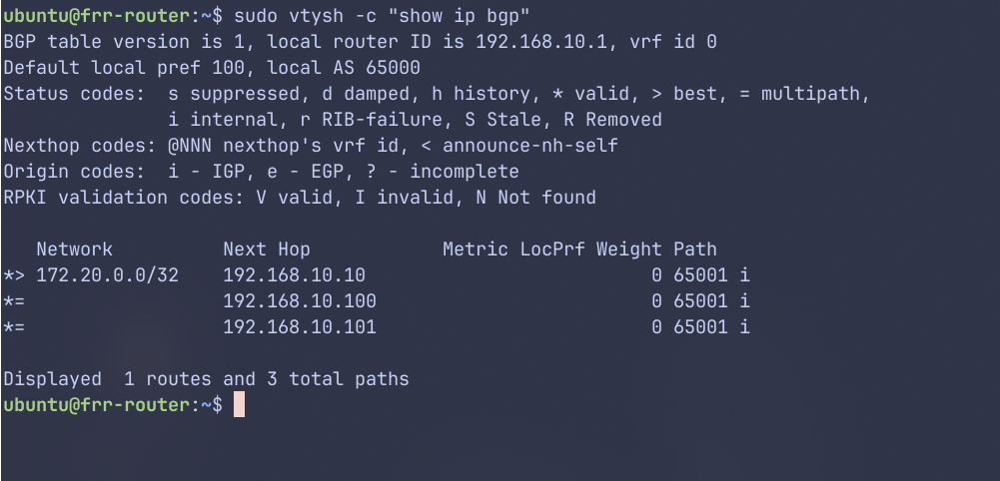

FRRouting은 Linux/Unix 플랫폼에서의 오픈 소스 라우팅 프로젝트이다.\
다양한 라우팅 프로토콜을 지원한다.\
우리는 쿠버네티스 클러스터 노드들의 앞단에 세워 쓸 것이고,\
service를 외부에 광고하거나 로드 밸런서를 실제로 부하가 분산되도록\
할 것이다.

---
## 💿 FRR 설치

```bash
# add GPG key_
curl -s https://deb.frrouting.org/frr/keys.gpg | sudo tee /usr/share/keyrings/frrouting.gpg > /dev/null

FRRVER="frr-stable"

# Ubuntu 24.04
echo deb '[signed-by=/usr/share/keyrings/frrouting.gpg]' [https://deb.frrouting.org/frr](https://deb.frrouting.org/frr) \
     noble $FRRVER | sudo tee -a /etc/apt/sources.list.d/frr.list

# update and install FRR_
sudo apt update && sudo apt install frr frr-pythontools -y

# enable services
sudo systemctl enable --now frr
```

이후, `/etc/frr/daemons`에서 bgpd를 켜준 뒤, 재시작한다.

```bash
# vim /etc/frr/daemons
---

bgpd=yes ...

````
```bash
sudo systemctl restart frr
````

---
## 📜 BGP란

**BGP(Border Gateway Protocol)** 는 AS(Autonomous System)들을 연결하는 정책 기반
라우팅 프로토콜이다. 최선의 속도만이 아닌, 비용, 보안, 정치적인 사유로 AS들간의
통신을 설정하여 네트워크 트래픽을 제어한다

Well-known port 179를 이용하여 라우팅 정보를 교환한다. 연결이 된 이후에는
변경사항만 업데이트된다.

### AS(Autonomous System)

인터넷은 **자율 시스템(AS: Autonomous System)** 이라는 수십만 개의 작은 네트워크로 나뉘어지는데, 이 각각의
네트워크는 기본적으로 하나의 조직이 운영하는 큰 라우터들의 큰 집합이다.

각 AS는 ASN이라는 고유의 식별 번호를 가진다. 2-octet값, 즉 16비트값으로, 최대
65535까지 가능하다.

64512 ~ 65535번은 private AS number들이다. 글로벌 인터넷에 노출되어서는 안된다.

### Address Family

**AF(Address Family)** 는 BGP가 어떤 주소 종류와 라우팅 정보 종류를 다루는가에 대해
구분한다. BGP는 IPv4와 IPv6에 대한 AFI(Address Family Identifier)를 지원한다.

같은 BGP세션(TCP 179)에서 여러 종류의 커넥션들에 대해 각각 광고 여부와 정책,
next-hop처리 등을 설정할 수 있다. 이때 서로 다른 처리를 위해 AF를 이용한다.

AF는 AFI/SAFI로 나뉜다:

- AFI(Address Family Identifier): 주소 체계(IPv4? IPv6?)
- SAFI(Subsequent AFI): 어떤 유형인지(unicast, multicast, vpn, evpn)

### 동작 과정

FRR의 BGP구현은 아래의 결정을 따른다: 위에 있을수록 더 우선되는 기준이다

1. Weight check
2. Local preference check
3. Local route check
4. AS path length check
5. Origin check
6. MED check
7. External check
8. IGP cost check
9. Multi-path check
10. Already-selected external check
11. Router-ID check
12. Cluster-List length check
13. Peer address

> NOTE  
> BGP에 대해서는 [여기]()를 더 참조할 수 있다.

---

## 🌐 쿠버네티스 앞단의 BGP라우터로 세팅하기

아래 내용을 `/etc/frr/frr.conf`에 작성하고, frr 서비스를 재시작한다.

```bash
frr version 10.5.1
frr defaults traditional
hostname frr-router
log syslog informational
service integrated-vtysh-config
!
# 라우트맵 정의: 모든 경로 허용
route-map ALLOW-ALL permit 10
exit
!
# BGP 라우터 설정 (ASN 65000)
router bgp 65000
 # BGP 라우터 ID 설정
 bgp router-id 192.168.10.1
 # K8s-NODES라는 peer-group 생성
 neighbor K8S-NODES peer-group
 # K8S-NODES peer-group의 remote ASN을 65001로 설정
 neighbor K8S-NODES remote-as 65001
 # 192.168.10.0/24 대역의 노드들이 동적으로 BGP피어링이 가능하도록 설정
 bgp listen range 192.168.10.0/24 peer-group K8S-NODES
 !
 # IPv4 유니캐스트 Address family 설정
 address-family ipv4 unicast
  # K8S-NODES그룹에게 Next-hop을 자신으로 변경
  neighbor K8S-NODES next-hop-self
  # K8s-NODES그룹에서 받는 경로에 ALLOW_ALL 라우트맵 적용
  neighbor K8S-NODES route-map ALLOW-ALL in
  # K8s-NODES그룹으로 보내는 경로에 ALLOW_ALL 라우트맵 적용
  neighbor K8S-NODES route-map ALLOW-ALL out
  # ECMP(Equal-Cost Multi-Path) 설정 - 최대 경로 수를 64개 설정
  maximum-paths 64
 exit-address-family
exit
!
```

이제, 쿠버네티스 클러스터 쪽에서 연결을 시도해주면 된다.\
다음 글에서 다룰 것이다.

아래는 BGP피어링이 잘 된 모습인데, Cilium 세팅을 해줄 것이다.



---

## 📚 References

- [FRR Debian Installation](https://deb.frrouting.org)
- [FRRouting - BGP](https://docs.frrouting.org/en/stable-8.2/bgp.html)

