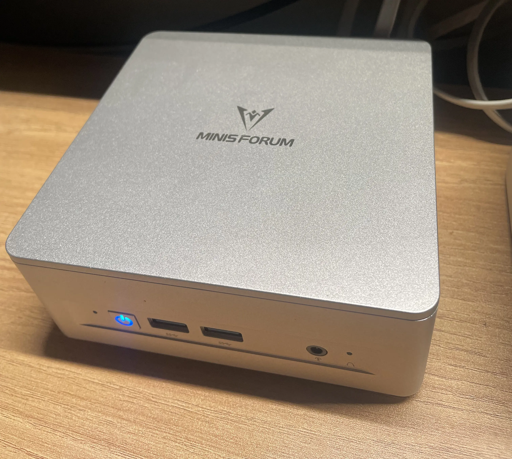
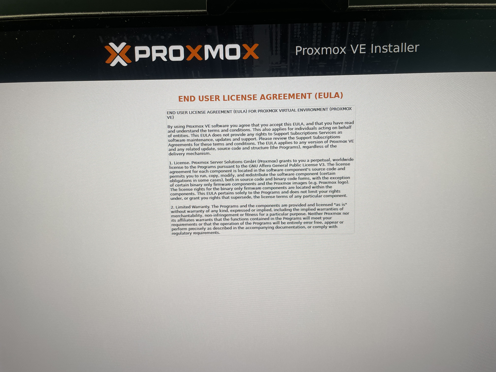
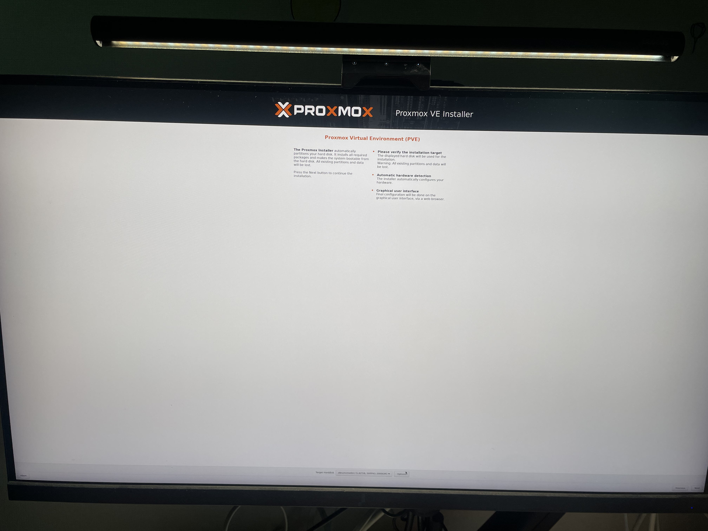
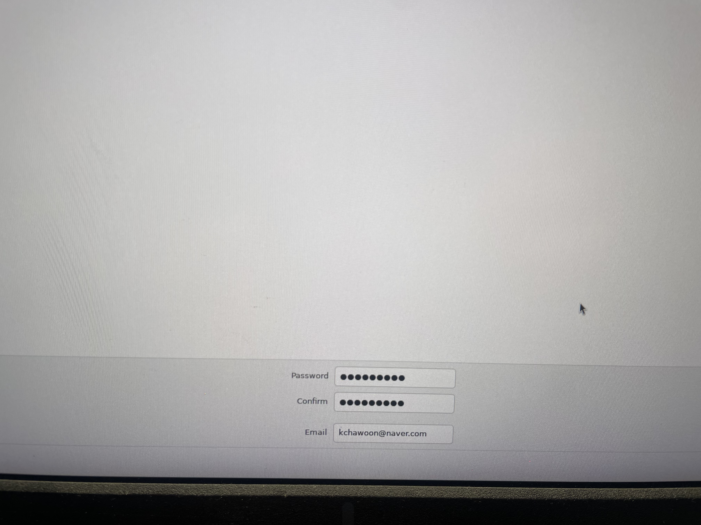
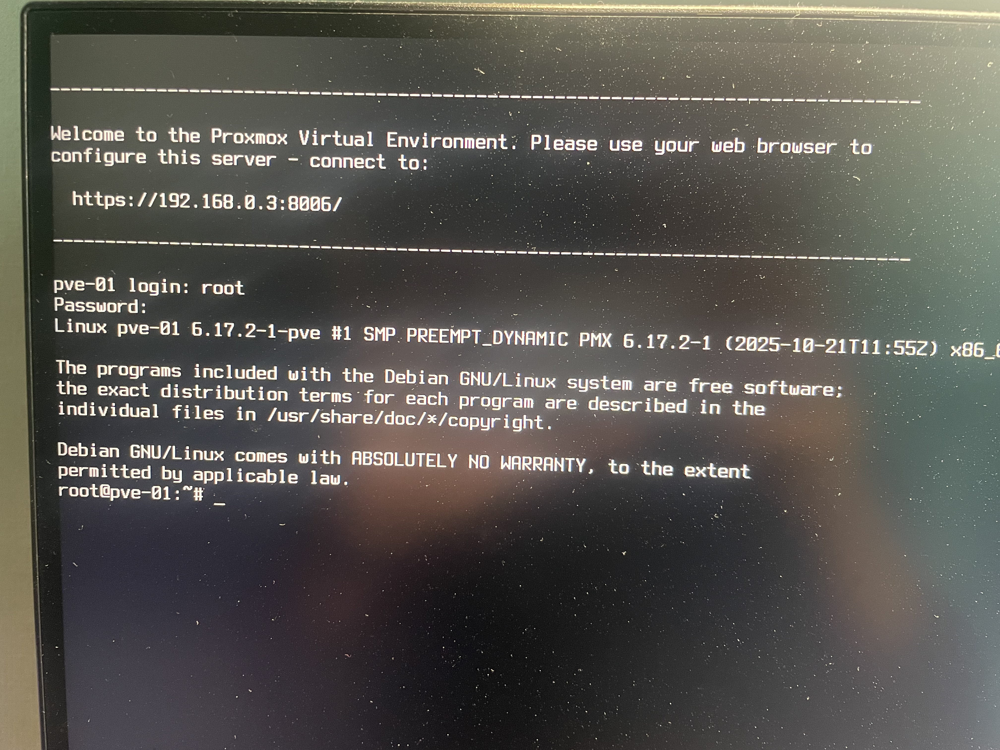
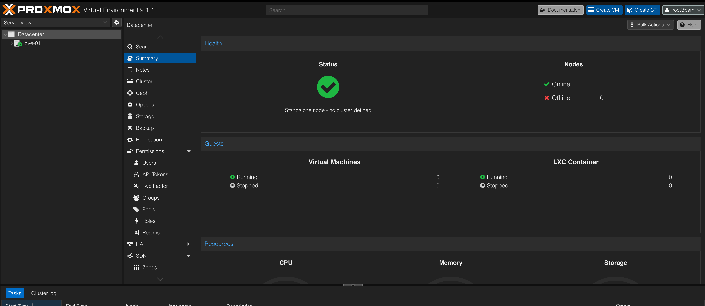

홈랩 머신으로 미니PC를 구매했다.  
기종은 UM870 Slim 32G Ram + 1TB SSD인데, 기존에 가지고 있던 하이닉스 Platinum P41 2TB로 교체시켰다.


Proxmox를 설치하여 미니PC 안에서 여러 가상 머신들 및 컨테이너들을 띄우고 실험하고, 쿠버네티스 공부 등에 활용할 것이다.  
나중에는 서비스를 운영하거나, 내 개인 사용 서비스를 셀프호스팅 하는데 쓸 예정이다.  
Openstack과 고민했지만, 일단 단일 노드이기도 하고, 너무 과한 것 같아서 당장은 Proxmox로 시작한다.

---
## 💉 Proxmox 설치 media 만들기
우선, [Proxmox 홈페이지](https://www.proxmox.com/en/downloads)에서 Proxmox VE를 설치해준다.  

Ventoy를 사용한다면, ventoy 파티션에 iso를 넣으면 된다.  
Ventoy를 사용하지 않는다면, 아래 과정을 따른다:

여기서는 usb가 `/dev/sda`에 있다고 가정한다.
파티션 테이블을 새로 생성해준다.
```bash
sudo parted /dev/sda --script mklabel gpt
```

이후, `dd`를 이용해서 설치 미디어를 만들어준다.
```bash
sudo dd if=~/Downloads/proxmox-ve_*.iso of=/dev/sda bs=4M status=progress
```

---
## 🏗️ Proxmox 설치


우선, EULA에 동의해주자.


그 뒤, 설치할 디스크를 선택한다.


국가와 타임존, 키보드 레이아웃을 선택한다.


루트 패스워드를 입력한다.


네트워크 설정을 해준다.
Proxmox 노드가 고정IP를 쓰도록 해주는 것이 좋다.
Hostname은 임의로 지어줬다.

이후, 설치하면 된다.

---
## 🚪 접속


설치 미디어를 빼고 재부팅해보자.  
설정해둔 비밀번호로 root에 로그인할 수 있다.  
또한, ssh연결도 가능하다.


`<노드 주소>:8006`에 접속하면 대시보드를 볼 수 있다.
