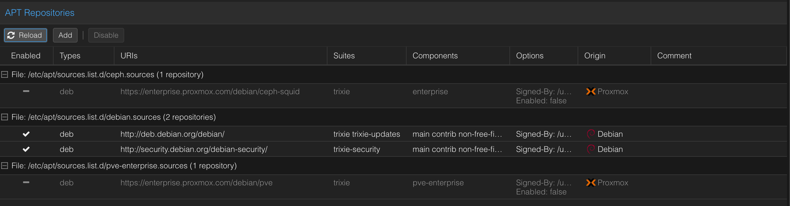
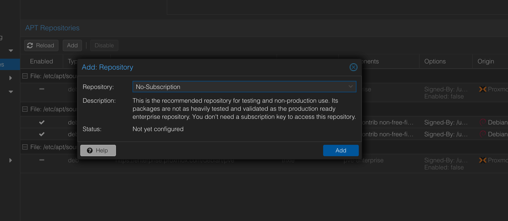
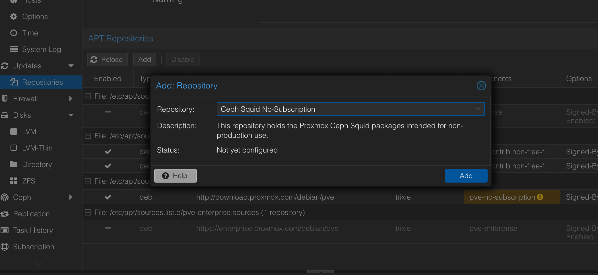
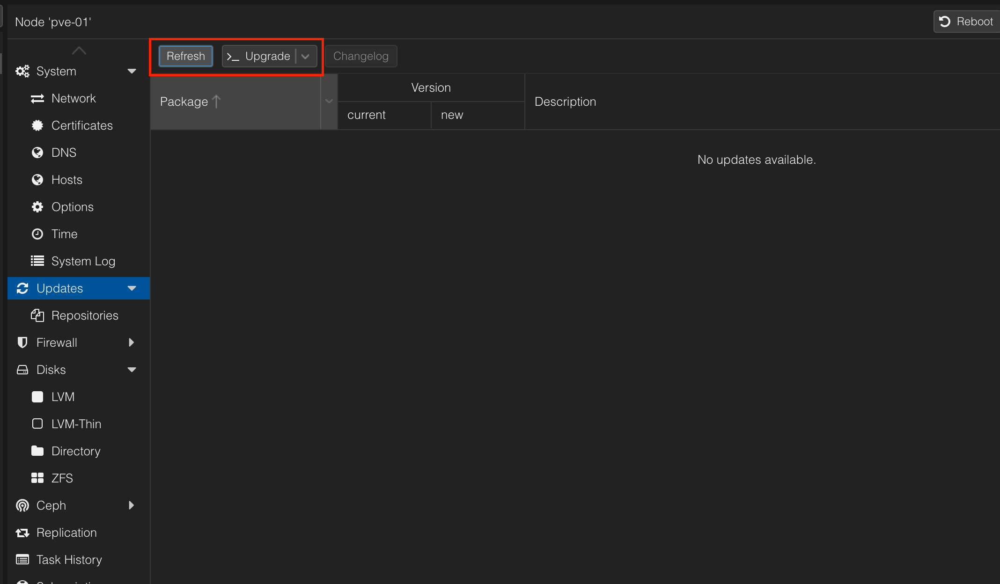
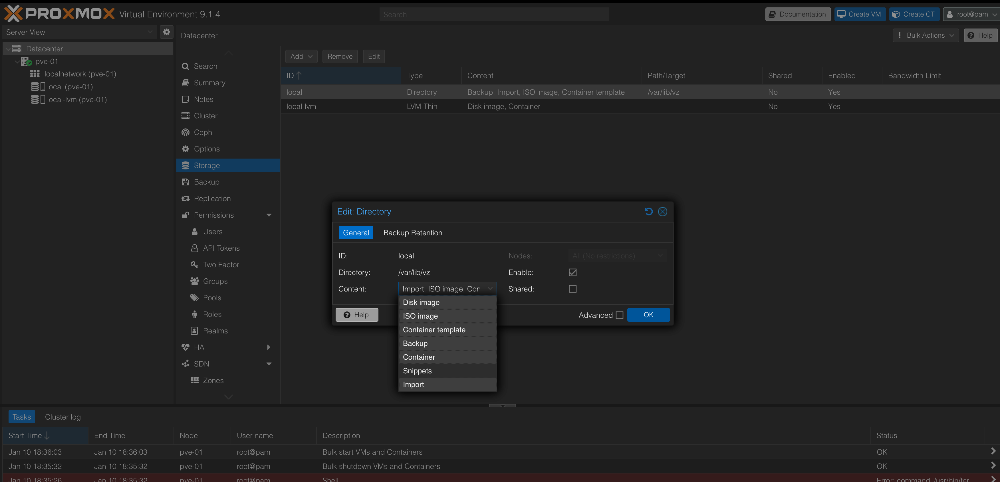
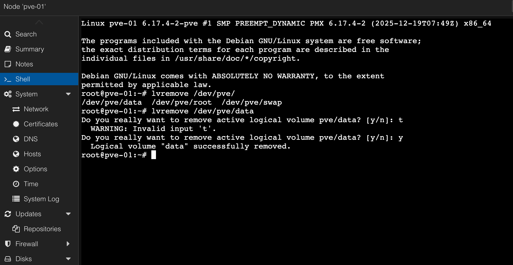
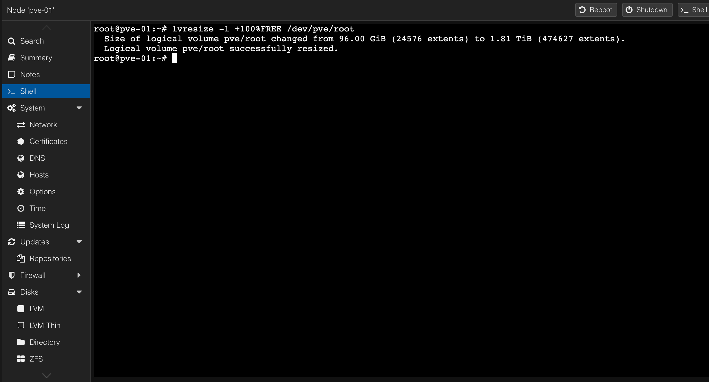
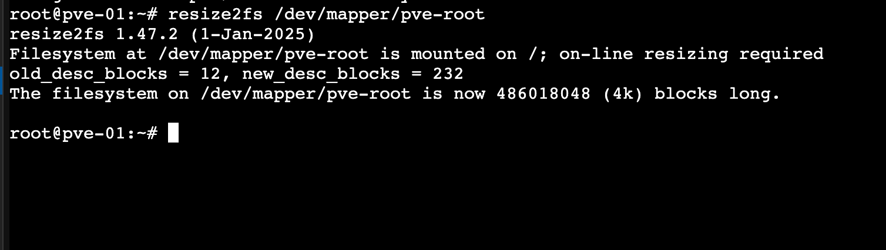

처음 Proxmox를 쓰기에 앞서, 기본적인 세팅 과정을 밟는다.  
유료 라이선스 구독이 없기에, 별도의 레포지토리로 갈아탄다.  
홈랩에서 간단한 사용이기에, 스토리지도 단순화시킬 것이다. 


---
## ⬇️ Repository 제거

우선, 유료 라이선스가 없기에, 구독이 없는 상태에서 쓰는 레포지토리를 이용해야 한다.  
**Node -> Updates -> Repositories**에서 proxmox 레포지토리를 제거한다.



그리고, **No Subscription** 레포지토리와 **Ceph Squid No-Subscription**을 추가해준다.




이후, Updates에서 Refresh하고 Upgrade해준다.  
또는 쉘에서 `apt update && apt upgrade`해주면 된다.


이후, 재부팅 해준다.


---
## 💾 (Optional) lvm스토리지 제거

처음에 `local`과 `local-lvm`스토리지가 생기는데, 둘은 역할이 분리되어 있다:

- **local:** 
	- 파일 기반 스토리지 
	- ISO / 백업 / 템플릿, qcow2이미지 
- **local-lvm:** 
	- 블록 기반 스토리지
	- VM disk(raw 이미지), LXC rootfs 저장

단순함을 위해, `local-lvm`을 없애고, `local`만 사용하도록 할 것이다.

Datacenter -> Storage로 이동한다.  
`local`에 모든 content타입들을 추가해준다.


그 뒤, `local-lvm`을 remove한다.


이제, Node 쉘에서 아래 명령어를 실행하여 실제 `local-lvm`의 LV를 제거한다.

```bash
lvremove /dev/pve/data
```



이후, root에 나머지 공간을 할당한다.
```bash
lvresize -l +100%FREE /dev/pve/root
```



이제, 파일시스템도 확장해준다.
```bash
resize2fs /dev/mapper/pve-root
```

