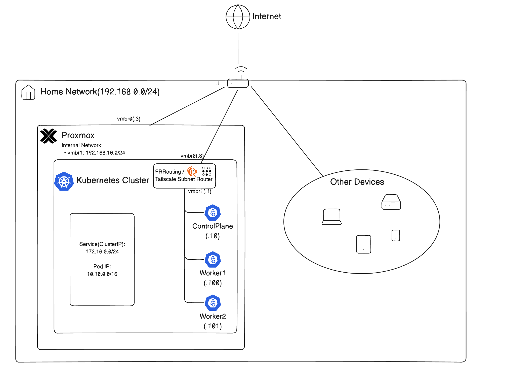
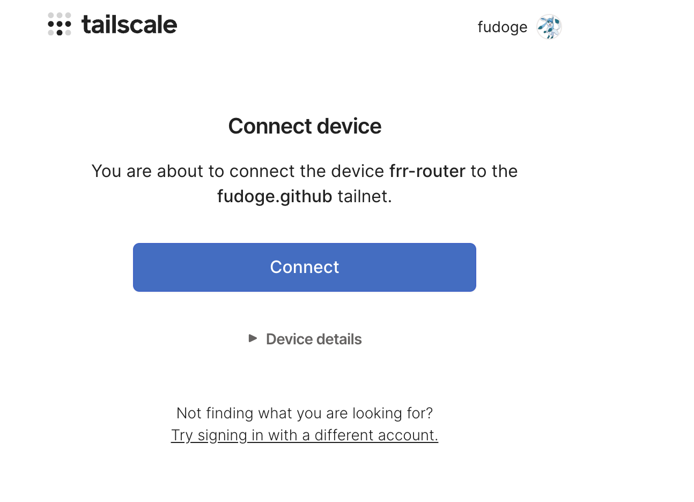
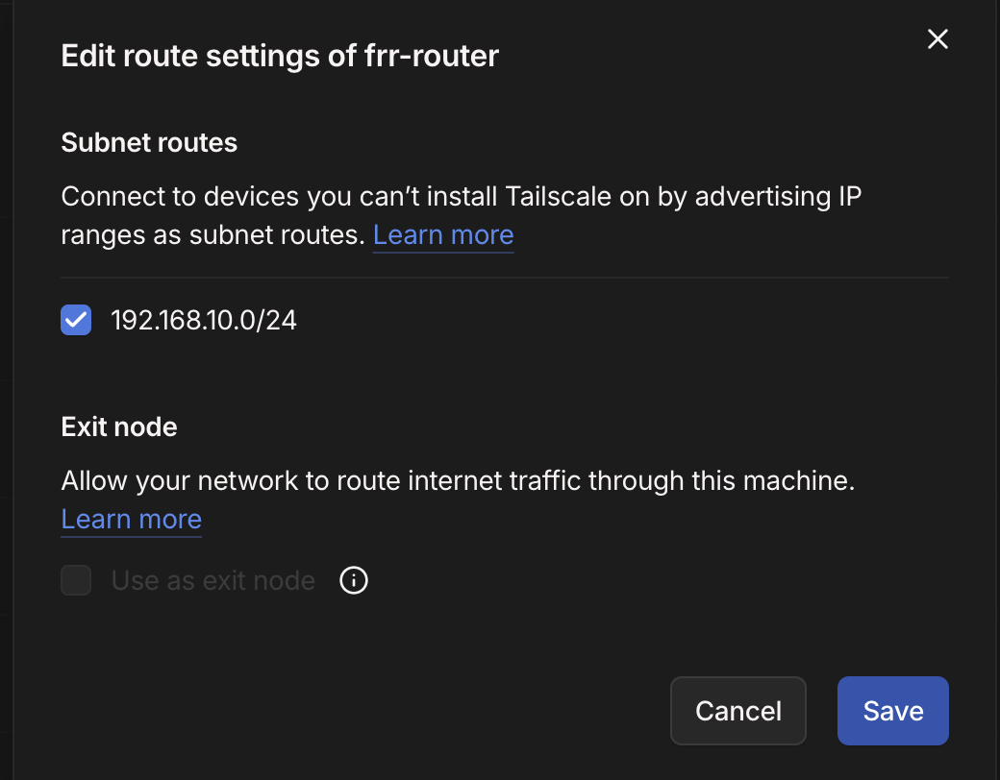

Proxmox의 VM 및 LXC등을 Terraform/Opentofu로 관리하여 선언적으로 홈랩 인프라를 관리할 수 있다.  
여기서는 [bpg/proxmox](https://registry.terraform.io/providers/bpg/proxmox/latest/docs)([opentofu버전은 여기](https://search.opentofu.org/provider/bpg/proxmox/latest)) Provider를 이용한다.

아래의 네트워크 토폴로지를 구성할 것이다:


---
## ⚙️ Proxmox에서 Terraform 유저 만들기
### 계정 생성
Terraform 사용을 위한 최소 권한의 계정을 만들어줄 것이다.

Proxmox 9에서는 아래의 명령을 쓰면 된다:
```bash
pveum role add TerraformProv -privs "Datastore.AllocateSpace Datastore.AllocateTemplate Datastore.Audit Pool.Allocate Pool.Audit Sys.Audit Sys.Console Sys.Modify VM.Allocate VM.Audit VM.Clone VM.Config.CDROM VM.Config.Cloudinit VM.Config.CPU VM.Config.Disk VM.Config.HWType VM.Config.Memory VM.Config.Network VM.Config.Options VM.Migrate VM.PowerMgmt SDN.Use VM.GuestAgent.Audit"
pveum user add terraform-prov@pve --password <password>
pveum aclmod / -user terraform-prov@pve -role TerraformProv
```

각 줄마다 다음과 같다:
- terraform user를 위한 role생성(vm생성, 네트워크 관리 등을 위한 최소 권한)
- 사용자 생성
- user에게 role을 바인딩

### 토큰 생성

비밀번호 대신 API 토큰을 사용하는 것이 권장된다.
```bash
pveum user token add terraform-prov@pve mytoken
```

이 명령은 `terraform-prov@pve`에게 mytoken이라는 id의 토큰을 만든다.

나온 값을 안전한 곳에 저장해주자.

기본적으로, token이 user의 권한을 다 계승받는 것이 아니다.   
**Privilege Separation**이 되어있다.   
그래서, **role을 별도로 바인딩**해줘야 한다.

```bash
pveum aclmod / -token 'terraform-prov@pve!mytoken' -role TerraformProv
```

---
## 🫥 `.gitignore`

`.gitignore`에 다음 파일들을 넣어주자
```gitignore
.terraform/
.DS_Store
*.tfstate
*.tfstate.backup
*tfvars
```

---
## 📂 폴더 구조
현재는 terragrunt나 s3 remote backend를 세팅하지 않았다.
당장은 부분마다 불편하더라도 폴더별로 init -> plan -> apply를 하는식으로 단순하게 사용한다.
때문에, `provider.tf`나 `variables.tf`등에서 반복적인 작업의 부분이 생길 수 있다.
```bash
.
├── 00.network
│   ├── main.tf
│   ├── provider.tf
│   ├── terraform.tfstate
│   ├── terraform.tfvars
│   └── variables.tf
├── 01.templates
│   ├── main.tf
│   ├── outputs.tf
│   ├── provider.tf
│   ├── terraform.tfstate
│   ├── terraform.tfvars
│   └── variables.tf
├── 10.routers
│   ├── main.tf
│   ├── outputs.tf
│   ├── provider.tf
│   ├── terraform.tfstate
│   ├── terraform.tfvars
│   └── variables.tf
├── 11.nodes
│   ├── main.tf
│   ├── outputs.tf
│   ├── provider.tf
│   ├── terraform.tfstate
│   ├── terraform.tfvars
│   └── variables.tf
├── 98.cloud-init
│   ├── frr-cloud-config.yaml
│   └── general-vm-config.yaml
├── 99.modules
│   ├── template
│   │   ├── main.tf
│   │   ├── outputs.tf
│   │   ├── provider.tf
│   │   └── variable.tf
│   └── vm
│       ├── main.tf
│       ├── outputs.tf
│       ├── provider.tf
│       └── variable.tf
```

---
## 📦 Provider 설정
각 세부폴더별 provider를 다음과 같이 세팅한다:

### SSH 에이전트 세팅

ssh키가 없다면, 생성한다.
```bash
ssh-keygen
```

사용하려는 Opentofu Provider가 파일을 조작할 때, SSH Agent를 이용하기에, SSH 키를 배포해야 한다.
```bash
# SSH Agent 실행
eval $(ssh-agent -s)

# SSH Agent에게 키 목록 추가
ssh-add ~/.ssh/id_rsa
ssh-add ~/.ssh/id_ed25519

# 노드에 키 전달
ssh-copy-id root@<proxmox-node>
```

### `provider.tf`

`provider.tf`에 아래 내용을 추가한다.
```hcl
terraform {
  required_providers {
    proxmox = {
      source  = "bpg/proxmox"
      version = "0.93.0"
    }
  }
}

provider "proxmox" {
  endpoint  = "https://<proxmox-node>:8006"
  api_token = var.proxmox_api_token
  insecure  = true

  ssh {
    agent    = true
    username = "root"
  }
}
```

`variable.tf`에 `proxmox_api_token`값을 저장한다.
```hcl
variable "proxmox_api_token" {
  type = string
}
```

이후, provider를 세팅해준다.
```bash
tofu init
```

---
## 🧱 모듈
테라폼 코드의 재사용성을 위해, 모듈화를 진행해주었다.  
여기서는 두 가지의 핵심 모듈이 있다:  
- **탬플릿 모듈** - 클라우드 이미지를 참조하여 proxmox에서 template vm으로 기초적인 뼈대를 생성하는 모듈
- **vm모듈** - 탬플릿을 참조하여 vm을 생성한 뒤, cloud-init을 이용하여 세부 설정

보통 Proxmox에서 vm을 생성하는 패턴은 다음과 같다:
1. 클라우드 이미지로부터 기본 세팅된 탬플릿 vm생성
2. 탬플릿 vm으로부터 클론
3. cloud-init으로 개별화

이를 통해서 다음의 이점을 가진다:
- 빠른 vm생성
- 일관성
- 재현성
- 자동화 친화적

참고로, 모듈의 `provider.tf`에는 `provider "proxmox"{}` 부분이 없어도 된다. 
모듈에서는 자격 증명을 요구하지 않기 때문이다.

### 탬플릿 모듈
탬플릿 모듈은 클라우드 이미지를 설치하여 최소한의 기본 설정을 할당한다.
`provider.tf`는 생략.

#### 변수 정의
```hcl
# 99.modules/template/variable.tf
variable "template_id" {
  type = number
}

variable "template_name" {
  type = string
}

variable "ve_node_name" {
  type = string
}

variable "datastore_id" {
  type    = string
  default = "local"
}

variable "image_url" {
	type = string
}
```

입력받을 변수를 정의한다.
- `template_id`: 탬플릿 vm의 id
- `template_name`: 탬플릿 vm의 이름
- `ve_node_name`: 생성될 Proxmox 노드
- `datastore_id`: 가상디스크를 할당할 스토리지명
- `image_url`: 클라우드 이미지를 설치할 수 있는 URL


#### `main.tf`
template vm의 이름과 어느 노드에서 띄울지, id등을 정한다.
그리고, 기본적인 cpu코어 수, 메모리, 디스크 설정 등을 해준다.
핵심은 `template=true`로 지정했으며, 클라우드 이미지를 디스크에 설치한다는 것이다.

```hcl
# 99.modules/template/main.tf
resource "proxmox_virtual_environment_vm" "template" {
  name      = var.template_name
  node_name = var.ve_node_name
  vm_id     = var.template_id

  template = true # Template
  started  = false

  machine     = "q35"  # modern vm type <-> pc: legacy system
  bios        = "ovmf" # UEFI
  description = "Managed by Terraform"

  cpu {
    cores = 2
  }

  memory {
    dedicated = 2048
  }

  # Required if bios == ovmf
  efi_disk {
    datastore_id = var.datastore_id
    type         = "4m" # Recommended
  }

  disk {
    datastore_id = var.datastore_id
    file_id      = proxmox_virtual_environment_download_file.cloud_image.id # file ID for a disk image
    interface    = "virtio0"
    iothread     = true
    discard      = "on" # pass discard/trim requests to the underlying storage
    size         = 20
  }

  # Cloud_init config
  initialization {
    datastore_id = var.datastore_id
    ip_config {
      ipv4 {
        address = "dhcp"
      }
    }
  }

  network_device {
    bridge = "vmbr0"
  }
}

# Download Cloud image
resource "proxmox_virtual_environment_download_file" "cloud_image" {
  content_type = "iso"
  datastore_id = var.datastore_id
  node_name    = var.ve_node_name
  url          = var.image_url
}
```


#### `outputs.tf`
template vm의 id를 다른 생성하려는 vm에서 참조하려면, id가 필요하므로 output으로 별도 저장해준다.
```hcl
# 99.modules/template/outputs.tf
output "id" {
  value = proxmox_virtual_environment_vm.template.id
}
```

### vm 모듈
이제, vm모듈을 만든다.
vm모듈은 template vm의 id를 참조하여 clone한 뒤, 별도의 cloud-init설정을 주입하도록 할 것이다.

#### `variables.tf`

```hcl
# 99.modules/vm/variables.tf
variable "vm_name" {
  type = string
}

variable "node_name" {
  type = string
}

variable "vm_id" {
  type = number
}

variable "template_id" {
  type = string
}

variable "cpu_cores" {
  type = number
}

variable "memory" {
  type = number
}

variable "datastore_id" {
  type = string
}

variable "networks" {
  type = list(object({
    bridge = string
    ip     = string
    gw     = string
  }))
}

variable "ssh_keys" {
  type = list(string)
}

variable "username" {
  type = string
}

variable "cloud_init_data" {
  type = string
}
```

이미 익숙한 변수들이 보인다.  
추가적으로, 다음의 변수들이 보인다:
- 참조할 `template_id`
- 덮어씌울 컴퓨팅 스펙
- 여러 네트워크 링크를 위한 정보
- ssh 키
- 사용자명
- cloud init 데이터

#### `main.tf`

```hcl
# 99.modules/vm/main.tf
resource "proxmox_virtual_environment_vm" "vm" {
  name      = var.vm_name
  node_name = var.node_name
  vm_id     = var.vm_id
  clone {
    vm_id = var.template_id
  }

  agent {
    enabled = true
  }

  cpu {
    cores = var.cpu_cores
  }
  memory {
    dedicated = var.memory
  }

  dynamic "network_device" {
    for_each = var.networks
    content {
      bridge = network_device.value.bridge
    }
  }

  initialization {
    datastore_id      = var.datastore_id
    user_data_file_id = proxmox_virtual_environment_file.cloud_config.id
    user_account {
      username = var.username
      keys     = var.ssh_keys
    }

    dynamic "ip_config" {
      for_each = var.networks
      content {
        ipv4 {
          address = ip_config.value.ip
          gateway = ip_config.value.gw != "" ? ip_config.value.gw : null
        }
      }
    }
  }
}

resource "proxmox_virtual_environment_file" "cloud_config" {
  node_name    = var.node_name
  datastore_id = var.datastore_id
  content_type = "snippets"

  source_raw {
    data      = var.cloud_init_data
    file_name = "${var.vm_name}.cloud-config.yaml"
  }
}
```

Proxmox는 기본적으로 Shutdown, Reboot등을  ACPI로 제어하여, VM안에서 qemu-guest-agent가 필요하지 않다.  
그러나, 간혹 통하지 않는 VM이 있다고 한다.  
이러면 destroy시 무한로딩이 걸릴 수 있다.  
그래서, qemu-guest-agent를 활성화시키는 것을 보장하기로 약속하는 플래그로 `agent.enabled = true`를 설정한다.

단, qemu-guest-agent가 설치되어야 하는데, 대부분의 클라우드 이미지에는 없을 것이다.
그래서, cloud-init을 통해 qemu-geust-agent를 설치해줘야 한다.

이 vm은 template vm으로부터 vm을 클론하고, 입력받은 스펙대로 새로 오버라이드하며, cloud-init을 이식해준다.
cloud-init데이터 또한 변수처리하여 유연하게 받을 수 있도록 세팅해줬다.

#### outputs.tf

출력 결과 표시를 위해, output으로 ip주소를 넣어주었다.

```hcl
# 99.modules/vm/outputs.tf
output "ips" {
  value = proxmox_virtual_environment_vm.vm.ipv4_addresses
}
```

---
## 🌐 내부 네트워크 생성

`vmbr1`이라는 가상 네트워크 인터페이스를 만들어준다.  
proxmox 내부 네트워크를 위해 만들어줬다.
```bash
# 00.network/main.tf
resource "proxmox_virtual_environment_network_linux_bridge" "vmbr1" {
  node_name = "pve-01"
  name      = "vmbr1"
  comment = "In-proxmox network"
}

```

이후, 적용해준다.
```bash
tofu apply
```

대시보드에서 vmbr1이 생긴 것을 확인할 수 있다.


---
## 🐣 탬플릿 생성

이제, 모듈을 참조해서 자원을 만들어보자.  
Ubuntu 24.04 LTS 클라우드 이미지를 기반으로 탬플릿을 생성해준다.

```hcl
# 01.templates/main.tf
module "ubuntu_template" {
  source        = "../99.modules/template"
  template_id   = 100
  template_name = "ubuntu-template"
  ve_node_name  = "pve-01"
  datastore_id  = "local"
  image_url     = "https://cloud-images.ubuntu.com/noble/20251113/noble-server-cloudimg-amd64.img"
}
```

`outputs.tf`로 id를 참조할 수 있도록 출력해준다.
```hcl
# 01.templates/outputs.tf
output "id" {
    value = module.ubuntu_template.id
}
```


적용해주면, Ubuntu 24.04를 기반으로 한 탬플릿 vm이 생성된다.
```bash
tofu init
```

---
## ↔️ 라우터 vm 생성

라우터 역할을 할 vm을 생성해준다.   
이 vm에서는 FRRouting BGP +  NAT + Tailscale Subnet Router를 제공해줄 것이다.  

```hcl
# 10.routers/main.tf
locals {
  # 공개 키를 여기에 넣기
  ssh_keys = [
	  ...
  ]

  vm_name  = "frr-router"
  username = "ubuntu"
}

data "terraform_remote_state" "ubuntu_template" {
  backend = "local"
  config = {
    path = "../01.templates/terraform.tfstate"
  }
}

module "frrouter" {
  source       = "../99.modules/vm"
  node_name    = "pve-01"
  vm_name      = local.vm_name
  vm_id        = 200
  template_id  = data.terraform_remote_state.ubuntu_template.outputs.id
  cpu_cores    = 2
  memory       = 2048
  username     = local.username
  datastore_id = "local"
  networks = [
    { bridge = "vmbr0", ip = "192.168.0.8/24", gw = "192.168.0.1" },
    { bridge = "vmbr1", ip = "192.168.10.1/24", gw = "" }
  ]
  ssh_keys = local.ssh_keys
  cloud_init_data = templatefile("${path.root}/../98.cloud-init/frr-cloud-config.yaml", {
    hostname = local.vm_name
    username = local.username
    ssh_keys = local.ssh_keys
  })
}
```

Ubuntu template으로부터 clone시키고, 별도의 cloud-init을 주입하여 NAT셋업을 해준다.  
SSH 키도 같이 주입해준다.

### Cloud-init

qemu-guest-agent와 기타 필수 프로그램을 설치한다.  
이후, 패킷을 포워딩하도록 커널 모듈을 활성화해주고, iptables의 포워딩 규칙도 추가하여 **proxmox 내부 네트워크에서 외부로 NAT가 가능하도록** 정책을 적용해준다.

```yaml
# 98.frr-cloud-config.yaml
#cloud-config
hostname: ${hostname}
manage_etc_hosts: true
user: ${username}
ssh_authorized_keys:
%{ for key in ssh_keys ~}
  - ${key}
%{ endfor ~}

packages:
  - qemu-guest-agent
  - curl
  - vim
  - iptables-persistent

runcmd:
  - apt update
  - apt upgrade -y
  - systemctl enable --now qemu-guest-agent
  - cat << EOF | tee /etc/sysctl.d/99-forward.conf
    net.ipv4.ip_forward = 1
    net.ipv6.conf.all.forwarding = 1  
    EOF
  - sysctl --system
  - iptables -t nat -A POSTROUTING -o eth0 -j MASQUERADE
  - iptables -A FORWARD -i eth1 -o eth0 -j ACCEPT
  - iptables -A FORWARD -i eth0 -o eth1 -m state --state RELATED,ESTABLISHED -j ACCEPT
  - netfilter-persistent save
  
  - echo "Cloud-init finished at $(date)" > /var/log/cloud-init-done.log
```


### `outputs.tf`

IP를 조회할 수 있도록 output을 만들어준다.  
쿠버네티스 노드들이 기본 게이트웨이를 참조할 때도 필요하다.

```hcl
# 10.routers/outputs.tf
output "frr_ip" {
  value = module.frrouter.ips
}
```

### 적용
적용 시, 라우터 vm이 생성되고, 두 개의 네트워크 인터페이스로 공유기의 네트워크와 proxmox클러스터 내부 네트워크에 둘다 연결된다.
```bash
tofu init
```

---
## 🐥 k8s노드 vm 생성

이제, 쿠버네티스 노드들을 위한 vm들을 생성해준다.  
반복문을 이용해서 값만 변경하여 여러 개 생성한다.  

template vm의 id와 라우터의 내부망 ip를 remote_state로 참조해온다.  
그뒤, 3개의 노드를 생성한다.  
**기본 게이트웨이로 앞에서 만든 라우터로 트래픽이 향하도록** 만든 것을 알 수 있다.  

```hcl
# 11.nodes/main.tf
data "terraform_remote_state" "ubuntu_template" {
  backend = "local"
  config = {
    path = "../01.templates/terraform.tfstate"
  }
}
data "terraform_remote_state" "frr" {
  backend = "local"
  config = {
    path = "../10.routers/terraform.tfstate"
  }
}

locals {
  # 공개 키를 여기에 넣기
  ssh_keys = [
	  ...
  ]

  ubuntu_template_id = data.terraform_remote_state.ubuntu_template.outputs.id
  frroute_ip         = data.terraform_remote_state.frr.outputs.frr_ip[2][0]

  k8s_nodes = {
    "cp-1" : {
      vm_name   = "cp-1"
      vm_id     = "1010",
      cpu_cores = 4
      memory    = 4096
      networks = [
        { bridge = "vmbr1", ip = "192.168.10.10/24", gw = local.frroute_ip }
      ]
    }
    "worker-1" : {
      vm_name   = "worker-1"
      vm_id     = "1100",
      cpu_cores = 4
      memory    = 4096
      networks = [
        { bridge = "vmbr1", ip = "192.168.10.100/24", gw = local.frroute_ip }
      ]
    }
    "worker-2" : {
      vm_name   = "worker-2"
      vm_id     = "1101",
      cpu_cores = 4
      memory    = 4096
      networks = [
        { bridge = "vmbr1", ip = "192.168.10.101/24", gw = local.frroute_ip }
      ]
    }
  }
}

module "k8s-node" {
  source       = "../99.modules/vm"
  node_name    = "pve-01"
  for_each     = local.k8s_nodes
  vm_name      = each.value.vm_name
  vm_id        = each.value.vm_id
  template_id  = local.ubuntu_template_id
  cpu_cores    = each.value.cpu_cores
  memory       = each.value.memory
  username     = "ubuntu"
  datastore_id = "local"
  networks     = each.value.networks
  ssh_keys     = local.ssh_keys
  cloud_init_data = templatefile("${path.root}/../98.cloud-init/general-vm-config.yaml", {
    hostname = each.value.vm_name
    username = "ubuntu"
    ssh_keys = local.ssh_keys
  })
}

```

### Cloud-init

여기서는 별도의 큰 작업 없이, 일부 필수프로그램만 받아주며 ssh키만 추가한다.

```yaml
# 98.cloud-init/general-vm-config.yaml
#cloud-config
hostname: ${hostname}
manage_etc_hosts: true
user: ${username}
ssh_authorized_keys:
%{ for key in ssh_keys ~}
  - ${key}
%{ endfor ~}

packages:
  - qemu-guest-agent
  - curl
  - vim

runcmd:
  - apt update
  - apt upgrade -y
  - systemctl enable --now qemu-guest-agent
  - echo "Cloud-init finished at $(date)" > /var/log/cloud-init-done.log

```

### `outputs.tf`
IP를 조회할 수 있도록 outputs를 사용한다.
```bash
output "k8s_node_ips" {
  value = {
    for k, ip in module.k8s-node :
    k => ip.ips
  }
}
```

노드가 여럿이므로 반복문을 이용한다.

### 적용
적용 시, 3개의 노드가 생성된다.
```bash
tofu apply
```

---
## 🔐 Tailscale 설치
Tailscale은 Wireguard기반의 VPN을 지원해주는 서비스이다.  
이를 이용해서 Proxmox 클러스터 내부의 vm들에 접근할 수 있도록 해줄 것이다.  
그러나, 각각의 VM이 tailnet VPN에 가입되는것은 번거롭기에, Subnet Router 기능을 이용해서 라우터 VM에만 VPN을 가입시키고, 트래픽을 중개시켜줄 것이다.

### Router에 Tailscale설치
bastion host(FRRouter)에 접속해서 Tailscale을 설치해준다.

```bash
ssh bastion

curl -fsSL https://tailscale.com/install.sh | sh

sudo tailscale up
```



### Subnet router 기능 이용하기

[공식 문서](https://tailscale.com/docs/features/subnet-routers#connect-to-tailscale-as-a-subnet-router)에 따르면, 원래는 패킷 포워딩설정을 먼저 해줘야 하지만, 우리는 이미 cloud-init에서 했기에 건너뛴다.  

광고할 서브넷을 세팅해준다.  
```bash
sudo tailscale set --advertise-routes=192.168.10.0/24
```


이후, Admin Console에서 승인해준다.


### 확인
이제, 우리는 내부 네트워크 노드에 모두 접근 가능하다!  
Ping을 해봐도 된다.


### SSH를 이용한 접속
아래와 같은 ssh config를 작성해두면 편하다.

```nginx
Host bastion
    User ubuntu
    Hostname 192.168.0.8
    IdentityFile ~/.ssh/id_rsa

Host cp-1
    User ubuntu
    Hostname 192.168.10.10
    IdentityFile ~/.ssh/id_rsa

Host worker-1
    User ubuntu
    Hostname 192.168.10.100
    IdentityFile ~/.ssh/id_rsa

Host worker-2
    User ubuntu
    Hostname 192.168.10.101
    IdentityFile ~/.ssh/id_rsa

```

이후, 각각 SSH로 접속해보자.
```bash
ssh bastion
# Ctrl + D 또는 exit으로 나온 뒤
ssh cp-1
# Ctrl + D 또는 exit으로 나온 뒤
ssh worker-1
# Ctrl + D 또는 exit으로 나온 뒤
ssh worker-2
```

만약, 이전에 같은 호스트 및 정보로 vm을 사용하다가 삭제 후 재생성 등으로 인해서, `~/.ssh/known_hosts`의 정보가 충돌하는 경우가 있는데, 이 경우 `~/.ssh/known_hosts`의 해당 호스트 정보를 제거하고 다시 접속을 시도해보면 된다.


---
## ☸️ 쿠버네티스 설치

이전에 만들어준 Ansible을 활용한 Kubernetes의 요소들을 설치하는 플레이북이 있다. 이를 이용하자.  
아래 링크에서 설치에 대해 도움받을 수 있을 것이다.

자세한 내용은 [이 게시글]()에서 확인가능하다.
- [GitHub에서 보기](https://github.com/fudoge/ansible-kubeadm)
- [Blog에서 보기]()

`ansible.cfg`와 `inventory.ini`는 아래를 참고하는 것이 편하다.

### ansible.cfg 예시
```ini
[defaults]
inventory = ./inventory.ini
remote_user = ubuntu
ask_pass = false

[privilege_escalation]
become = true
become_method = sudo
become_user = root
become_ask_pass = false
```

### inventory.ini 예시
```ini
[masters]
cp-1 ansible_host=cp-1 ansible_port=22

[workers]
worker-1 ansible_host=worker-1 ansible_port=22
worker-2 ansible_host=worker-2 ansible_port=22

[k8s_nodes:children]
masters
workers
```

### 설치 확인
설치 이후, 노드들이 모두 READY인지 확인해보자.
```bash
root@cp-1:~# kubectl get no
NAME       STATUS   ROLES           AGE   VERSION
cp-1       Ready    control-plane   16m   v1.35.0 
worker-1   Ready    <none>          11m   v1.35.0
worker-2   Ready    <none>          10m   v1.35.0
```

---
## 🪪 자격 증명 가져오기

우선, Control Plane에서 ubuntu유저의 것으로 가져오자.
```bash
# cp-1에서
mkdir -p ~/.kube
sudo cp /etc/kubernetes/admin.conf ~/.kube/config
sudo chown $(id -u):$(id -g) ~/.kube/config
```

이후, 작업할 컴퓨터에서 scp로 가져온 뒤, 기존의 kubeconfig와 병합한다.

```bash
# 내 컴퓨터에서
scp ubuntu@cp-1:~/.kube/config ~/.kube/config.homelab

# 클러스터명, 계정명, 컨텍스트명을 수정. 기존것들과 다르게 unique해야 함
vim ~/.kube/config.homelab

KUBECONFIG=~/.kube/config:~/.kube/config.homelab kubectl config view --merge --flatten > ~/.kube/config
```

이제, 마음껏 `kubectl`을 써주면 된다!  
다음은 Cilium BGP Peering을 위한 FRR 셋업과 Ceph스토리지 생성 등을 알아볼 것이다.