집에서 쓰는 맥미니에서 bitwraden의 경량버전인 vaultwarden을 운영해서 실제 개인 사용을 위한 패스워드 서버로 쓸 것이다.

전체 아키텍처는 다음과 같다:  


---
## 🔒 Vaultwarden 시작하기

### docker-compose 작성
`docker-compose.yaml`에 아래와 같이 작성한다:
```yaml
name: "vaultwarden-server"
services:
  vaultwarden:
    container_name: vaultwarden
    image: "vaultwarden/server@sha256:84fd8a47f58d79a1ad824c27be0a9492750c0fa5216b35c749863093bfa3c3d7" # vaultwarden 1.34.3 arm64
    restart: "always"
    volumes:
      - "./vw-data:/data"
    environment:
      - DOMAIN=https://${SERVER_DOMAIN}
      - WEBSOCKET_ENABLED=true
      - ROCKET_PORT=80
      - ROCKET_ADDRESS=0.0.0.0
      - LOG_LEVEL=WARN
    ports:
      - "8080:80"
```

`.env`파일에 `SERVER_DOMAIN`에 대한 값을 작성해주었다.

### 대시보드 접속하기
`docker compose up -d`를 실행한 뒤, [localhost:8080](localhost:8080)에 접속해서 계정을 생성하자.
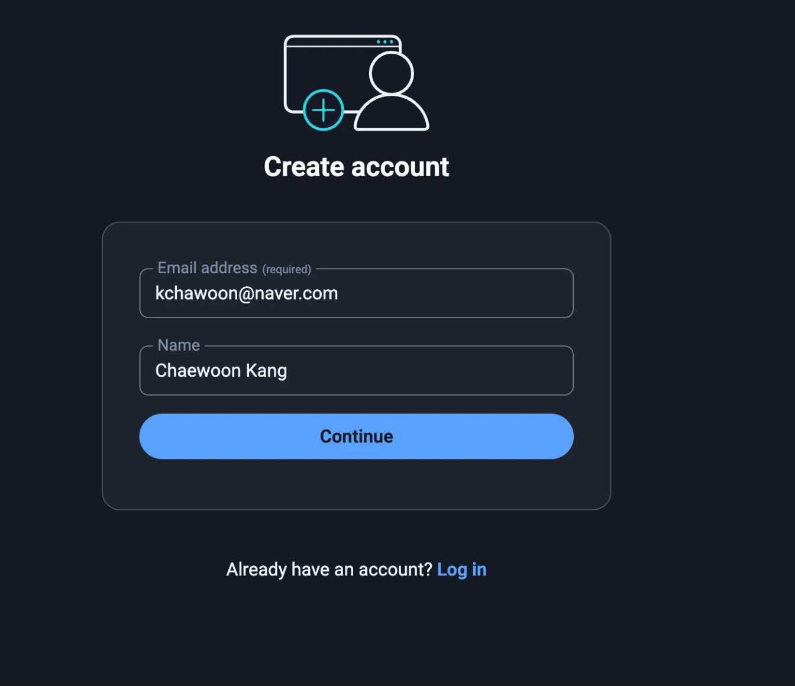

로그인한 뒤, Import Data에서 기존 비밀번호 데이터를 삽입한다.  
나는 iCloud KeyChain로부터 export한 데이터를 가져왔다.  
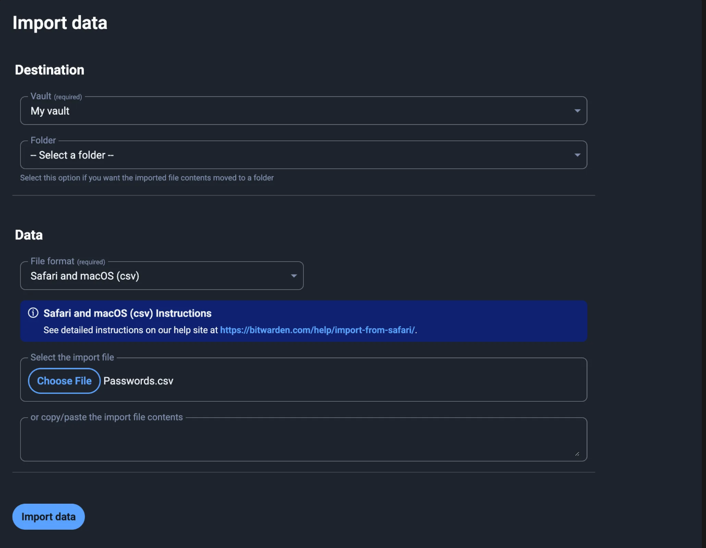

우선, 기본적인 vaultwarden서버 세팅이 완료되었다.  
그러나, 우린 이 서버에 안전하게 접근해야 한다!  

---
## 🌐 TailScale 세팅하기
TailScale은 WireGuard 프로토콜을 기반으로 한 분산 VPN 서비스이다.  
자세한 내용은 [이 게시글]()에서 확인가능하다.

[TailScale 공식 홈페이지](tailscale.com)에 접속한다.  
로그인 후, 정보를 입력한다.  

기기들에 클라이언트를 설치해서 연결해준다.  
여기서는 우선 핸드폰이랑 서버로 쓸 기기에 설치해주었다.  
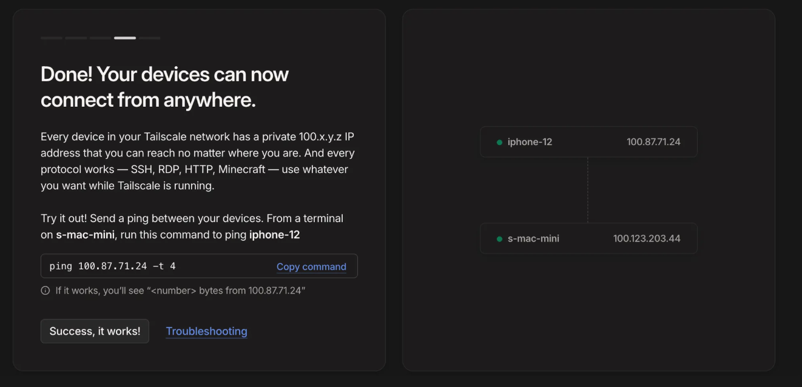

`ping`을 보내보자. 잘 보내닌다!
```bash
00:14:28 in ~/vaultwarden-sever on 🐳 v28.3.0
➜ ping 100.87.71.24 -t 4
PING 100.87.71.24 (100.87.71.24): 56 data bytes
64 bytes from 100.87.71.24: icmp_seq=0 ttl=64 time=98.555 ms
64 bytes from 100.87.71.24: icmp_seq=1 ttl=64 time=7.591 ms
64 bytes from 100.87.71.24: icmp_seq=2 ttl=64 time=74.451 ms
64 bytes from 100.87.71.24: icmp_seq=3 ttl=64 time=5.851 ms
^C
--- 100.87.71.24 ping statistics ---
4 packets transmitted, 4 packets received, 0.0% packet loss
round-trip min/avg/max/stddev = 5.851/46.612/98.555/40.796 ms
```

---
## ✅ HTTPS 세팅하기
이제 어디서나 홈서버와 내 다른 기기들은 서로 통신할 수 있게 되었다.  
Vaultwarden은 외부 클라이언트로부터 SSL/TLS연결을 요구한다. 
그러므로, https를 세팅해줘야 한다.  

### 도메인 설정 및 인증서 발급
TailScale의 대시보드에서 [DNS]에 들어간 뒤, MagicDNS가 켜져 있는지 확인한다.  
아래처럼 비활성화 버튼이 있다면 켜진 것이다.  
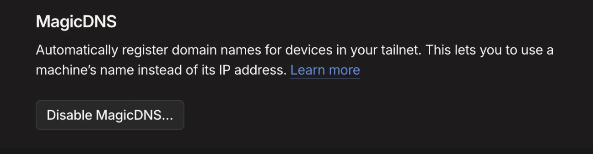

그 아래에 HTTPS Certificates가 있다.  
Enable HTTPS를 눌러주자..  
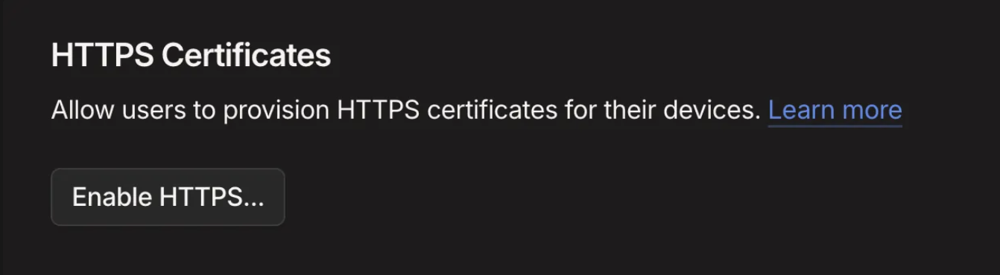
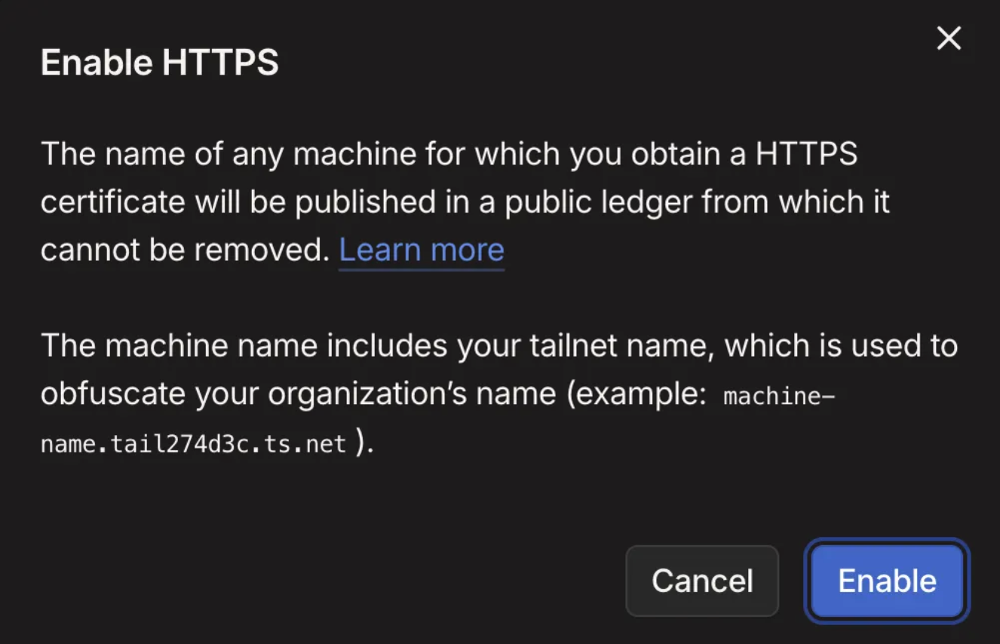

Let’s Encrypt에 의해 인증서가 발급되는데, 실제 인터넷에 도메인이 등록되는 것은 아니지만, Let’s Encrypt에 인증서 발행 장부에 기록된다고 한다.   
기본적으로 난독화를 위해 tailnet의 이름이 들어간다고 한다.  
`<host>.<tailnet_name>.ts.net` 과 같이 생성된다.  
그러나, tailnet의 이름은 커스텀 가능하다.

`tailscale cert` 명령으로 인증서를 발급받는다.

### Caddy를 리버스 프록시로 사용하기
Caddy는 고성능 리버스 프록시로, 간결한 설정 파일 구조를 가진다.  
또한, 인증서 갱신도 Tailscale과 조합이 좋다.  
단, 

`docker-compose.yaml`의 `services`의 하위에 다음을 추가한다.
```yaml
  caddy:
    container_name: caddy
    image: "caddy@sha256:87aa104ed6c658991e1b0672be271206b7cd9fec452d1bf3ed9ad6f8ab7a2348" # caddy 2.10.2 - linux/arm64/v8
    restart: "always"
    volumes:
      - "./caddy/caddy-data:/data"
      - "./caddy/conf:/etc/caddy"
      - "./caddy/certs:/certs:ro"
    ports:
      - "443:443"
      - "80:80"
    depends_on:
      - vaultwarden
```

`caddy/conf/Caddyfile`에 아래와 같이 작성한다: 
`tls`의 값에는 자신의 서버의 DNS주소를 써야 한다.  
```caddyfile
s-mac-mini.tail274d3c.ts.net {
    tls /certs/s-mac-mini.tail274d3c.ts.net.crt /certs/s-mac-mini.tail274d3c.ts.net.key

    log {
        level WARN
    }
    reverse_proxy vaultwarden:80
}
```

인증서를 `caddy/certs`에 옮겨주자.  
```bash
mv <host>.<tailnet_name>.ts.net.crt /caddy/certs/<host>.<tailnet_name>.ts.net.crt
mv <host>.<tailnet_name>.ts.net.key /caddy/certs/<host>.<tailnet_name>.ts.net.key
```

아래 사진의 좌물쇠표시에 주목하자. https가 성공적으로 적용되었다!  


아쉽게도, 맥미니 호스트 Tailscale + Caddy 컨테이너 조합으로는 인증서 자동 갱신을 할 수 없다.  
그래서, 아래와 같이 쉘 스크립트를 구성하여 cron에 등록하여 인증서를 자동갱신하도록 하였다.  
Tailscale이 발급받는 인증서의 유효기간은 90일이고, 30일 이내인경우에만 실제로 재발급해주며, 이외의 경우에는 같은 인증서를 발급 해준다.  
```bash
#! /bin/bash

set -euo pipefail

BIN="/usr/local/bin"
BASE_DIR="/Users/<you>/vaultwarden-server"
CERT_DIR="${BASE_DIR}/caddy/certs"
BASE_URL="<url>"
CERT="${BASE_URL}.crt"
KEY="${BASE_URL}.key"

TMPDIR=$(mktemp -d)

if ! tailscale cert --cert-file "${TMPDIR}/${CERT}" --key-file "${TMPDIR}/${KEY}" "${BASE_URL}"; then
    echo "tailscale cert failed"
    exit 1
fi

mv "${TMPDIR}/${CERT}" "${CERT_DIR}/${CERT}"
mv "${TMPDIR}/${KEY}" "${CERT_DIR}/${KEY}"
rm -rf "${TMPDIR}"

if ! docker exec caddy caddy reload --config /etc/caddy/Caddyfile --force; then
    echo "Caddy reload failed"
    exit 1
fi
```

이 방법 외에도, **Caddy container**를 tailnet에 가입시켜 운영할 수도 있다.  
여기서는 자동 인증서 갱신이 가능하다.  
여기서는 별도로 컨테이너를 가입시킨 형태를 원하진 않아서 이 방법을 사용하지 않았다.  
[Caddy-Tailscale](https://github.com/tailscale/caddy-tailscale)참조. 


---
## 📱 Bitwarden 클라이언트로 로그인해보기

### 모바일에서 로그인
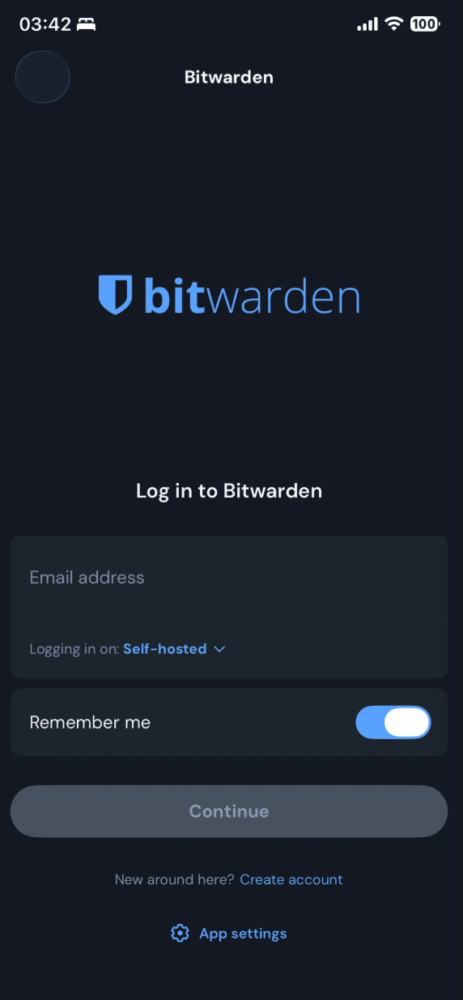
Bitwarden 앱을 다운로드 받고, **Self-hosted**를 선택하고 로그인하여 이용해주면 된다.  

### 브라우저 확장 프로그램
Bitwarden 확장프로그램을 다운받은 뒤, **Self-hosted**에서 로그인해주면 된다.  
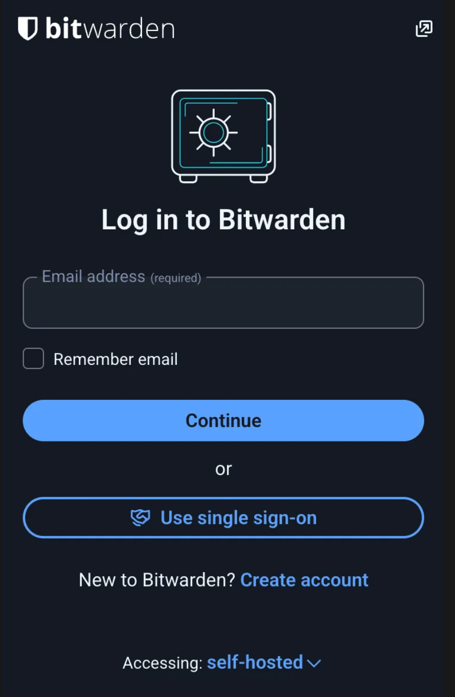

---
## 🫙 AWS S3에 백업하기(w. Terraform)
이제 다음문제는, 혹시 모를 상황에 대비하여 vaultwarden의 데이터를 백업하는 것이다.   
오브젝트 스토리지인 AWS S3(Simple Storage Service)를 이용하자.  
11-nines의 내구성을 자랑하며, 비용이 매우 저렴하다.  
여기서는 이틀간 S3 Standard 스토리지 클래스를 이용하다가, 이후 180일까지 S3 Glacier Deep Archive를 이용하는 정책을 이용하여 비용을 절감할 것이다. 

### IAM계정 생성 및 자격증명 등록
AWS 콘솔의 IAM에 접속해서, Terraform을 위한 IAM계정을 생성해서, 액세스 키를 만들어서 발급한 뒤, `aws configure`를 통해서 aws-cli에 자격증명을 넣는다.  

### backend 생성
아래와 같이 `backend.tf`를 작성한다:
```hcl
provider "aws" {
  region = "ap-northeast-2"
}

resource "aws_s3_bucket" "terraform_state" {
  bucket = "my-homeserver-backup" # 원하는 이름 지정

  lifecycle {
    prevent_destroy = true
  }
}

resource "aws_s3_bucket_versioning" "enabled" {
  bucket = aws_s3_bucket.terraform_state.id
  versioning_configuration {
    status = "Enabled"
  }
}

resource "aws_s3_bucket_server_side_encryption_configuration" "default" {
  bucket = aws_s3_bucket.terraform_state.id
  rule {
    apply_server_side_encryption_by_default {
      sse_algorithm = "AES256"
    }
  }
}

resource "aws_s3_bucket_public_access_block" "public_access" {
  bucket                  = aws_s3_bucket.terraform_state.id
  block_public_acls       = true
  block_public_policy     = true
  ignore_public_acls      = true
  restrict_public_buckets = true
}

resource "aws_dynamodb_table" "terraform_locks" {
  name         = "homeserver-backup-locks" # 원하는 이름 지정
  billing_mode = "PAY_PER_REQUEST"
  hash_key     = "LockID"
  attribute {
    name = "LockID"
    type = "S"
  }
}
```

벡엔드 저장소를 생성해준다:
```bash
terraform init
terraform apply
```

### S3, SNS, IAM생성
vaultwarden 데이터를 저장할 S3저장소와 SNS토픽, 자동화에 쓸 IAM계정을 생성한다.  
`main.tf`
```hcl
terraform {
  backend "s3" {
  }
}

// S3 bucket
resource "aws_s3_bucket" "vaultwarden_backup" {
  bucket = var.backup_bucket_name

  tags = {
    Name = "vaultwarden-backup-bucket"
  }

}

resource "aws_s3_bucket_server_side_encryption_configuration" "backup_sse" {
  bucket = aws_s3_bucket.vaultwarden_backup.id
  rule {
    apply_server_side_encryption_by_default {
      sse_algorithm = "AES256"
    }
  }
}

resource "aws_s3_bucket_public_access_block" "vault_public_access" {
  bucket                  = aws_s3_bucket.vaultwarden_backup.id
  block_public_acls       = true
  block_public_policy     = true
  ignore_public_acls      = true
  restrict_public_buckets = true
}

resource "aws_s3_bucket_lifecycle_configuration" "backup_lifecycle" {
  bucket = aws_s3_bucket.vaultwarden_backup.id

  rule {
    id     = "move-to-glacier"
    status = "Enabled"

    filter {
      prefix = ""
    }

    transition {
      days          = 2
      storage_class = "DEEP_ARCHIVE"
    }

    expiration {
      days = 180
    }
  }
}


// SNS
resource "aws_sns_topic" "email_notifications" {
  name = "noti-on-backup-failure-topic"
}

resource "aws_sns_topic_subscription" "admin_email_subscription" {
  topic_arn = aws_sns_topic.email_notifications.arn
  protocol  = "email"
  endpoint  = var.notification_email
}

// IAM user to backup
resource "aws_iam_user" "vw_backup_usr" {
  name = "vaultwarden-backup-usr"
  path = "/"

  tags = {
    Purpose   = "backup"
    Service   = "vaultwarden"
    ManagedBy = "terraform"
  }
}

data "aws_iam_policy_document" "vw_backup_min" {
  statement {
    sid       = "S3ListBucketForPrefix"
    actions   = ["s3:ListBucket", "s3:GetBucketLocation"]
    resources = [aws_s3_bucket.vaultwarden_backup.arn]

    condition {
      test     = "StringLike"
      variable = "s3:prefix"
      values   = ["*"]
    }
  }

  statement {
    sid       = "S3ListBucketMultipartUploads"
    actions   = ["s3:ListBucketMultipartUploads"]
    resources = [aws_s3_bucket.vaultwarden_backup.arn]
  }

  statement {
    sid = "S3ObjectCpOnly"
    actions = [
      "s3:GetObject",
      "s3:PutObject",
      "s3:AbortMultipartUpload",
      "s3:ListMultiPartUploadParts",
    ]
    resources = ["${aws_s3_bucket.vaultwarden_backup.arn}/*"]
  }

  statement {
    sid       = "SnsPublishOnly"
    actions   = ["sns:Publish"]
    resources = [aws_sns_topic.email_notifications.arn]
  }
}

resource "aws_iam_policy" "vw_backup_min" {
  name   = "vw-backup-minimal"
  policy = data.aws_iam_policy_document.vw_backup_min.json
}

resource "aws_iam_user_policy_attachment" "vw_backup_attach" {
  user       = aws_iam_user.vw_backup_usr.name
  policy_arn = aws_iam_policy.vw_backup_min.arn
}
```

적용하여 S3 + Dynamodb로 벡엔드를 관리하도록 리소스를 생성한다.

`backend.tf`(참고로, 위에랑 다르다. 변수화되어있는 것을 볼 수 있다.)
```hcl
provider "aws" {
  region = var.region
}

resource "aws_s3_bucket" "terraform_state" {
  bucket = var.state_bucket_name

  lifecycle {
    prevent_destroy = true
  }
}

resource "aws_s3_bucket_versioning" "enabled" {
  bucket = aws_s3_bucket.terraform_state.id
  versioning_configuration {
    status = "Enabled"
  }
}

resource "aws_s3_bucket_server_side_encryption_configuration" "default" {
  bucket = aws_s3_bucket.terraform_state.id
  rule {
    apply_server_side_encryption_by_default {
      sse_algorithm = "AES256"
    }
  }
}

resource "aws_s3_bucket_public_access_block" "public_access" {
  bucket                  = aws_s3_bucket.terraform_state.id
  block_public_acls       = true
  block_public_policy     = true
  ignore_public_acls      = true
  restrict_public_buckets = true
}

resource "aws_dynamodb_table" "terraform_locks" {
  name         = var.state_dynamodb_table
  billing_mode = "PAY_PER_REQUEST"
  hash_key     = "LockID"
  attribute {
    name = "LockID"
    type = "S"
  }
}
```

`variables.tf`
```hcl
variable "region" {
    description = "AWS region"
    type = string
    default = "ap-northeast-2"
}

variable "state_bucket_name" {
    description = "S3 bucket for Terraform state"
    type = string
}

variable "state_dynamodb_table" {
    description = "DynamoDB table for state locking"
    type = string
}

variable "backup_bucket_name" {
    description = "S3 bucket for Vaultwarden backup"
    type = string
}

variable "notification_email" {
    description = "Email address for SNS notification"
    type = string
}
```

`backend.hcl`에 값을 넣어주자.
```hcl
bucket         = # 처음에 정한 상태 벡엔드 버킷명
key            = # dynamodb lock을 위한 키
region         = # ap-northeast-2
dynamodb_table = # 처음에 정한 table name
encrypt        = # true
```

`terraform.tfvars`
```hcl
region               = # ap-northeast-2
state_bucket_name    = # 처음에 정한 상태 벡엔드 버킷명
state_dynamodb_table = # 처음에 정한 table name
backup_bucket_name   = # 백업버킷으로 할 이름
notification_email   = # 알림받을 이메일주소
```

바뀐 벡엔드로 상태를 이전시키고, 다시 적용시킨다:
```bash
terraform init
terraform apply
```

### 백업 스크립트
vaultwarden의 데이터를 자동으로 업로드하도록 해보자.  
아래는 vaultwarden컨테이너를 잠시 중단하고, 복사를 뜬 다음 다시 컨테이너를 실행시키고, 복사본을 압축하여 aws s3에 올리는 작업을 한다.  
이후, 결과를 sns토픽에 발행한다.  

최종적으로, 복사본 폴더와 압축파일을 정리한다.

이 스크립트를 cron에 등록해주었다.

```bash
#! /bin/bash

set -euo pipefail

BIN="/usr/local/bin"

BASE_DIR="/Users/<you>/vaultwarden-server"
BACKUP="vw-$(date +%F)"
S3_BUCKET="<s3 bucket>"
SNS_TOPIC="<sns topic arn>"

ZIPFILE="backup-${BACKUP}.tar.gz"


${BIN}/docker pause vaultwarden > /dev/null
tar -czf "${ZIPFILE}" -C "${BASE_DIR}" vw-data
${BIN}/docker unpause vaultwarden > /dev/null

if ${BIN}/aws s3 cp "${ZIPFILE}" "${S3_BUCKET}" --profile backup-manager > /dev/null; then
    ${BIN}/aws sns publish --topic-arn ${SNS_TOPIC} --message "Backup Success: ${ZIPFILE} at $(date)" --profile backup-manager
else
    ${BIN}/aws sns publish --topic-arn ${SNS_TOPIC} --message "Backup Failed: ${ZIPFILE} at $(date)" --profile backup-manager
    exit 1
fi

rm -f ${ZIPFILE}
```

스크립트에서 profile이 `backup-manager`인것을 알 수 있는데, 이 프로필을 쓰도록, 아까 Terraform으로 생성된 IAM계정에서 별도로 키를 발급받아서 
아래와 같은 형식으로 추가해주면 된다:

```ini
# ~/.aws/config
[default]
region = ap-northeast-2
output = yaml

[profile backup-manager]
region = ap-northeast-2
output = yaml
```

```ini
# ~/.aws/credentials
[default]
aws_access_key_id = ******
aws_secret_access_key = *****

[backup-manager]
aws_access_key_id = *****
aws_secret_access_key = ******
```

### SNS 연동 확인하기
SNS 가 보낼 이메일 대상에 이메일을 등록했으면, 확인 이메일이 와있을 것이다. 확인해주면 된다.  
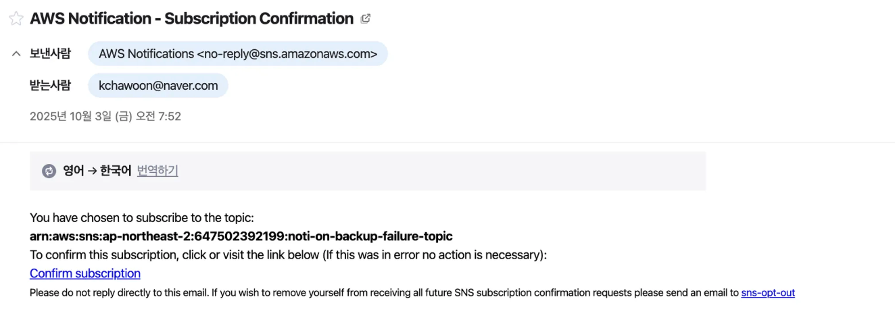

이제, 스크립트 실행 후 백업 결과가 이메일로 올 것이다!
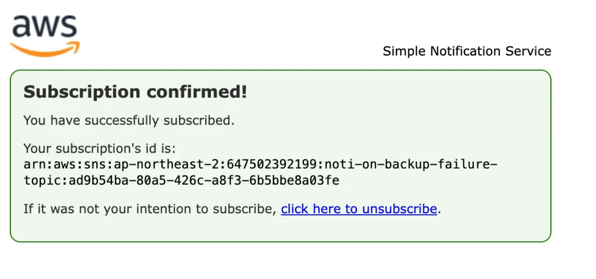

### gitignore
Terraform을 쓸 때는, 다음과 같은 파일들을 추적하지 않는 것이 좋다:
```gitignore
.terraform/
.DS_Store
*.tfstate
*.tfstate.backup
*tfvars
backend.hcl
```

---
## 🖥️ 모니터링

### node_exporter를 이용한 서버 자원 수집
node_exporter는 노드의 메트릭을 수집하는 프로그램이다.  
리눅스였다면 이것도 컨테이너로 띄워서 볼륨 마운트만 해주면 되지만, macOS에서는 컨테이너 대신 직접 데몬으로 띄우는 게 낫다.  

아래 명령어로 설치하고 실행해주자
```bash
brew install node_exporter
brew services start node_exporter
```

### Prometheus를 이용한 메트릭 수집
Prometheus는 주기적으로 각종 메트릭 데이터들을 수집해서 시계열 데이터베이스에 저장하고, Grafana등의 대시보드에서 이를 출력할 수 있다.  
`docker-compose.yaml`의 `services`의 요소로 아래를 넣어주자:
```yaml
  prometheus:
    container_name: prometheus
    image: "prom/prometheus@sha256:23031bfe0e74a13004252caaa74eccd0d62b6c6e7a04711d5b8bf5b7e113adc7" # prometheus 3.7.2 - linux/arm/v7
    restart: "always"
    volumes:
      - "./prometheus-data:/prometheus"
      - "./prometheus/prometheus.yml:/etc/prometheus/prometheus.yml"
    ports:
      - "9090:9090"
```

그 뒤, `prometheus/prometheus.yml`에 다음을 작성한다:
```yaml
global:
  scrape_interval: "15s" # 15초에 한번씩
  scrape_timeout: "10s" # 타임아웃 10초
  evaluation_interval: "1m" # Alert나 recording규칙 평가 (지금은 쓰이지 않음)

scrape_configs: # 메트릭 수집 경로
  - job_name: "prometheus" # 자신
    static_configs:
      - targets:
          - prometheus:9090
  - job_name: "node_exporter" # node_exporter
    static_configs:
      - targets:
          - "host.docker.internal:9100" # 컨테이너 내부가 아닌, 호스트 데몬이므로 이렇게 접근
  - job_name: "loki" # loki
    metrics_path: "/metrics"
    static_configs:
      - targets: ["loki:3100"]
```

### Promtail을 이용한 로그 포워딩
Promtail은 로그를 수집하여 로그 중앙 수집기로 보내는 역할을 한다.  
`docker-compose.yaml`의 `services`에 아래와 같이 추가한다:
```yaml
  promtail:
    container_name: promtail
    image: "grafana/promtail@sha256:086e4e85d2eb383fb04ea83c0f5074da81df56e415062ca888dba426abd8dfa5" # promtail 3.5 - linux/arm/v7
    restart: "always"
    volumes:
      - "/var/log:/var/log:ro"
      - "/var/lib/docker/containers:/var/lib/docker/containers:ro"
      - "./promtail/promtail-config.yml:/etc/promtail/config.yml"
      - "./promtail-positions/:/var/lib/promtail"
    command: "--config.file=/etc/promtail/config.yml"
```

`promtail/promtail-config.yml`에 아래와 같이 적는다:
```yaml
server: # listen port
  http_listen_port: 9080 
  grpc_listen_port: 0

clients: # 수집된 데이터를 보낼 대상
  - url: http://loki:3100/loki/api/v1/push

positions:
  filename: "/var/lib/promtail/positions.yaml"

scrape_configs:
  - job_name: system # 시스템 로그 가져오기
    static_configs:
      - targets:
          - localhost
        labels:
          job: varlogs
          host: host
          __path__: /var/log/*.log
  - job_name: docker # docker 컨테이너들 로그 가져오기
    static_configs:
      - targets:
          - localhost
        labels:
          job: docker
          __path__: /var/lib/docker/containers/*/*.log
```

추가로, `promtail-positions/positions.yaml`을 생성해놔준다.  
이는 책갈피 같은 역할을 하여, 이전까지 읽은 기록을 기반으로 컨테이너 재실행 시에도 추적할 수 있다.  
```bash
touch promtail/positions.yaml`
```

### Loki를 이용한 로그 중앙수집
Loki는 로그를 중앙수집해주는 역할을 한다.  
`docker-compose.yaml`에서 `services`에 아래를 추가한다:
```yaml
  loki:
    container_name: loki
    image: "grafana/loki@sha256:0eaee7bf39cc83aaef46914fb58f287d4f4c4be6ec96b86c2ed55719a75e49c8" # loki 3.5 - linux/arm/v7
    restart: "always"
    volumes:
      - "./loki-data:/loki"
      - "./loki/local-config.yaml:/etc/loki/local-config.yaml"
    ports:
      - "3100:3100"
```

`loki/local-config.yaml`을 생성하여 설정해준다:
```yaml
auth_enabled: false # 프로덕션 환경에서는 비추천.

server:
  http_listen_port: 3100 # 3100포트로 Listen

common: # 단일 노드, 메모리 기반 메타데이터 저장 클러스터 세팅(공유안함)
  ring:
    instance_addr: localhost
    kvstore:
      store: inmemory
  replication_factor: 1
  path_prefix: /loki

schema_config: # 저장 스키마 및 인덱싱. 시계열 + 파일시스템 기반.
  configs:
    - from: 2020-05-15
      store: tsdb
      object_store: filesystem
      schema: v13
      index:
        prefix: index_
        period: 24h

storage_config: # 실제 로그 청크 저장소 설정
  filesystem:
    directory: /loki/chunks
```

### Grafana Dashboard
Grafana는 여러 data sources로부터 대시보드를 꾸릴 수 있다.  
`docker-compose.yaml`의 `services`에 아래를 추가하자:
```yaml
  grafana:
    container_name: grafana
    image: "grafana/grafana@sha256:b882588a1b66697f1e444e798b15ecd810aba8ce430f98a3a4feecbab561a6b8" # grafana 12.3.0-18925857539 - linux/arm/v7
    restart: "always"
    volumes:
      - "./grafana-data:/var/lib/grafana"
    ports:
      - "3000:3000"
```

이제, 서버의 3000번 포트로 접속해보자:  
최초 사용자 id와 비밀번호는 admin/admin이다.  

Prometheus나 Loki등의 Data source를 가져올 수 있다.  
같은 docker network에 속해있으므로, service:port 엔드포인트를 통해서 연결할 수 있다.  
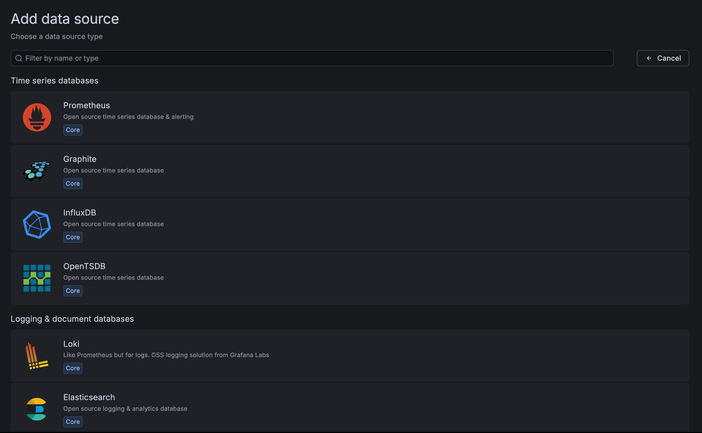

[Dashboards] - [New]를 통해서 새로운 대시보드를 만든다:
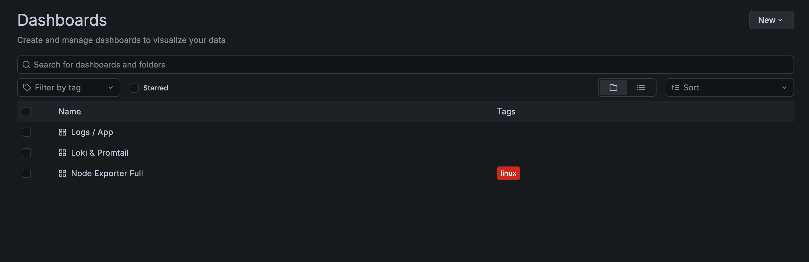

여기서는 기존에 이미 있는 탬플릿을 Import할것이다.
ID에 아래의 숫자를 넣으면 된다:

- 1860: Node Exporter Full  
노드의 컴퓨팅 자원 메트릭을 확인할 수 있다.
아쉽게도 맥에서는 완전한 지원이 안 되나 보다.
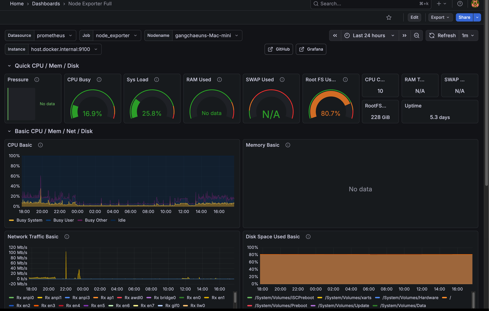

- 13639: Logs/App  
로그 데이터를 볼 수 있다.
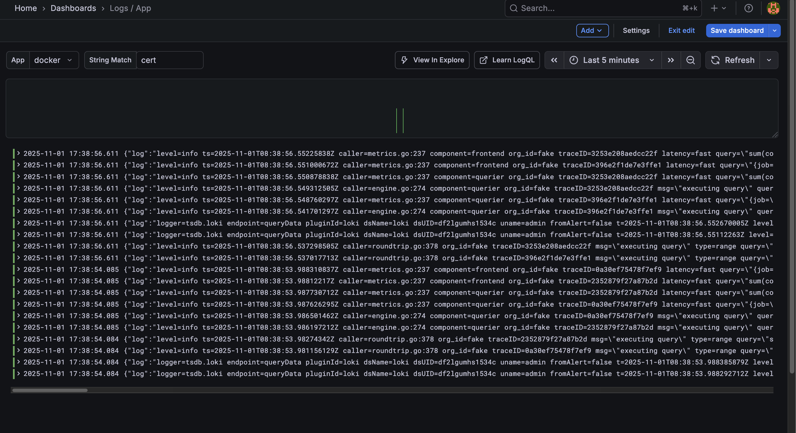

- 10880: Loki/Promtail  
로그 수집 상태를 볼 수 있다.
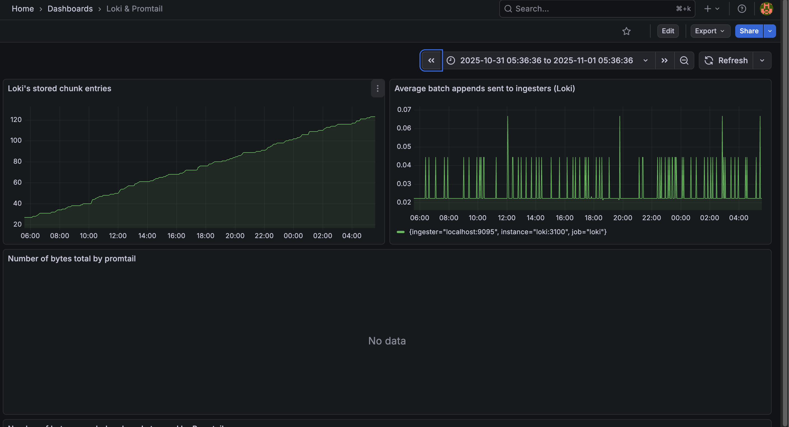

---
## 🫥 gitignore
세부 데이터들은 추적하지 않는 것이 좋다
```gitignore
/caddy
/vw-data
/promtail-positions
/loki-data
/grafana-data
/prometheus-data
.env
/backup
autobackup.sh
rerollcert.sh
```

---
## 🚀 실행하기
아래의 셀 스크립트를 이용해서 mac이 잠자기 모드에 빠지지 않게 실행되도록 했다:
```bash
#!/bin/bash

set -euo pipefail

echo "☕️ Keeping the Mac awake..."
caffeinate -i -s &

CAFFEINATE_PID=$!

echo "🐳 Starting docker containers..."
docker compose up -d

docker compose ps
echo "🚀 Containers are up! Enjoy it!"
echo -e "To stop: \033[31mkill ${CAFFEINATE_PID} && docker compose down \033[0m"
```

---
## 🏁 향후 고려할 업그레이드 사항
- 클라우드 백업 이중화: 최근 AWS 버지니아 북부 장애사건으로, 멀티클라우드의 중요성이 대두되고 있는데, 더 긴 주기로 한번씩 다른 클라우드 오브젝트 스토리지에 저장하는 것도 괜찮을 듯 하다.
- macOS에서의 node-exporter 지원이 시원찮아서 다른 대안을 이용해볼까 싶다..  예를 들면 influxDB + telegraf..
- AlertManager 추가
- Grafana Dashboard를 추가로 직접 구성
- 로그 데이터를 클라우드로
- 또 무언가 생각나면 추가해볼 예정이다..

당장은 시간이 부족하거나, 필요성을 잘 못느끼겠는 이유로 하지 못한 것들인데, 추가로 더 하고싶긴 하다.

---
## Repository
- [vaultwarden-server](https://github.com/fudoge/vaultwarden-server)
- [backup-infra-hcl](https://github.com/fudoge/vaultwarden-server-backup-infra)

