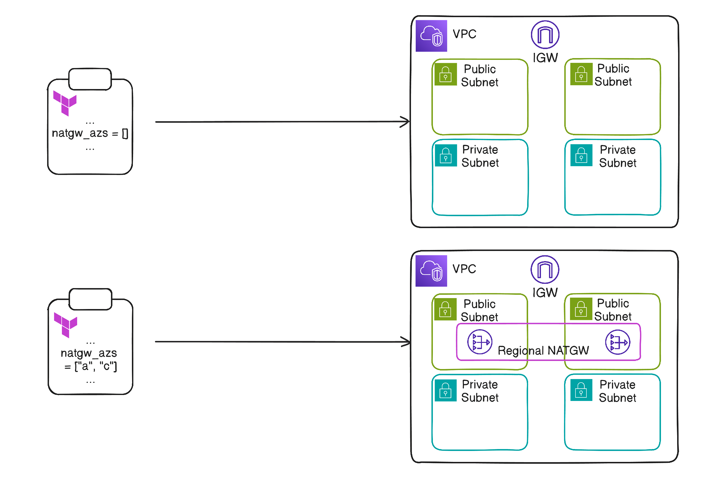

## 💰 서론

학교 캡스톤디자인에서, AWS 인프라를 풀로 가동할 예산에 무리가 있다. \
그러나, 실제 운영환경이 아닌, 개발 환경이며, 24/7로 가동할 이유가 없다. \
NAT Gateway는 프로비저닝되어있는 동안, 그 자체로 비용이 꽤 나가기에, 야간 등 팀이 작업하지 않을 때에는 닫아놓아도 된다. \
작업하지 않을 때 꺼두기만 해도 큰 지출을 줄일 수 있을 것이다.

## 💡 전략



NAT Gateway를 `natgw_azs`라는 변수를 통해 토글하면 된다. \
`natgw_azs`는 `list(string)`의 타입으로, Regional NAT Gateway의 EIP를 할당하는 az를 정하게 하는데, 만약 비어있다면, NAT Gateway와 관련 라우팅 테이블 엔트리를 생성하지 않으면 된다. \
만약 생성된 상태여도, 비우고 새로 apply하게 되면, 사라질 것이다. \
이러한 구조로 모듈을 설계하면, NAT Gateway와 라우팅 테이블 엔트리를 조건부터 생성할 수 있게 되고, 자동화 도구와 추후 연계하여 비용을 절감할 수 있을 것이다. 

## 🖥️ Terraform 코드

### Module

이 모듈은 `natgw_azs`가 한 개 이상의 요소를 가질 때 Regional NAT Gateway를 생성한다. \
`natgw_azs`가 비어있다면, NAT Gateway는 apply시에 없는 상태여야 한다.

```hcl
# main.tf
locals {
  nat_enabled = length(var.natgw_azs) > 0
}

#########
## VPC ##
#########
resource "aws_vpc" "vpc" {
  cidr_block           = var.cidr_block
  enable_dns_support   = true
  enable_dns_hostnames = true

  tags = {
    Name = "${var.cluster_name}-vpc"
  }
}

#############
## Subnets ##
#############
resource "aws_subnet" "public" {
  for_each = var.public_subnets

  vpc_id                  = aws_vpc.vpc.id
  cidr_block              = each.value.cidr
  availability_zone       = var.azs[each.value.az]
  map_public_ip_on_launch = false

  tags = {
    Name                                        = "${var.cluster_name}-public-subnet-${each.key}"
    "kubernetes.io/role/elb"                    = "1"
  }
}

resource "aws_subnet" "private" {
  for_each = var.private_subnets

  vpc_id                  = aws_vpc.vpc.id
  cidr_block              = each.value.cidr
  availability_zone       = var.azs[each.value.az]
  map_public_ip_on_launch = false

  tags = {
    Name                                        = "${var.cluster_name}-private-subnet-${each.key}"
    "kubernetes.io/role/internal-elb"           = "1"
  }
}

resource "aws_subnet" "db" {
  for_each = var.db_subnets

  vpc_id                  = aws_vpc.vpc.id
  cidr_block              = each.value.cidr
  availability_zone       = var.azs[each.value.az]
  map_public_ip_on_launch = false

  tags = {
    Name = "${var.cluster_name}-db-subnet-${each.key}"
  }
}

#################
## IGW & NATGW ##
#################
resource "aws_internet_gateway" "igw" {
  vpc_id = aws_vpc.vpc.id

  tags = {
    Name = "${var.cluster_name}-igw"
  }
}

# Create EIPs for each azs
resource "aws_eip" "regional_nat" {
  for_each = local.nat_enabled ? toset([
    for az in var.natgw_azs : var.azs[az]
  ]) : []

  domain = "vpc"

  tags = {
    Name = "${var.cluster_name}-regional-nat-${each.key}"
  }
}

# NAT Gateway: created when len(natgw_azs) > 0
resource "aws_nat_gateway" "regional_natgw" {
  count = local.nat_enabled ? 1 : 0

  vpc_id            = aws_vpc.vpc.id
  availability_mode = "regional"

  # Associate EIP alloc & NATGW
  dynamic "availability_zone_address" {
    for_each = aws_eip.regional_nat

    content {
      availability_zone = availability_zone_address.key
      allocation_ids    = [availability_zone_address.value.id]
    }
  }

  tags = {
    Name = "${var.cluster_name}-regional-natgw"
  }
}

###############################
## Route Table & Association ##
###############################
resource "aws_route_table" "public_rtb" {
  vpc_id = aws_vpc.vpc.id
  route {
    cidr_block = "0.0.0.0/0"
    gateway_id = aws_internet_gateway.igw.id
  }
  tags = {
    Name = "${var.cluster_name}-public-rtb"
  }
}

resource "aws_route_table" "private_rtb" {
  vpc_id = aws_vpc.vpc.id

  # Create route entry for NATGW if presents
  # aws_nat_gateway.regional_nat returns array, because of `count`
  dynamic "route" {
    for_each = local.nat_enabled ? [1] : []

    content {
      cidr_block     = "0.0.0.0/0"
      nat_gateway_id = aws_nat_gateway.regional_natgw[0].id
    }
  }

  tags = {
    Name = "${var.cluster_name}-private-rtb"
  }
}

resource "aws_route_table" "db_rtb" {
  vpc_id = aws_vpc.vpc.id

  tags = {
    Name = "${var.cluster_name}-db-rtb"
  }
}

resource "aws_route_table_association" "public_rtb" {
  for_each       = aws_subnet.public
  subnet_id      = each.value.id
  route_table_id = aws_route_table.public_rtb.id
}

resource "aws_route_table_association" "private_rtb" {
  for_each       = aws_subnet.private
  subnet_id      = each.value.id
  route_table_id = aws_route_table.private_rtb.id
}

resource "aws_route_table_association" "db_rtb" {
  for_each       = aws_subnet.db
  subnet_id      = each.value.id
  route_table_id = aws_route_table.db_rtb.id
}
```

```hcl
# variables.tf
variable "cluster_name" {
  description = "Kubernetes cluster name for prefix"
  type        = string
}

variable "azs" {
  description = "Availability zone aliases"
  type        = map(string)
}

variable "cidr_block" {
  description = "CIDR block for vpc."
  type        = string
}

variable "public_subnets" {
  description = "Public subnets"
  type = map(object({
    cidr = string
    az   = string
  }))
}

variable "private_subnets" {
  description = "Private subnets"
  type = map(object({
    cidr = string
    az   = string
  }))
}

variable "db_subnets" {
  description = "DB subnets"
  type = map(object({
    cidr = string
    az   = string
  }))
}

variable "natgw_azs" {
  description = "EIP alloc az for NATGW"
  type        = list(string)
}
```

### Usage

아래는 모듈을 사용하는 예시이다.
`natgw_azs`를 조절하여 NAT Gateway를 토글할 수 있다.

```hcl
# main.tf

#######
# VPC #
#######
module "vpc" {
  source       = "../../../modules/vpc"
  cluster_name = var.cluster_name
  cidr_block   = local.vpc_cidr
  azs = {
    a = "ap-northeast-2a"
    c = "ap-northeast-2c"
  }
  public_subnets = {
    a = {
      cidr = "10.1.0.0/24"
      az   = "a"
    }
    c = {
      cidr = "10.1.1.0/24"
      az   = "c"
    }
  }
  private_subnets = {
    a = {
      cidr = "10.1.100.0/24"
      az   = "a"
    }
    c = {
      cidr = "10.1.101.0/24"
      az   = "c"
    }
  }
  db_subnets = {
    a = {
      cidr = "10.1.200.0/24"
      az   = "a"
    }
    c = {
      cidr = "10.1.201.0/24"
      az   = "c"
    }
  }
  # When reducing the number of NAT gateway AZs,
  # it is safer to first set `natgw_azs` to an empty list and apply,
  # then recreate the NAT gateway with the desired AZs.
  natgw_azs = ["a", "c"]
}
```

## 📚 References

- [Terraform Registry - AWS NAT Gateway](https://registry.terraform.io/providers/hashicorp/aws/latest/docs/resources/nat_gateway)
- [Module Source Code (GitHub)](https://github.com/Hallym-Workerbees/hivewiki-infra/blob/main/modules/vpc/main.tf)
