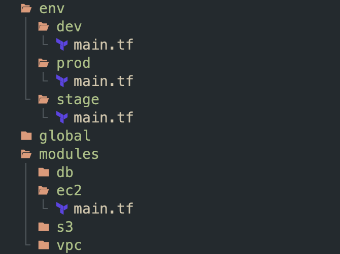
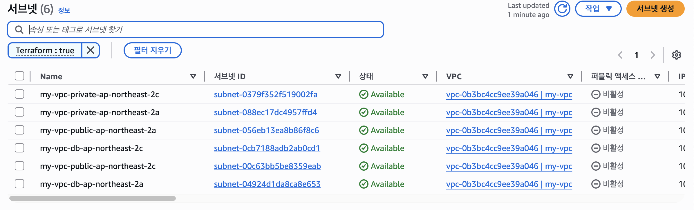

## 🧱 모듈
Terraform은 기본적으로 현재 디렉토리에 있는 모든 `.tf`파일들을 불러와서, 하나의 구성 파일로 보고 의존 관계를 정리한 뒤, 자원을 순서에 맞게 생성한다.  
이렇게 구성된 것들을 재사용할 수는 없을까?  

**모듈을 이용하면 코드를 재사용할 수 있다.**   
모듈은 재사용, 유지 관리 및 테스트 가능한 Terraform 코드를 작성하는 핵심 요소이다.  

모듈은 조직 내에서 공유될 수도 있고, 온라인에 배포되어 사용될 수도 있다.  

**폴더에 있는 모든 Terraform 구성 파일 세트는 모듈이다.**  
모듈에서 직접 실행되면, 루트 모듈이라고 한다.  
보통 모듈의 구성은 프로젝트의 `modules/<리소스 종류>`에 정의된다.  

### 모듈 정의 및 사용 예시

간단한 EC2 서버 모듈을 하나 만들어보자.

```hcl
# modules/ec2/main.tf

provider "aws" {
  region = "ap-northeast-2"
}

resource "aws_instance" "example" {
  ami                    = "ami-08943a151bd468f4e" # Ubuntu 22.04
  instance_type          = var.instance_type
  vpc_security_group_ids = [aws_security_group.example_sg.id]

  user_data = <<-EOF
  #!/bin/bash
  apt-get update -y
  apt-get install -y apache2
  echo "<h2> Hello World! </h2>" > /var/www/html/index.html
  systemctl enable apache2
  systemctl start apache2
  EOF

  user_data_replace_on_change = true

  tags = {
    "Name" = "ec2"
    "environment" = var.environment
  }
}

resource "aws_security_group" "example_sg" {
  name   = "myweb-sg"
  vpc_id = data.aws_vpc.default.id

  ingress {
    from_port   = 80
    to_port     = 80
    protocol    = "tcp"
    cidr_blocks = ["0.0.0.0/0"]
  }

  egress {
    from_port   = 0
    to_port     = 0
    protocol    = "-1"
    cidr_blocks = ["0.0.0.0/0"]
  }
}

data "aws_vpc" "default" {
  default = true
}

variable "instance_type" {
  type = string # default가 없으면 required이다.  
}

variable "environment" {
  type = string
  default = "dev" # default가 있으면 optional하다. 
}
```

그 뒤, 이런 식으로 사용하면 된다:
```hcl
module "myserver" {
  source = "./modules/ec2" # 디렉토리를 맞춰줘야 한다.

  instance_type = "t3.micro" # instance_type은 required이므로, 반드시 선언해야 한다.
}
```

모듈에는 변수를 지정해서 자리를 만들어놓고, 
모듈을 사용하는 시스템에서 변수를 지정해서 사용하면 된다.  

적용해보자. 모듈의 추가 또는 관련 정보를 바꿀 때에도 `init`이 필요하다. 
```bash
terraform init
terraform apply
```


### 모듈 output 사용하기

출력 변수를 사용하여 퍼블릭 IP를 출력하게 할 수는 없을까? 물론 가능하다.  
그러나, 이중으로 출력 작업이 필요하다.  
모듈 정의에서 출력하고, 사용하는 루트 모듈에서 출력해야 한다.  
**모듈은 캡슐화되어있기 때문이다.**  

`modules/helloserver/main.tf`에 아래 스니펫을 추가하자.
```hcl
output "public_ip" {
  description = "The public IP address of the EC2 instance"
  value       = aws_instance.example.public_ip
}

```

그리고, 루트 모듈에도 정의해주자.
```hcl
output "public_ip" {
  value = module.myserver.public_ip
}
```

다시 적용해보자. 
```bash
➜ terraform apply -auto-approve
module.myserver.data.aws_vpc.default: Reading...
module.myserver.data.aws_vpc.default: Read complete after 1s [id=vpc-063724386f9ff7382]
module.myserver.aws_security_group.example_sg: Refreshing state... [id=sg-0290d12641c27eac8]
module.myserver.aws_instance.example: Refreshing state... [id=i-09e6320eba5984532]

Changes to Outputs:
  + public_ip = "52.78.5.192"

You can apply this plan to save these new output values to the Terraform state, without changing any real infrastructure.

Apply complete! Resources: 0 added, 0 changed, 0 destroyed.

Outputs:

public_ip = "52.78.5.192"

➜ curl $(terraform output -raw public_ip)
<h2> Hello World! </h2>
```

### local 변수
그러면, 모든 변수를 외부 루트 모듈에서의 사용으로부터 받아야 할까?  
모듈 정의 내부에서만 편리하게 재사용할 수 있는 방법은 없을까?  
이러한 문제를 해결해주는 것이 `local`변수이다.  

아래 예시를 참고하자. 포트 번호를 `local`변수로 사용하고 있다.  

```hcl
provider "aws" {
  region = "ap-northeast-2"
}

resource "aws_instance" "example" {
  ami                    = "ami-08943a151bd468f4e" # Ubuntu 22.04
  instance_type          = var.instance_type
  vpc_security_group_ids = [aws_security_group.example_sg.id]

  user_data = <<-EOF
  #!/bin/bash
  apt-get update -y
  apt-get install -y apache2
  echo "<h2> Hello World! </h2>" > /var/www/html/index.html
  systemctl enable apache2
  systemctl start apache2
  EOF

  user_data_replace_on_change = true

  tags = {
    "Name" = "ec2"
    "env"  = var.environment
  }
}

resource "aws_security_group" "example_sg" {
  name   = "myweb-sg"
  vpc_id = data.aws_vpc.default.id

  # local은 이렇게 사용할 수 있다.
  ingress {
    from_port   = local.port
    to_port     = local.port
    protocol    = "tcp"
    cidr_blocks = ["0.0.0.0/0"]
  }

  egress {
    from_port   = 0
    to_port     = 0
    protocol    = "-1"
    cidr_blocks = ["0.0.0.0/0"]
  }
}

data "aws_vpc" "default" {
  default = true
}

# 로컬 변수 정의
locals {
  port = 80
}

variable "instance_type" {
  type = string
}

variable "environment" {
  type = string
}

output "public_ip" {
  description = "The public IP address of the EC2 instance"
  value       = aws_instance.example.public_ip
}
```


### 환경 나눠보기
dev, stage, prod등의 여러 환경으로 나눌 때, 모듈은 용이하다.  
아래와 같이 구성을 할 수 있겠다(예시일 뿐이다):


이렇게 구성한 뒤, 각 환경에서 모듈에 각각 상이하게 입력변수들을 넣어서 사용하면 되겠다.  
- `global`과 같은 곳에는 IAM 등을 것을 정의하면 좋겠고,  
- `tfstate`도 환경별로 원격 저장 벡엔드를 분리하면 좋을 것이다. 

--- 
## 🏷️ 모듈 버저닝
이전에는 로컬에 버전을 참조하고 있는데, 대신 모듈을 **VCS(Version Control System)** 등에서 관리하도록 하면 더욱 편할 것이다.  
모듈에 `git tag`등으로 버전 지정이 가능해지고, 모듈과 실제 환경들의 각 루트 모듈과의 분리된 저장으로 더욱 유연한 관리가 가능하다.  

Terraform의 모듈은 Git, HTTPS등의 여러 모듈 리소스를 지원한다.  
모듈을 별도의 레포지토리로 구성하여 이와 같이 커밋 및 푸시해주면 된다.  
```bash
cd modules/ec2
git init
git add .
git commit -m "Initial commit"
git remote add origin "(URL OF REMOTE REPOSITORY)"
git push origin main
```

아래와 같이 `git tag`를 달아줄 수도 있다:

```bash
git tag -a "v0.0.1" -m "First Tag"
git push --follow-tags
```

이제, 리포트 레포지토리로부터 가져올 수 있다:
```hcl
module "myserver" {
  source = "github.com/<user>/<repo>//ec2?ref=v0.0.1"
  instance_type = "t3.micro"
  environment = "prod"  
}
```

여기서 `terraform init`을 하면, 다운로드를 받는 것을 알 수 있다.    
로컬 모듈을 제외하고, 원격 모듈이나 외부 모듈을 사용하는 경우, 반드시 다운받는다.  

이러한 방법을 사용하면, 모듈을 업데이트하고 리모트 레포지토리에 푸시된 이후, 태그만 잘 업데이트된다면, 여러 버전의 모듈들을 사용할 수 있다.  

---
## 🌐 외부 모듈 사용하기

[Terraform Registry](https://registry.terraform.io)에는 다양한 모듈들이 올라와 있다.  
이곳에서 여러 모듈을 사용할 수 있다.  

예를 들어, [AWS의 VPC 모듈](https://registry.terraform.io/modules/terraform-aws-modules/vpc/aws/latest)을 사용한다고 해보자.   
두 개의 가용영역을 사용하고, 각각 퍼블릭 서브넷, 프라이빗 서브넷, DB 서브넷을 하나씩 만들어 줄 것이다.  


```hcl
module "vpc" {
  source  = "terraform-aws-modules/vpc/aws"
  version = "6.0.1"

  name = "my-vpc"
  cidr = "10.0.0.0/16"

  azs              = ["ap-northeast-2a", "ap-northeast-2c"]
  public_subnets   = ["10.0.1.0/24", "10.0.2.0/24"]
  private_subnets  = ["10.0.101.0/24", "10.0.102.0/24"]
  database_subnets = ["10.0.201.0/24", "10.0.202.0/24"]

  # Single NAT Gateway setup
  enable_nat_gateway     = true
  single_nat_gateway     = false
  one_nat_gateway_per_az = true

  tags = {
    Terraform   = "true"
    Environment = "dev"
  }
}
```

초기화 후 적용해보자:
```bash
terraform init
terraform apply
```


잘 만들어진 것을 볼 수 있다!  


---
## 📚 요약
- Terraform은 현재 디렉토리의 모든 `.tf`파일들을 읽어서 하나의 구성으로 간주하는데, 이 하나의 단위를 모듈이라고 한다.  
- 루트 모듈에서 여러 모듈들을 꺼내서 쓸 수 있다.  
- git, https등 여러 방법으로 모듈을 가져올 수 있고, Terraform Registry등의 외부 모듈도 사용이 가능하다  
- 모듈을 통해 반복되는 자원 정의를 재사용할 수 있고, 특히 환경 분리에 용이하다. 
