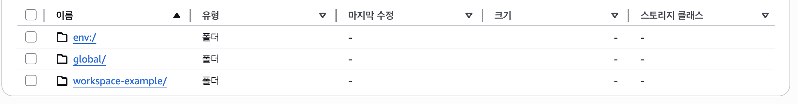
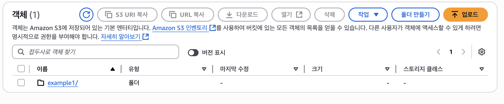
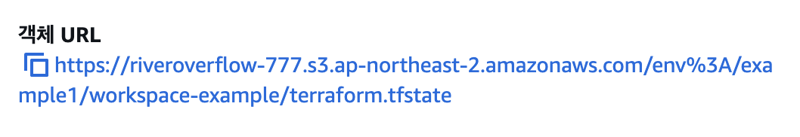
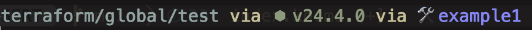
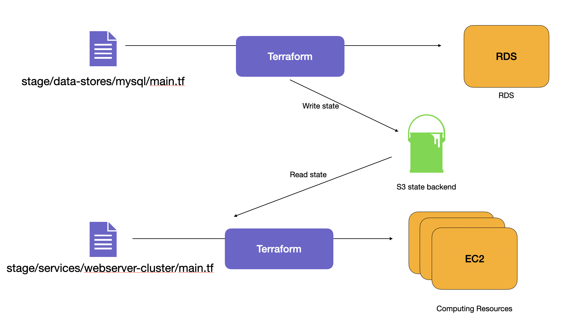
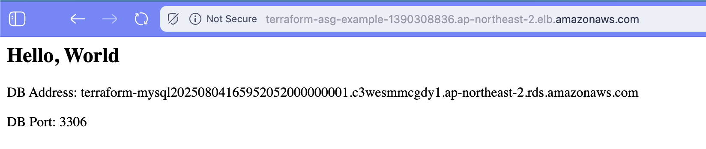

## 💜 State

Terraform을 실행할 때마다, 생성된 인프라에 대한 정보가 기록된다.  
실행된 곳에서 `terraform.tfstate`파일을 생성한다.  

구성 파일의 Terraform의 리소스에서 실제 리소스 표현으로의 매핑을 기록하는 JSON이 포함되어 있다.  

상태 파일은 비공개 API로, 직접 편집하면 안된다.  
상태를 조작해야 하는 경우, `terraform import` 또는 `terraform state`명령을 사용해야 한다.  

개인 프로젝트에서는 로컬에 `terraform.tfstate`를 저장하고 사용하는 것은 별 문제가 없다.  
그러나, 실제 프로덕션에서 협업하는 경우, 일부 문제에 직면하게 된다.  
- **상태 파일을 위한 공유 저장소**
state는 공유된 위치에 저장되어야 한다.
- **상태 파일 잠금**
동시성 문제가 생길 수 있다.
- **상태 파일 격리**
또한, test, production등 환경의 격리가 필요하다.

---
## 📦 상태 파일을 위한 공유 저장소

### 원격 벡엔드 사용하기
공통의 저장소가 필요하지만, Git과 같은 버전 컨트롤에 맡기는 것은 좋지 않다.  
다음의 문제가 있기 때문이다:  
- **수동작업 오류**
버전 제어에서 최신 변경사항을 풀다운하거나 실행한 후 버전 제어에 최신 변경 사항을 푸시하는 것을 잊어버리기 쉽다
- **잠금**
동시적인 apply시의 잠금을 제공하지 않아 위험하다.
- **비밀(secret)**
상태 파일의 모든 데이터는 일반 텍스트로 저장되기에, private하게 저장할 방법이 필요하다.

가장 좋은 방법은, **Terraform에서 제공하는 원격 벡엔드 지원** 을 사용하는 것이다.  
Terraform 벡엔드는 Terraform이 상태를 저장하고 불러오는 방법을 결정한다.  
기본 벡엔드는 로컬에 저장하는 로컬 벡엔드인데, 원격 벡엔드를 이용하면 상태 파일을 원격 공유 저장소에 저장할 수 있다.  
위의 문제점들을 모두 해결한다.  

**AWS의 경우, S3와 DynamoDB를 이용하여 원격 벡엔드를 구성할 수 있다.**  
AWS S3는 다음의 이점이 있다:
- 관리형 서비스로, 매우 편리
- 11-nines(99.999999999%)의 가용성 보장
- 암호화를 지원(via KMS)
- DynamoDB를 통한 잠금 지원
- 버전 관리 지원
- 저럼한 가격


```hcl
provider "aws" {
  region = "ap-northeast-2"
}

resource "aws_s3_bucket" "terraform_state" {
  bucket = "YOUR_BUCKET_NAME" # 고유해야 함

  lifecycle {
    prevent_destroy = true # 중요한 리소스의 삭제 보호
  }
}

# 버저닝 활성화
resource "aws_s3_bucket_versioning" "enabled" {
  bucket = aws_s3_bucket.terraform_state.id
  versioning_configuration {
    status = "Enabled"
  }
}

#디폴트로 서버 측 암호화 활성화
resource "aws_s3_bucket_server_side_encryption_configuration" "default" {
  bucket = aws_s3_bucket.terraform_state.id
  rule {
    apply_server_side_encryption_by_default {
      sse_algorithm = "AES256"
    }
  }
}

#퍼블릭 액세스 허용
resource "aws_s3_bucket_public_access_block" "public_access" {
  bucket                  = aws_s3_bucket.terraform_state.id
  block_public_acls       = true
  block_public_policy     = true
  ignore_public_acls      = true
  restrict_public_buckets = true
}


# dynamoDB 설치
resource "aws_dynamodb_table" "terraform_locks" {
  name         = "terraform-locks"
  billing_mode = "PAY_PER_REQUEST"
  hash_key     = "LockID"
  attribute {
    name = "LockID"
    type = "S"
  }
}
```
이 구조는 **실제 tfstate가 S3에 저장되고, DynamoDB가 엑세스를 요청받아 상태의 lock을 관리** 하도록 하고 있다.

이제, 명령을 실행하여 적용해보자.
```bash
terraform init
terraform apply
```

배포되면, 이제 벡엔드를 원격으로 옮기자.  
`main.tf`의 맨 앞에 벡엔드 설정을 해주자.

```hcl
terraform {
  backend "s3" {
    bucket         = "riveroverflow-777"           # 버킷 네임
    key            = "global/s3/terraform.tfstate" # 저장하는 tfstate의 key
    region         = "ap-northeast-2"
    dynamodb_table = "terraform-locks" # DynamoDB 테이블
    encrypt        = true                # 암호화 켬
  }
}
```

다시 초기화하면, 벡엔드가 이제 S3에 저장된다.  


---
## ❗️ 주의 사항
이렇게 구성하면, 여러 주의 사항이 있다.

### Terraform과 State 순서
구성할 때에는 아래와 같이 사용해야 한다:
1. Terraform 코드를 작성하여 S3버킷과 DynamoDB 테이블 생성 후, 로컬 벡엔드 잠시 사용
2. 새로 생성된 S3버킷 및 DynamoDB를 쓰도록 구성 추가 후 상태를 S3에 복사

삭제할 때에는 다음과 같다:
1. Terraform 코드로 이동하여 벡엔드 구성 제거 후, 다시 `init`하여 복사
2. `terraform destroy`로 실행하여 자원 정리

약간 어색한 구조일 수 있으나, 처음에만 잘 구성해놓으면 유용하다. 


### 변수나 참조
**벡엔드 블록에서는 변수나 참조의 사용이 불가능** 하다.  
즉, 아래처럼 사용할 수 없다: 
```hcl
# This will NOT work. Variables aren't allowed in a backend configuration.
terraform {
  backend "s3" {
    bucket = var.bucket
    region = var.region
    dynamodb_table = var.dynamodb_table
    key = "example/terraform.tfstate"
    encrypt = true
  }
}
```

이러면, 값을 할당할 때, 반복적인 작업이 생길 수 있는데, 이를 줄이려면, 부분 구성을 하면 된다.  
예를 들어, `bucket`, `region`등의 인수를 `backend.hcl`에 추출할 수 있다.  
```hcl
# backend.hcl
bucket = "terraform-state-ID"
region = "ap-northeast-2"
dynamodb_table = "terraform-locks"
encrypt = true
```

벡엔드 구성은 아래처럼 간단해진다:
```hcl
terraform {
  backend "s3" {
    key = "example/terraform.tfstate"
  }
}
```

그 뒤, 이렇게 초기화하면 된다:  
```bash
terraform init -backend-config=backend.hcl
```

그러나, 여전히 모든 모듈에서 고유 키 값을 수동으로 설정해야 하는 점은 있다.  

또 다른 방법은, Terragrunt를 사용하는 방법이 있으나, 지금 다루지는 않는다.  

---
## 🎭 상태 파일 환경 격리

개발, 스테이징, 프로덕션 등의 환경을 격리할 필요가 있다.  
방법에는 두 가지가 있다:
- 작업 공간을 통한 격리
- 파일 레이아웃을 통한 격리

---
## 🛠️ Workspace를 통한 격리
workspace를 이용하면 별도의 이름이 지정된 여러 작업공간에 저장가능하다.  
Terraform은 `default`라는 기본 작업 공간에서 시작한다.  


인스턴스를 하나 띄워보자.  아래와 같이 간단하게 띄워보자.
```hcl
terraform {
  backend "s3" {
    bucket         = "YOUR_BUCKET_NAME"
    key            = "workspace-example/terraform.tfstate"
    region         = "ap-northeast-2"
    dynamodb_table = "terraform-locks"
    encrypt        = true
  }
}

provider "aws" {
  region = "ap-northeast-2"
}

resource "aws_instance" "example" {
  ami           = "ami-08943a151bd468f4e"
  instance_type = "t3.micro"
}

```


적용까지 해주자.
```bash
terraform init
terraform apply
```

현재 workspace를 확인해보자.  
```bash
➜ terraform workspace show
default
```

새로 구성해보자.
```bash
➜ terraform workspace new example1
Created and switched to workspace "example1"!

You're now on a new, empty workspace. Workspaces isolate their state,
so if you run "terraform plan" Terraform will not see any existing state
for this configuration.
```


다시 적용해보자. 새로 생긴다는 것을 알 수 있다.
```bash
terraform apply
```

이제, AWS 콘솔에서 확인해보자.  


`env:/`안으로 들어오니, workspace 이름이 있는 것을 확인할 수 있다. 



계속해서 안으로 들어가서, `tfstate`를 확인할 수 있다.



그러나, workspace를 쓰는 건 다음의 단점들이 존재한다: 
- 모든 상태 파일이 동일한 벡엔드를 사용  
동일한 인증 및 엑세스 제어를 이용한다는 뜻
- CLI에서 네임스페이스의 표시가 잘 되지 않음  
혼동 가능성 있음
물론, 아래와 같이 일부 표시되는 경우도 있다.  아래는 `spaceship prompt`라는 zsh 테마를 설정한 기준이다.  



그래서, 실제로는 파일 레이아웃 기반의 분리가 더 잘 쓰인다.   

이제 위 자원 및 워크스페이스는 정리하자.. 
```bash
terraform destroy -auto-approve # example1 자원정리
terraform workspace select default # 다시 디폴트로 복귀
terraform workspace delete example1 # 워크스페이스 제거
terraform destroy -auto-approve # default 자원정리
```

다시 S3 버킷을 확인하면, `example1`의 `tfstate`가 삭제된걸 볼 수 있다. 


---
## 📂 파일 레이아웃을 통한 격리
**각 환경의 구성 파일을 별도의 폴더에 저장하는 방식이다.**  
그 뒤, 서로 인증 메커니즘과 액세스 제어를 사용하여 각 환경별로 서로 다른 벡엔드를 구성할 수 있다.  
**배포환경이 훨씬 명확해지고, 별도의 인증 메커니과 함께 별도의 상태 파일을 사용하면 한 환경에서 문제가 발생할 가능성이 훨씬 줄어든다.**  
실제로, 격리 개념을 “구성 요소”수준까지 가져갈 수 있다.   
예를 들어, 네트워크 관련 설정은 자주 바뀌지 않는데 같이 관리되다가 손상될 수 있다.  
각 환경과 해당 환경 내의 각 구성 요소에 대해 별도의 Terraform 폴더를 사용하는 것이 좋다.  

일반적인 환경은 다음과 같다:
- `stage`: 사전 프로덕션 워크로드를 위한 환경(테스트)
- `prod`: 프로덕션 워크로드를 위한 환경(사용자 대상 애플리케이션)
- `mgmt`: DevOps도구 환경(Bastion host, CI 서버)
- `global`: 모든 환경에서 사용되는 리소스를 보관

각 환경 내의 구성 요소는 다음과 같다:
- `vpc`: 네트워크 토폴로지
- `services`: 앱 또는 마이크로서비스
- `data-storage`: 데이터베이스
등등..

각 구성요소 내에는 다음 구칙에 따라 구성되는 실제 Terraform 구성파일이 있다:
- `variables.tf`: 입력 변수
- `outputs.tf`: 출력 변수
- `main.tf`: 리소스 및 데이터 소스

추가로, 다음의 것들이 필요할 수 있다:
- `dependencies.tf`
    - 의존하는 외부 항목을 더 쉽게 확인할 수 있도록
- `providers.tf`
    - 코드가 어떤 공급자와 통신하는지, 어떤 인증을 제공해야 하는지
- `main-xxx.tf`
    - main.tf 파일에 많은 리소스가 포함되어 너무 길어지면 파일을 논리적인 방식으로 리소스를 그룹화하는 작은 파일로


이런 환경에서는 다음과 같은 **장점** 이 있다:
- **명확한 코드 / 환경 레이아웃**  
직관적으로 자원의 구성 파일들이 환경변로 분리되어 있다.
- **격리**  
만약 문제가 발생할 경우, 피해를 최소화 시킬 수 있다.  

그러나, **단점** 역시 존재한다:
- **여러 폴더 작업**  
각각을 apply해야 하는 불편함이 있다.  
그러나, Terragrunt나 다른 솔루션이 일부 존재한다.  
- **중복되는 내용**  
많은 복사-붙여넣기가 이루어질 수 있다.  
- **자원 의존성**  
코드를 나누다 보면, 리소스 종속성을 사용하기 더 어려워진다.  
다른 디렉토리에 정의된 리소스간의 데이터 참조가 어려워진다.  

---
## 🔗 terraform_remote_state
`terraform_remote_state`는 파일 레이아웃 기반의 분리에서의 자원 의존성 참조의 어려움을 해결해준다.  

웹 서버와 데이터베이스 서버를 별도의 폴더로 관리되는데, 연결을 어떻게 구성해야 할까?

우선, 스테이징 상황을 가정하자. 아래와 같이 구성한다:
```bash
mkdir -p stage/services/web-server-cluster
mkdir -p stage/data-stores/mysql
```

`stage/services/web-server-cluster/main.tf`에 ASG + ALB를 아래와 같이 정의하자: 
```hcl
provider "aws" {
  region = "ap-northeast-2"
}

resource "aws_lb" "example" {
  name               = "terraform-asg-example"
  load_balancer_type = "application"
  subnets            = data.aws_subnets.default.ids
  security_groups    = [aws_security_group.alb.id]
}

resource "aws_lb_listener" "http" {
  load_balancer_arn = aws_lb.example.arn
  port              = 80
  protocol          = "HTTP"

  default_action {
    type = "fixed-response"
    fixed_response {
      content_type = "text/plain"
      message_body = "404: Page Not Found"
      status_code  = 404
    }
  }
}

resource "aws_lb_target_group" "asg" {
  name     = "terraform-asg-example"
  port     = var.server_port
  protocol = "HTTP"
  vpc_id   = data.aws_vpc.default.id

  # health check
  health_check {
    path                = "/" # 헬스체크 요청 경로
    protocol            = "HTTP"
    matcher             = "200" # 기대하는 응답 코
    interval            = 15    # 체크 간격
    timeout             = 3     # 요청 타임아웃(초)
    healthy_threshold   = 2     # 몇 번 연속 성공적인 응답이어야 healthy한지
    unhealthy_threshold = 2     # 몇 번 연속 실패해야 unhealthy한지
  }
}

resource "aws_lb_listener_rule" "asg" {
  listener_arn = aws_lb_listener.http.arn
  priority     = 100

  condition {
    path_pattern {
      values = ["*"]
    }
  }

  action {
    type             = "forward"
    target_group_arn = aws_lb_target_group.asg.arn
  }
}

resource "aws_launch_template" "example" {
  name_prefix = "example-lt"

  image_id               = "ami-08943a151bd468f4e" # Ubuntu 22.04
  instance_type          = "t3.micro"
  vpc_security_group_ids = [aws_security_group.example_sg.id]

  user_data = base64encode(templatefile("server-init.sh", {
    server_port = var.server_port
  }))

  tags = {
    Name = "terraform-example"
  }
}

resource "aws_autoscaling_group" "example" {
  # 시작 탬플릿 선언
  launch_template {
    id      = aws_launch_template.example.id
    version = "$Latest"
  }

  # 디폴트 서브넷들 참조하기
  vpc_zone_identifier = data.aws_subnets.default.ids

  # 이 ASG와 target group 바인딩
  target_group_arns = [aws_lb_target_group.asg.arn]
  # 타겟 그룹 단위로 헬스체크.
  health_check_type = "ELB"

  # 최소 ~ 최대 인스턴스 수 선언
  min_size = 2
  max_size = 10

  # 인스턴스에 할당할 tag지정.
  tag {
    key                 = "Name"
    value               = "terraform-asg-example"
    propagate_at_launch = true
  }

  # 먼저 생성 후 제거하여 리소스 교체를 안전하게 진행
  lifecycle {
    create_before_destroy = true
  }
}

resource "aws_security_group" "alb" {
  name = "terraform-example-alb"

  # HTTP 요청 허용
  ingress {
    from_port   = 80
    to_port     = 80
    protocol    = "tcp"
    cidr_blocks = ["0.0.0.0/0"]
  }

  # 서버로 트래픽 전달
  egress {
    from_port   = 0 # 모든 포트
    to_port     = 0
    protocol    = "-1" # 와일드카드: 모든 프로토콜 허용
    cidr_blocks = ["0.0.0.0/0"]
  }
}

resource "aws_security_group" "example_sg" {
  name = "terraform-example-sg"

  ingress {
    from_port   = var.server_port
    to_port     = var.server_port
    protocol    = "tcp"
    cidr_blocks = ["0.0.0.0/0"]
  }
}

data "aws_vpc" "default" {
  default = true
}

data "aws_subnets" "default" {
  filter {
    name   = "vpc-id"
    values = [data.aws_vpc.default.id]
  }
}

variable "server_port" {
  type    = number
  default = 8080
}

output "alb_dns_name" {
  value       = aws_lb.example.dns_name
  description = "The domain name of the load balander"
}
```

`stage/data-stores/mysql/main.tf`에는 아래와 같이 구성하자:
```hcl
# 다른 버킷에 구성하는 등, 벡엔드 분리를 할 수도 있다.
terraform {
  backend "s3" {
    bucket         = "YOUR_BUCKET_NAME"
    key            = "stage/data-stores/mysql/terraform.tfstate"
    region         = "ap-northeast-2"
    dynamodb_table = "terraform-locks"
    encrypt        = true
  }
}

provider "aws" {
  region = "ap-northeast-2"
}

resource "aws_db_instance" "example" {
  identifier_prefix   = "terraform-mysql"
  engine              = "mysql"
  allocated_storage   = 10
  instance_class      = "db.t3.micro"
  skip_final_snapshot = true
  db_name             = "example_database"

  username = var.db_username
  password = var.db_password
}

# 실험 환경이므로 기본값을 넣었다. 실제로는 더 안전한 방법을 쓰자.
variable "db_username" {
  description = "The username for the database"
  type        = string
  sensitive   = true
  default     = "testuser"
}

variable "db_password" {
  description = "The password for the database"
  type        = string
  sensitive   = true
  default     = "testpass"
}

# 출력 변수 지정
output "address" {
  value       = aws_db_instance.example.address
  description = "db ip addr"
}

output "port" {
  value       = aws_db_instance.example.port
  description = "db service port"
}
```

데이터베이스부터 적용하자.  
RDS 서비스는 오래 걸리니, 조금 기다리자.  
```bash
# stage/data-stores/mysql
terraform init
terraform apply
```
결과에 출력이 나올 건데, 이 출력 변수는 S3벡엔드의 `tfstate`에도 존재한다. 

웹 서버 클러스터에서 해당 `tfstate`로부터 출력변수를 가져올 수 있는 것이다!



아래 스니펫을 `stage/services/web-server-cluster/main.tf`에 추가한다:
```hcl
data "terraform_remote_state" "db" {
  backend = "s3"
  config = {
    bucket = "YOUR_BUCKET_NAME"
    key    = "stage/data-stores/mysql/terraform.tfstate"
    region = "ap-northeast-2"
  }
}
```

참조는 `data.terraform_remote_state.<NAME>.outputs.<ATTR>`로 하면 된다.

`web-server-cluster`의 `server-init.sh`의 내용을 아래와 같이 구성한다: 
```bash
#!/bin/bash
echo "<h2>Hello, World</h2>" > index.html
echo "<p>DB Address: ${db_address}</p>" >> index.html
echo "<p>DB Port: ${db_port}</p>" >> index.html
nohup busybox httpd -f -p ${server_port} &  
```

그 뒤, Launch Template에서 아래와 같이 수정한다:
```hcl
resource "aws_launch_template" "example" {
  name_prefix = "example-lt"

  image_id               = "ami-08943a151bd468f4e" # Ubuntu 22.04
  instance_type          = "t3.micro"
  vpc_security_group_ids = [aws_security_group.example_sg.id]

  user_data = base64encode(templatefile("server-init.sh", {
    server_port = var.server_port
    # 추가
    db_address  = data.terraform_remote_state.db.outputs.address
    db_port     = data.terraform_remote_state.db.outputs.port
  }))

  tags = {
    Name = "terraform-example"
  }
}
```

이제, 웹 서비스도 `apply`해보자.   
그리고 ALB 엔드포인트로 접속해보자.
```bash
terrform apply
```



---
## 📚 요약
- `tfstate`는 구성 파일을 기반으로 만든 리소스에 대한 정보가 들어 있는 중요한 파일이다.  
평문으로 저장되어 있으므로, 안전한 관리가 필요하고, 협업 시 동기화 문제가 필요하다.  
- 환경을 분리하는 데에는 workspace 기반과 파일 레이아웃(프로젝트 디렉토리)기반 관리가 있다.
    - 파일 레이아웃 기반은 벡엔드 분리가 가능하고 실수를 줄이며, 실수 시의 피해도 최소화한다.  
    - 그러나, 분리된 구성 파일들 간의 데이터 참조 문제가 있다.  
- `terraform_remote_state`는 분리된 구성 파일들 간의 데이터 참조 문제를 해결해준다.  

