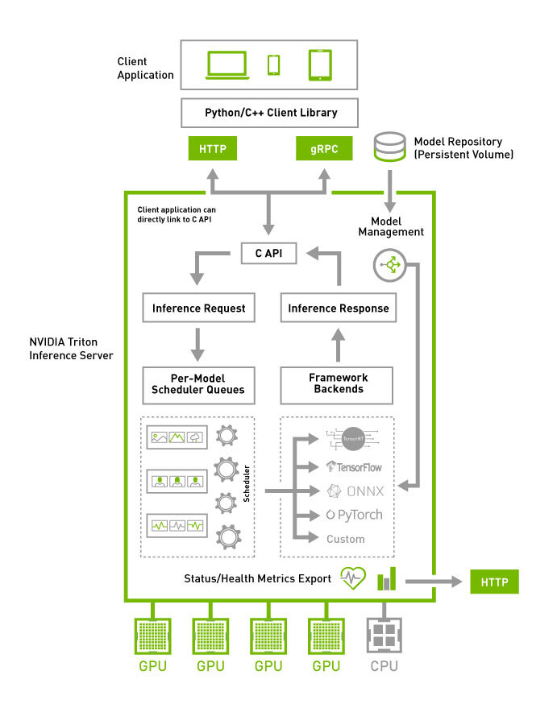

**Triton Inference Server**는 Nvidia에서 제공하는 오픈소스 모델 서빙 소프트웨어이다.  
컨테이너의 형태로 제공되며, 여러 모델들을 로딩하여 API를 제공한다.  
다음의 기능들을 제공한다:
- REST / gRPC API
- Prometheus Metrics
- Python, Tensorflow, Pytorch, ONNX, TensorRT, vLLM, FIL 등 다양한 backend
- 여러 모델들을 로딩하며 버저닝
- 모델은 컨테이너의 볼륨을 마운트하거나 클라우드 오브젝트 및 호환 스토리지 이용 가능
- liveness, readines probe
- kserve와 연동가능


---
## 🍰 내부 구조


컨테이너 안에는 지원하는 모든 벡엔드들이 들어있고, 모델 레포지토리로부터 모델들을 로딩하며 실제 필요한 벡엔드만 로딩한다.  
C API를 통해서 HTTP/gRPC API가 제공된다.  
각 요청들은 스케줄러에 의해 적절히 배치된다.  
이후, 프레임워크 벡엔드들에서 요청이 처리된다.  
각 벡엔드들은 C++ shared library(.so)로 구현되어 있으며, 동적으로 로딩될 수 있다.  
메트릭 등은 HTTP API로 제공된다.


---
## 🐋 Tritonserver 컨테이너

Tritonserver의 컨테이너 이미지 형식은 `nvcr.io/nvidia/triotnserver:<yy.mm>-py3`을 따른다.  
매월 새로운 릴리스가 나온다.

시작 command는 `tritonserver --model-repository=/models`이다.  
모델 저장소는 보통 `/models`로 시작하며, 볼륨을 줄때 모델 레포지토리 폴더를 마운트해준다.  
또는 오브젝트 스토리지를 이용할 수 있다.  

모델 레포지토리의 폴더 구조는 아래와 같다.  
이후 글에서 폴더 구조에 대해 더 자세히 알아볼 것이다.
아래는 Pytorch backend의 예시이다. 
```bash
model_repository
|
+-- resnet50         // 모델 이름
    |
    +-- config.pbtxt // 필수 configuration file
    +-- 1            // 모델 버전
        |
        +-- model.pt // 모델 파일(torchscript)
```

예시 시작은 아래와 같다. `model_repository`에 아래 형식처럼 구조를 가져야 한다:

```bash
docker run --rm -p8000:8000 -p8001:8001 -p8002:8002 -v/full/path/to/docs/examples/model_repository:/models nvcr.io/nvidia/tritonserver:<xx.yy>-py3 tritonserver --model-repository=/models
```
