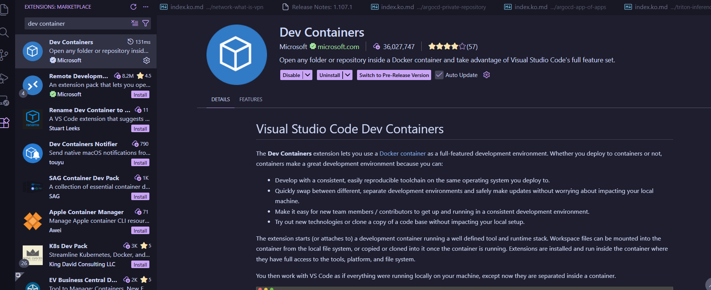
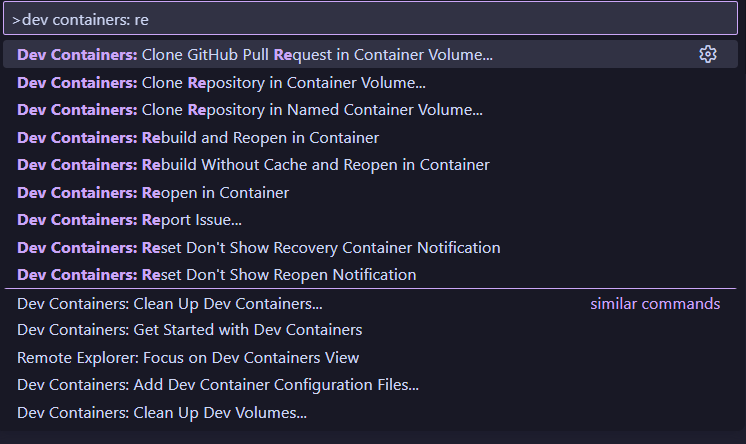
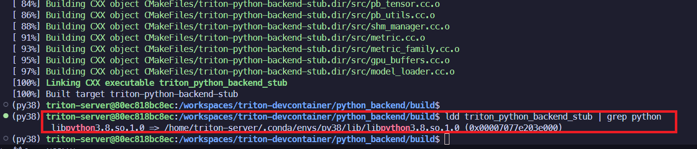
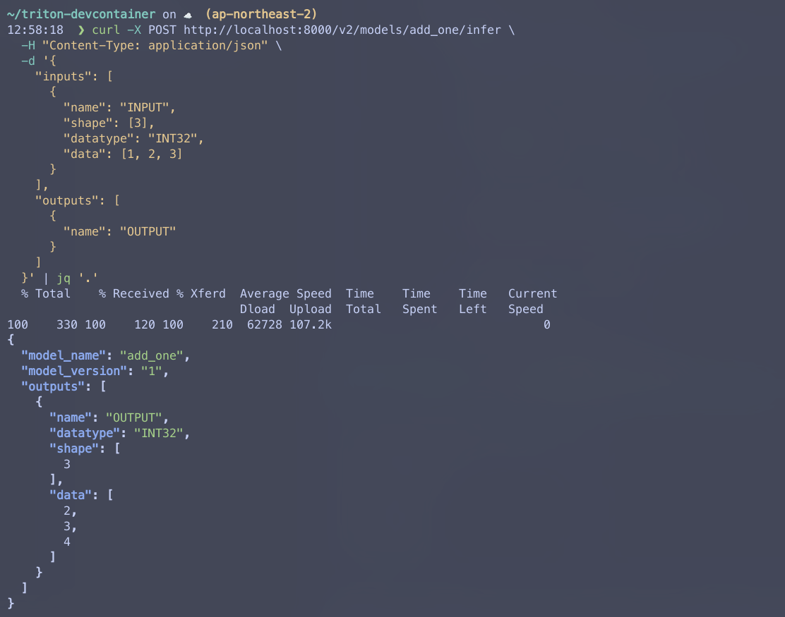

Triton Inference Server에서 가장 단순한 방법인 Python Backend에 대해 알아볼 것이다.  
성능은 Pytorch, Onnx등, 다른 Backend가 더 좋다.  
대신, 간편하게 모델을 올릴 수 있다.

---
## 🐍 `model.py` 작성

```python
import triton_python_backend_utils as pb_utils

class TritonPythonModel:
    """
	Python 모델 `model.py`는 항상 TritonPythonModel클래스명을 가져야 한다.
    """

    @staticmethod
    def auto_complete_config(auto_complete_model_config):
		"""
		만약, 직접 config.pbtxt를 작성할 예정이고, --disable-auto-complete-config 옵션을 항상 킬 예정이라면, 이 부분을 구현할 필요가 없다.
		"""

    def initialize(self, args):
		"""
		`initialize`는 모델이 로딩되었을 때, 단 한 번만 실행된다.
		이 모델의 관련된 상태를 불러오는 데 사용된다.
		이 부분도 optional하다.

        Parameters
        ----------
        args : dict
		  key, value모두 string이다.
          * model_config: 모델 config를 담는 JSON문자열
          * model_instance_kind: 모델 인스턴스의 종류("cpu", "cuda" 등)
          * model_instance_device_id: 모델 인스턴스의 디바이스 id
          * model_repository: 모델 레포지토리 경로
          * model_version: 모델 버전
          * model_name: 모델 이름
        """
        print('Initialized...')

    def execute(self, requests):
		"""
		`execute`는 반드시 구현되어야 하는 함수이다.
		argument로 pb_utils.InferenceRequest의 리스트를 받는다.
		이 함수는 추론 요청이 올 때 실행된다.

        Parameters
        ----------
        requests : list
          pb_utils.InferenceRequest의 리스트

        Returns
        -------
        list
		  pb_utils.InferenceResponse 리스트.
		  응답의 길이는 `requests`와 같아야 한다.
        """

        responses = []

		# 모든 Python Backend는 리스트의 아이템을 정확히 한 번 다뤄야한다.
        for request in requests:
			# 여기에서 각 요청에 대한 추론이 이뤄지도록 하고,
			# 각각의 응답을 순서 그대로 담도록 해야 한다.

		# pb_utils.InferenceRenponse의 리스트를 반환
		# len(pb_utils.InferenceResponse) == len(pb_utils.InferenceRequest)
        return responses

    def finalize(self):
		"""
		`finalize`는 모델 언로드 시 반드시 한 번 실행된다.
		종료 이전 필요한 cleanup 작업들을 실행하면 된다.
        """
        print('Cleaning up...')

```

4 가지의 함수 구현을 할 수 있다:

### `auto_complete_config`
서버가 `--disable-auto-complete-config`옵션 없이 실행할 때 실행된다.  
이 메서드의 구현은 optional하다.

더 자세한 내용은 [여기](https://docs.nvidia.com/deeplearning/triton-inference-server/user-guide/docs/python_backend/README.html#auto-complete-config)에서확인하면 된다.


### `initialize` 
`initialize`는 모델의 로딩 시에 정확히 한 번 실행된다.  
구현은 optional하며, 여기에서 추론 이전의 중요한 작업들을 할 수 있다.  
`initialize`함수에서, `args`라는 Python 딕셔너리를 입력받는다.  
key와 value 모두 string이다.  

| key                        | description             |
| -------------------------- | ----------------------- |
| `model_config`             | 모델 config를 담은 JSON 문자열  |
| `model_instance_kind`      | 모델 인스턴스 종류를 담은 문자열      |
| `model_instance_device_id` | 모델 인스턴스 디바이스 ID를 담은 문자열 |
| `model_repository`         | 모델 레포지토리 경로             |
| `model_version`            | 모델 버전                   |
| `model_name`<br>           | 모델 이름                   |

### `execute`
`execute`함수는 추론 요청이 오면 실행된다.  
모든 Python Model은 `execute` 함수를 구현해야 한다.  
요청으로는 `InferenceRequest` 리스트를 받는다.  
두 가지 구현 방법이 있다.  

모델로부터 디커플링된 응답을 받고 싶은지 아닌지에 따라 다르다.  

#### Default Mode
한 요청에 한 응답을 받는, 일반적인 방법이다.  
응답으로는 `InferenceResponse` 오브젝트의 리스트를 반환해야 한다.  
`requests`의 길이와 같아야 한다.  
워크플로우는 아래와 같다:
- `execute` 함수가 N개의 `pb_utils.InferenceRequest` 배치를 받는다.
- 각각에 대응하는 `pb_utils.InferenceResponse`를 `response`배열에 append한다.
- `response`배열을 응답한다
	- 응답의 길이는 N이어야 한다
	- 리스트의 각 요소는 각각의 `request`에 대응하는 배열이어야 한다

#### Error Handling
응답에 에러가 있다면, `TritonError`객체로 에러 메시지를 쓸 수 있다.  
아래는 예시이다.  
```python
import triton_python_backend_utils as pb_utils

class TritonPythonModel:
	def execute(self, requests):
		responses = []
		for request in requests:
			if an_error_occured:
			responses.append(pb_utils.InferenceResponse(
			error = pb_utils.TritonError("An Error Occurred")))
		return responses
```

23.09버전부터는 `pb_utils.TritonError`는 에러 코드를 넣을 수 있게 되었다.  
예를 들어, 아래와 같이 넣을 수 있다:  
```python
pb_utils.TritonError("The file is not found", pb_utils.TritonError.NOT_FOUND)
```

에러 코드가 없다면, `pb_utils.TritonError.INTERNAL`이 기본으로 쓰일 것이다.  
지원되는 에러 코드는 다음과 같다:  
- `pb_utils.TritonError.UNKNOWN`
- `pb_utils.TritonError.INTERNAL`
- `pb_utils.TritonError.NOT_FOUND`
- `pb_utils.TritonError.INVALID_ARG`
- `pb_utils.TritonError.UNAVAILABLE`
- `pb_utils.TritonError.UNSUPPORTED`
- `pb_utils.TritonError.ALREADY_EXISTS`
- `pb_utils.TritonError.CANCELLED` (23.10 부터)


#### Request Cancellation 핸들링
실행 중에 클라이언트로부터 취소를 받을 수 있다.  
23.10부터는, `request.is_cancelled()`로 요청의 취소 여부를 알 수 있다.  
예시는 다음과 같다:
```python
import triton_python_backend_utils as pb_utils

class TritonPythonModel:
	...
	def execute(self, requests):
		responses = []
		for request in requests:
			if request.is_cancelled():
				responses.append(pb_utils.InferenceResponse(
				error=pb.utils.TritonError("Message", pb_utils.TritonError.CANCELLED)))
			else:
				...
		return responses
```

요청 취소 확인은 optional하지만, 요청이 더 이상 필요하지 않을 때, 일찍 종료할 수 있도록 전략을 취해주는 것이 좋다.  

#### Decoupled Mode
이 모드는 요청에 대해 0개 또는 여러 개의 응답을 보낼 때 사용된다.  
이 모드를 쓰려면, config의 `model-transaction-policy`가 decouped로 되어있어야 한다.  

디커플모드에서, 모델은 반드시 요청마다 `InferenceResponseSender` 객체를 써야 한다.  
워크플로우는 아래와 같다:  
- `execute`함수가 pb_utils.InferenceRequest배열을 받는다.
- 각 pb_utils.InferenceRequest를 순회하며 아래 동작을 수행한다
	- `InferenceRequest.get_response_sender()`를 이용하여`InferenceResponseSender`객체를 얻는다.
	- `pb_utils.InferenceResponse`를 만든다.
	- `InferenceResponseSender.send()`를 이용하여 응답을 보낸다.
	  만약 마지막 요청의 것이였다면, `InferenceResponseSender.sned()`에  `pb_utils.TRITONSERVER_RESPONSE_COMPLETE_FINAL`플래그를 넘겨야 한다.
	  아니라면, 계속 반복을 하면된다
- 함수의 리턴값은 None이된다.

유즈 케이스는 다음과 같다:  
- 모델이 아무 응답 데이터를 보내지 않을때
- 응답과 요청의 순서가 유지되지 않을때
- 모델의 다른 스레드로 넘겨질때.
  즉, `execute`내부에서 새로운 스레드를 만들어서 넘기고, `execute`에서는 닫을 수 있도록.

24.04부터, `async def execute(self, requests)`가 decoupled python models에서 지원된다.  
AsyncIO 이벤트 루프에서 코루틴으로 돌아간다.  
현재 요청이 대기중이더라도 다음 모델 인스턴스의 실행이 이뤄질 수 있다.  
주어진 요청들이 AsyncIO에 의해 동시 요청될 수 있다.  
동시성의 이점을 얻기 위해서, 이벤트 루프에서 대기가 있으면 안된다.  


### `finalize`
Triton Server로부터 모델이 언로드될때의 마무리 클린업 작업을 할 수 있다.


---
## ❇️ 모델 config 파일
모든 Python Triton 모델은 `config.pbtxt`를 작성해야 한다.  
`backend`필드에서는 `python`으로 써야 하고,  
`platform`은 쓰면 안된다.  

아래의 폴더 구조를 가진다:
```bash
models
└── add_sub(모델명)
    ├── 1
    │   └── model.py
    └── config.pbtxt
```


---
## 🐙 파라미터 확장
더 자세한 내용을 [여길](https://docs.nvidia.com/deeplearning/triton-inference-server/user-guide/docs/protocol/extension_parameters.html) 참조

### Inference Request 파라미터
Inference Request에서 `inference_request.parameters()`함수로 파라미터를 받을 수 있다.    
이 함수는 JSON문자열을 반환하며, key는 파라미터 오브젝트들의 키, 값은 파라미터 필드의 값이다.    
`json.loads`로 딕셔너리로 변환하여 쓸 수 있다.  

23.11릴리즈부터는, 파라미터들은 생성 중에 제공될 수 있다.
```python
request = pb_utils.InferenceRequest(parameters={"key": "value"}, ...)
```

키는 `str`, 값은 `bool`, `int`, `str`이어야 한다.

### Inference Response 파라미터
Inference Response 파라미터는 Inference Response객체의 생성중 옵셔널하게 세팅될 수 있다.  
파라미터는 키-값 쌍을 가지고, 역시 key는 `str`, 값은 `bool`, `int`, `str`이다.  
```python
response = pb_utils.InferenceResponse(
    output_tensors, parameters={"key": "value"}
)
```


---
## 🏦 Python 런타임과 라이브러리 관리
Python Backend는 현재의 Python환경에 있는 라이브러리를 쓸 수 있다.  
virtualenv, conda environment, 또는 Python 전역 시스템으로 쓰일 수 있다.  
이 라이브러리들은 Python 버전이 Python backend stub과 매칭되는 버전인 경우에만 쓰일 수 있다.  

예를 들어, Python 3.9환경을 쓰려는데, Python backend stub이 3.12라면, 커스텀 Python 벡엔드 Stub을 만들어야 한다.  
Stub은 C로 구현된 Triton Server가 Python 벡엔드를 libpython을 통해서 실행할 수 있도록 해주는 다리의 역할을 하는 프로그램이라고 보면 된다.  

### Custom Python Backend Stub 빌드하기
Note: Triton 컨테이너의 기본 버전인 Python 3.12와 다른 경우에만 하면 된다.  
Python backend는 `model.py`에 연결하기 위해 Triton C++ Core에서 stub process를 쓴다.  
이러한 stub 프로세스는 특정 `libpython<X>.<Y>.so`의 특정 버전과 동적 링크가 된다.  

기본 버전과 다른 Python 버전을 쓴다면, 직접 Python Backend stub을 써야한다:  
1. 아래의 소프트웨어 패키지 설치:
	-  cmake
	- [rapidjson, libarchive](https://docs.nvidia.com/deeplearning/triton-inference-server/user-guide/docs/python_backend/README.html#building-from-source)
2. 원하는 Python 버전이 당신의 환경에서 있어야 한다.  
   만약 `conda`를 쓴다면, 환경을 `conda activate <env-name>`으로 활성화해야 한다.
3. Python backend 레포지토리를 Clone하고, Python backend stub을 컴파일한다
   <GIT_BRANCH_NAME>을 원하는 브랜치명으로 해야한다. `r<xx.yy>`가 릴리즈의 브랜치이다.
```bash
git clone https://github.com/triton-inference-server/python_backend -b
<GIT_BRANCH_NAME>
cd python_backend
mkdir build && cd build
cmake -DTRITON_ENABLE_GPU=ON -DTRITON_BACKEND_REPO_TAG=<GIT_BRANCH_NAME> -DTRITON_COMMON_REPO_TAG=<GIT_BRANCH_NAME> -DTRITON_CORE_REPO_TAG=<GIT_BRANCH_NAME> -DCMAKE_INSTALL_PREFIX:PATH=`pwd`/install ..
make triton-python-backend-stub
```

이제, Python backend stub을 파이썬 버전에 맞게 접근해야 한다.  
`ldd`를 이용할 수 있다.

```bash
ldd triton_python_backend_stub
...
libpython3.6m.so.1.0 => /home/ubuntu/envs/miniconda3/envs/python-3-6/lib/libpython3.6m.so.1.0(0x00007fbb69cf3000)
...
```

`libpython<major>.<minor>.so.1.0`에서 `<major>.<minor>`가 원하는 Python 버전인지 확인하면 된다.  
이후, `triton_python_backend_stub`을 커스텀 Python backend stub으로 하면 된다.  
만약, `model_a`가 있다면, 폴더 구조를 아래와 같이 하면 된다:  
```bash
models
|-- model_a
    |-- 1
    |   |-- model.py
    |-- config.pbtxt
    `-- triton_python_backend_stub
```

### Custom 실행 환경 만들기
만약 필요한 의존성을 담고 싶다면, 커스텀 실행 환경을 만들면 된다.  
Python backend는 `conda-pack`을 지원한다.

```bash
conda-pack
Collecting packages...
Packing environment at '/home/iman/miniconda3/envs/python-3-6' to 'python-3-6.tar.gz'
[########################################] | 100% Completed |  4.5s
```

패키지를 받기전, `PYTHONNOUSERSITE` 환경변수를 `True`로 해준다.  
```bash
export PYTHONNOUSERSITE=True
```

만약 이 변수가 없으면, `conda` 환경 밖에 설치되고, tar file에 격리된 환경에서 필요한 의존성이 다 담기지 못할 수 있다.  

대신, Python backend는 unpacked된 실행환경도 지원한다.  
`conda create -p`를 이용하여 활성화 스크립트를 제공할 수 있다.  
스크립트는 `$path_to_conda_pack/lib/python<your.python.version>/site-packages/conda_pack/scripts/posix/activate`에 있다.  
서버 로딩 시간을 줄일 수 있다.

별도의 conda환경을 만들고 나서는, Python backend에게 해당 환경을 쓰도록 해야한다.  
`config.pbtxt`에서 아래의 내용을 추가해서 환경에 참조할 수 있다.  
```protobuf
name: "model_a"
backend: "python"
...
parameters: {
	key: "EXECUTION_ENV_PATH",
	value: {string_value: "home/ubuntu/miniconda3/envs/python-3-6/python3.6.tar.gz"}
}
```

또한, 모델 레포지토리 내에서 상대 경로를 이용할 수도 있다:  
```proto
name: "model_a"
backend: "python"
...
parameters: {
	key: "EXECUTION_ENV_PATH",
	value: {string_value: "$$TRITON_MODEL_DIRECTORY/python3.6.tar.gz"}
}
```

이 경우, `python3.6.tar.gz`는 모델 폴더의 아래와 같은 위치에 있어야 한다:
```bash
models
|-- model_a
|   |-- 1
|   |   `-- model.py
|   |-- config.pbtxt
|   |-- python3.6.tar.gz
|   `-- triton_python_backend_stub
```

모델 로딩시간을 줄이기 위해, 아래와 같이 unpack할 수 있다:
```bash
mkdir -p $pwd/models/model_a/python3.6
tar -xvf $pwd/models/model_a/python3.6.tar.gz -C $pwd/models/model_a/python3.6
```

그 뒤, `EXECUTION_ENV_PATH`는 unpack된 디렉토리로 하면 된다.
```protobuf
parameters: {
  key: "EXECUTION_ENV_PATH",
  value: {string_value: "$$TRITON_MODEL_DIRECTORY/python3.6"}
}
```
상대 경로를 이용한 방법은 클라우드 오브젝트 저장소에서도 유용하게 쓰인다.

### Important Notes
1. Python 인터프리터의 버전은 `triton_python_backend_stub`과 일치해야 한다.
2. 기본으로 충분하다면, 굳이 커스텀 Python Backend Stub을 쓸 이유가 없다.
   `conda-pack`으로 라이브러리만 불러와도 충분하다.
   현재 stub의 기본 버전은 Python3.12이다.
3. 하나의 실행 환경을 여러 모델에서 공유할 수 있다.
   `config.pbtxt`에서 같은 곳을 참조하면 된다.
4. 만약 `$$TRITON_MODEL_DIRECTORY`가 `EXECUTION_ENV_PATH`에서 쓰인다면,`EXECUTION_ENV_PATH`의 최종적인 위치는 `$$TRITON_MODEL_DIRECTORY`를 떠나면 안된다.
5. `$$TRITON_MODEL_DIRECTORY`가 쓰이지 않았다면, 클라우드의 경로를 쓸 수 없다.
6. 만약 Python backend stub을 직접 컴파일하길 원한다면, 공식 Triton NGC container에서 빌드하는것을 권장한다.
   아니라면, 컴파일된 stub이 오류가 날 수 있다.
7. "GLIBCXX_3.4.30 not found"에러가 뜬다면, conda 버전을 업그레이드하고, `conda install -c conda-forge libstdcxx-ng=12 -y`로 `libstdcxx-ng=12`를 설치하는것을 추천한다.
   비슷하게, "GLIBCXX_3.4.32 not found"라는 에러가 보인다면, `conda install -c conda-forge libstdcxx-ng=13 -y`를 실행하면 될 것이다.


---
## ⚽ Hands-On

Triton의 Python Backend로 모델을 서빙해보자.  
이번 예시에서는 주어진 정수에 1을 더해주는 간단한 모델을 만들어줄 것이다.  
Python 3.8환경에서 numpy를 포함시켜서 서빙시켜 볼 것이다.

폴더 구조를 아래와 같이 만들 것이다:  
```bash
model_repository
└── add_one
    ├── 1
    │   └── model.py
    ├── config.pbtxt
    ├── add_one_env.tar.gz 
    └── triton_python_backend_stub
```

### 개발 환경 세팅

Triton Python Backend는 vscode에서의 개발환경을 지원한다.  
vscode에서 Dev Containers 확장을 설치한다.  
Pasted image 20260120101659.png


프로젝트 루트에 `.devcontainer`라는 디렉토리를 생성하고, 아래의 두 파일을 만든다:

`devcontainer/devcontainer.json`
```json
{
	"name": "Python Backend",

	"build": {
		"dockerfile": "Dockerfile"
	},
	"customizations": {
		"vscode": {
			"extensions": [
				"ms-python.vscode-pylance",
				"ms-python.python",
				"ms-vscode.cpptools-extension-pack",
				"ms-vscode.cmake-tools",
				"github.vscode-pull-request-github"
			]
		}
	},
	"postCreateCommand": "sudo chown -R triton-server:triton-server ~/.cache",

	// "--gpus=all"은 nvidia gpu가 없으면 제거
	"runArgs": [ "--cap-add=SYS_PTRACE", "--security-opt", "seccomp=unconfined", "--gpus=all", "--shm-size=2g", "--ulimit", "stack=67108864" ],
	"mounts": [
		"source=${localEnv:HOME}/.ssh,target=/home/triton-server/.ssh,type=bind,consistency=cached",
		"source=${localEnv:HOME}/.cache/huggingface,target=/home/triton-server/.cache/huggingface,type=bind,consistency=cached"
	],
	"remoteUser": "triton-server"
}
```

`.devcontainer/Dockerfile`
```docker
# Copyright 2024, NVIDIA CORPORATION & AFFILIATES. All rights reserved.
#
# Redistribution and use in source and binary forms, with or without
# modification, are permitted provided that the following conditions
# are met:
#  * Redistributions of source code must retain the above copyright
#    notice, this list of conditions and the following disclaimer.
#  * Redistributions in binary form must reproduce the above copyright
#    notice, this list of conditions and the following disclaimer in the
#    documentation and/or other materials provided with the distribution.
#  * Neither the name of NVIDIA CORPORATION nor the names of its
#    contributors may be used to endorse or promote products derived
#    from this software without specific prior written permission.
#
# THIS SOFTWARE IS PROVIDED BY THE COPYRIGHT HOLDERS ``AS IS'' AND ANY
# EXPRESS OR IMPLIED WARRANTIES, INCLUDING, BUT NOT LIMITED TO, THE
# IMPLIED WARRANTIES OF MERCHANTABILITY AND FITNESS FOR A PARTICULAR
# PURPOSE ARE DISCLAIMED.  IN NO EVENT SHALL THE COPYRIGHT OWNER OR
# CONTRIBUTORS BE LIABLE FOR ANY DIRECT, INDIRECT, INCIDENTAL, SPECIAL,
# EXEMPLARY, OR CONSEQUENTIAL DAMAGES (INCLUDING, BUT NOT LIMITED TO,
# PROCUREMENT OF SUBSTITUTE GOODS OR SERVICES; LOSS OF USE, DATA, OR
# PROFITS; OR BUSINESS INTERRUPTION) HOWEVER CAUSED AND ON ANY THEORY
# OF LIABILITY, WHETHER IN CONTRACT, STRICT LIABILITY, OR TORT
# (INCLUDING NEGLIGENCE OR OTHERWISE) ARISING IN ANY WAY OUT OF THE USE
# OF THIS SOFTWARE, EVEN IF ADVISED OF THE POSSIBILITY OF SUCH DAMAGE.

FROM nvcr.io/nvidia/tritonserver:25.09-py3 # 원하는 버전에 맞추기

ARG USERNAME=triton-server

RUN apt-get update \
    && apt-get install -y sudo

RUN pip3 install transformers torch

# Create the user
RUN apt-get update \
    && apt-get install -y sudo \
    && echo $USERNAME ALL=\(root\) NOPASSWD:ALL > /etc/sudoers.d/$USERNAME \
    && chmod 0440 /etc/sudoers.d/$USERNAME

RUN pip3 install pre-commit ipdb

RUN mkhomedir_helper triton-server

RUN apt-get install -y cmake rapidjson-dev

USER ${USERNAME}
```

이후, 명령 팔레트에서 `Dev Containers: Reopen in Container`를 실행한다.  


이제, DevContainer에서 작업할 수 있다.   
그러나, LSP에서 Python backend utils를 인식하지는 못하는 듯하다.  

나중에 DevContainer에서 빠져나올때는 명령 팔레트에서 Reopen하되, Container말고 기존의 로컬 옵션을 이용한다.  

### Python 3.8 custom stub 만들기
```bash
# 컨테이너 안에서 
# 패키지 업데이트
apt update && apt install -y rapidjson-dev libarchive-dev

# Miniconda 설치
wget https://repo.anaconda.com/miniconda/Miniconda3-latest-Linux-x86_64.sh
sudo bash Miniconda3-latest-Linux-x86_64.sh -b -p /opt/miniconda
export PATH="/opt/miniconda/bin:$PATH"

# TOS 승인
conda tos accept --override-channels --channel https://repo.anaconda.com/pkgs/main
conda tos accept --override-channels --channel https://repo.anaconda.com/pkgs/r

# conda 환경 초기화
conda init
source ~/.bashrc

# conda 환경 생성
conda create -n py38 python=3.8 -y
conda activate py38
pip install cmake==3.31.10

# Triton Python Backend 레포지토리 클론 및 빌드 작업 경로로 디렉토리 이동
git clone https://github.com/triton-inference-server/python_backend -b r25.09 # 자신에게 맞는 버전의 브랜치를 쓸 것.
cd python_backend
mkdir build && cd build

# 빌드
# GPU를 쓰지 않는다면, `-DTRITON_ENABLE_GPU=OFF`로 할 것.
# 여기서도 Triton 버전을 알맞게 표시할 것
cmake -DTRITON_ENABLE_GPU=ON \
 -DTRITON_BACKEND_REPO_TAG=r25.09 \
 -DTRITON_COMMON_REPO_TAG=r25.09 \
 -DTRITON_CORE_REPO_TAG=r25.09 \
 -DCMAKE_INSTALL_PREFIX:PATH=$(pwd)/install ..

make triton-python-backend-stub

# libpython3.8.so.1.0을 링크하는지 확인
ldd triton_python_backend_stub | grep python

# 빌드된 아티팩트 이동
cp triton_python_backend_stub /workspaces/triton-devcontainer/model_repository/add_one/triton_python_backend_stub
```

`ldd`로 링크를 확인하면, 아래와 같다:


### `conda pack`으로 필요한 의존성 패킹하기

```bash
export PYTHONNOUSERSITE=True

pip install numpy
pip install conda-pack

conda pack -n py38 -o add_one_env.tar.gz
```

### 주의: conda pack과 custom stub
custom stub을 빌드하고 나서, 이후에 빌드한 컨테이너를 빠져나온 뒤에는 `lld`에서 `libpython` 링크가 not found로 보인다.  
그래서 빌드를 잘못한 것은 아닌가 걱정할 수 있다.  
그러나, `conda pack`을 압축풀어서 안을 확인해보면, `libpython`이 있다.  
공식적으로 적혀있는 것을 찾지는 못했지만, 모델을 로딩하면서, conda pack안에있는 libpython에 링크하여 동작하는 듯 하다.  
즉, 다른 파이썬 버전에서는 custom stub + conda pack이 필수적이다.

```bash
~/triton-devcontainer on ☁️  (ap-northeast-2) 
# ldd에서 not found로 보임
20:55:46  ❯ ldd model_repository/add_one/triton_python_backend_stub | grep python 
        libpython3.8.so.1.0 => not found

# conda pack 압축해제
~/triton-devcontainer on ☁️  (ap-northeast-2) 
20:55:51  ❯ tar -xvf model_repository/add_one/add_one_env.tar.gz -C add_one_env                           

(...)

# libpython이 conda pack안에 있다
~/triton-devcontainer on ☁️  (ap-northeast-2) 
21:02:17  ❯ ls add_one_env/lib | grep python
libpython3.8.so -> libpython3.8.so.1.0
libpython3.8.so.1.0
libpython3.so
python3.8
```

### 간단한 `model.py`

`model_repository/add_one/1/model.py`에 아래와 같이 작성한다:
```python
import triton_python_backend_utils as pb_utils
import numpy as np
import sys

class TritonPythonModel:
    """
    Triton Python Model
    """

    def initialize(self, args):
        pb_utils.Logger.log_info("Model Initializing...")
        pb_utils.Logger.log_info(sys.version) # 모델 로딩시의 버전을 확인해봅시다
        
    def execute(self, requests):
        responses = []
        for request in requests:
            input_tensor = pb_utils.get_input_tensor_by_name(request, "INPUT")
            input_array = input_tensor.as_numpy()

            output_array = input_array + 1

            output_tensor = pb_utils.Tensor(
                "OUTPUT",
                output_array.astype(np.int32)
            )

            response = pb_utils.InferenceResponse(
                output_tensors=[output_tensor]
            )

            responses.append(response)

        return responses

    def finalize(self):
        """finalizer"""
        pb_utils.Logger.log_info("Model cleanup...")
```

### `config.pbtxt` 작성

`model_repository/add_one/config.pbtxt`에는 아래와 같이 작성한다: 
```protobuf
name: "add_one"
backend: "python"

input [
  {
    name: "INPUT"
    data_type: TYPE_INT32
    dims: [ -1 ]
  }
]

output [
  {
    name: "OUTPUT"
    data_type: TYPE_INT32
    dims: [ -1 ]
  }
]

instance_group [
  {
    kind: KIND_CPU
  }
]

parameters: {
  key: "EXECUTION_ENV_PATH",
  value: {
    string_value: "$$TRITON_MODEL_DIRECTORY/add_one_env.tar.gz"
  }
}

```


### 테스트 및 요청 날려보기

`model_repository`를 볼륨으로 마운트해서, 서버를 띄워보자.
```bash
docker run --rm -p 8000:8000 -p 8001:8001 -p 8002:8002 -v ./model_repository:/models nvcr.io/nvidia/tritonserver:25.09-py3 tritonserver --model-repository=/models # 태그 알맞게 작성!
```

로그를 확인해보자. Python 3.8버전을 쓰고있다!
```bash
=============================
== Triton Inference Server ==
=============================

...

I0120 10:28:48.767944 1 model_lifecycle.cc:473] "loading: add_one:1"
I0120 10:28:48.772835 1 python_be.cc:1851] "Using Python execution env /models/add_one/add_one_env.tar.gz"
I0120 10:28:51.613833 1 python_be.cc:2289] "TRITONBACKEND_ModelInstanceInitialize: add_one_0_0 (CPU device 0)"
I0120 10:28:51.732199 1 model.py:11] "Model Initializing..."
I0120 10:28:51.732443 1 model.py:12] "3.8.20 (default, Oct  3 2024, 15:32:15) \n[GCC 11.2.0]" # << 여기!!
I0120 10:28:51.737114 1 model_lifecycle.cc:849] "successfully loaded 'add_one'"

...

I0120 10:28:51.737425 1 server.cc:638] 
+---------+-------------------------------------------------------+---------------------------------------------------------------------------------------------------------------------------------------------------------------+
| Backend | Path                                                  | Config                                                                                                                                                        |
+---------+-------------------------------------------------------+---------------------------------------------------------------------------------------------------------------------------------------------------------------+
| python  | /opt/tritonserver/backends/python/libtriton_python.so | {"cmdline":{"auto-complete-config":"true","backend-directory":"/opt/tritonserver/backends","min-compute-capability":"6.000000","default-max-batch-size":"4"}} |
+---------+-------------------------------------------------------+---------------------------------------------------------------------------------------------------------------------------------------------------------------+

I0120 10:28:51.737493 1 server.cc:681] 
+---------+---------+--------+
| Model   | Version | Status |
+---------+---------+--------+
| add_one | 1       | READY  |
+---------+---------+--------+

...

I0120 10:28:51.743777 1 grpc_server.cc:2562] "Started GRPCInferenceService at 0.0.0.0:8001"
I0120 10:28:51.744013 1 http_server.cc:4789] "Started HTTPService at 0.0.0.0:8000"
I0120 10:28:51.786121 1 http_server.cc:358] "Started Metrics Service at 0.0.0.0:8002"
```

Curl을 이용해서 간단히 요청을 날려보자.  
성공적으로 응답받는 것을 볼 수 있다!



---
## 📚 References
- [Python Backend](https://docs.nvidia.com/deeplearning/triton-inference-server/user-guide/docs/python_backend/README.html)
- [Python DevContainer](https://github.com/triton-inference-server/python_backend/tree/main/.devcontainer)