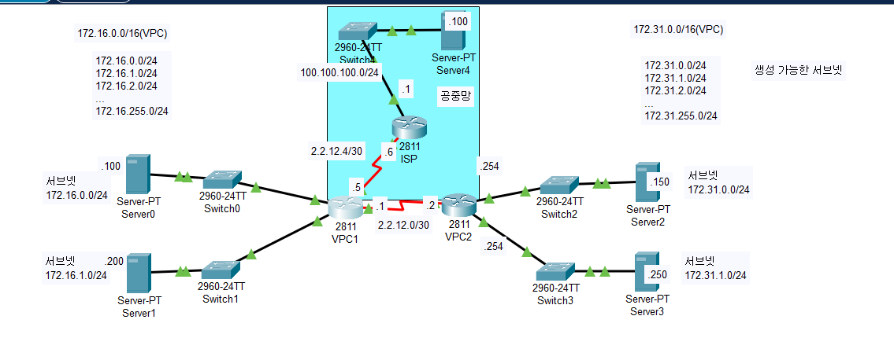

Router는 **ACL(Access-Control List)** 를 사용하여 트래픽을 필터링하거나, 식별한 후, 암호화 및 변환(NAT), 그리고 QoS(Quality of Service) 작업을 수행할 수 있다.  
Router와 같은 L3장비는 인터페이스로 송수신되는 Packet을 Flitering할 수 있다. (L3방화벽의 기능을 해낼 수 있다.)  

사용방법은 다양하다:
- Priority and Custom Queuing
- Dial on Demand Routing(DDR)
- Route Filtering


## ACL의 타입
- **Standard Access List** (Range 1-99, 1300-1999)
    - Source Address를 검사한다.
    - 검사결과에 따라 전체 Protocol Suite에 대한 Packet출력을 허용하거나, 거부할 수 있다.
- **Extended Access List** (Range 100-199, 2000-2699)
    - Source Address와 Destination Address를 모두 검사한다.
    - 특정 Protocol, Port번호, 다른 매개변수를 검사하여 유연하게 제어가 가능하다.


## 인바운드, 아웃바운드 ACL

- **Inbound ACL**: 라우터나 방화벽의 특정 인터페이스로 들어오는(수신하는) 트래픽에 적용되는 규칙이다.  
즉, 외부 -> 내부로 유입되는 트래픽을 제어한다.
- **Outbound ACL**: 라우터나 방화벽의 특정 인터페이스로 나가는(송신하는) 트래픽에 적용되는 규칙이다.  
즉, 내부 -> 외부로 나가는 트래픽을 제어한다.


### 동작 과정
**Inbound ACL**:
1. 각각의 ACL의 규칙들을 순차적으로 확인하며 대조 확인
2. 대조하는 규칙이 있다면, 해당 규칙을 따라야 함
3. 만약 대조하는 규칙이 없다면, Deny(ACL에 매칭되지 않는 모든 패킷은 기본적으로 Deny된다)
4. 만약 대조하는 규칙이 있고, Permit이라면, Routing Table에서 Routing이 가능한지 검사
5. Outbound Interface를 정함
6. Outbound Interface로 패킷을 송신  

**Outbound ACL**:
1. Routing Table에서 Routing이 가능한지 확인, 불가능하다면 패킷 Discard
2. 각각의 ACL규칙들을 순차적으로 확인하며 대조하는 규칙 찾음
3. 대조하는 규칙이 있다면, 해당 규칙을 따라야 함
4. 만약 대조하는 규칙이 있고, Permit이라면, Outbount Interface로 패킷을 송신
5. 대조하는 규칙이 없거나, Deny 규칙에 걸리면, 패킷 Discard


## WildCard Mask: 특정 주소에 해당하는지 검사하기

WildCard Mask는 검사하고자 하는 비트를 0으로 설정한다.  
즉, 네트워크 주소가 0으로 설정되고, 호스트 주소가 1로 설정된다.  
이러한 성질에 의해, subnet mask의 정반대 비트로 이루어진다.  

ex) 192.168.1.0/24에 대해서 wildcard mask를 적용하고자 한다면, `0.0.0.255`이다.

## ACL command in Cisco IOS

### 표준 ACL 설정

Step 1: access-list 명령어로 ACL을 만들거나 ACL에 규칙 추가
```shell
Router(config)#access-list <access-list-number> {permit | deny} {test_conditions}
```

Step 2: IP access-group 명령으로 기존 AccessList를 Interface에 적용
```shell
Router(config-if)#{protocol} access-group <access-list-number> {in | out}
```


### 확장 ACL 설정
Step 1: access-list로 ACL선언 또는 ACL에 규칙 추가
```shell
Router(config)#access-list <access-list-number> {permit | deny} \
protocol source source-wildcard [operator port] destination destination-wildcard \
[operator port] [established] [log]
```

Step 2: IP access-group 으로 기존 AccessList를 Interface에 적용
```shell
Router(config-if)#ip access-group <access-list-number> {in | out}
```

### Named ACL 설정
Named IP Access list는 IOS 11.2 이전에서는 호환되지 않는다.  
여러 개의 액세스 리스트에 같은 이름을 사용할 수 없다.

Named IP Access List 생성 단계
```shell
Router(config)#ip access-list {standard | extended} <name>
```

Test 조건 입력

```shell
Router(config-{std|ext})#{permit|deny} {test conditions}
Router(config-{std|ext})#no {permit|deny} {test conditions}
```


Interface에 ACL 적용
```shell
Router(config-if)#ip access-group name {in | out}
```

### Telnet 접속 제한 설정
접속 제어할 포트 번호를 설정한다.
```shell
Router(config)#line vty {vty# | vty-range}
```

적용할 ACL 적용
```shell
Router(config-line)#access-class <access-list-number> {in | out}
```

## 예제


### 상황 1
VPC1에서 출발지가 172.16.0.0/24에서 인터넷으로 가는 트래픽을 차단

```shell
enable
conf t
access-list 1 deny 172.16.0.0 0.0.0.255

int s/0/0/0
ip access-group 1 out


```

### 상황 2
출발지가 172.16.1.0/24에 해당하는 트래픽이 172.31.0.0/24로 전송되는 것을 차단, 나머지를 허용
```shell
enable
conf > t
access-list 2 deny 172.16.0.0 0.0.0.255

int s0/0/1
ip access-group 2 out

access-list 2 permit 0.0.0.0 255.255.255.255
do sh access-list

```

### 상황 3
이전의 access-list를 s0/0/0, s0/0/1에 붙은 것들을 없애고 시작하자.
```shell
int s0/0/0
no ip access-group 1 out
int s0/0/1
no ip access-group 2 out
```

172.16.0.0/24 네트워크에서 172.31.1.250 서버로 가는 트래픽만 허용  
172.16.0.0/24 네트워크에서 172.31.1.0/24 네트어크로 가는 모든 트래픽 차단  
그 외 트래픽 모두 허용

```shell
conf t
access-list 100 permit ip 172.16.0.0 0.0.0.255 host 172.31.1.250
access-list 100 deny ip 172.16.0.0 0.0.0.255 172.31.1.0 0.0.0.255
access-list 100 permit ip any any
int f0/0
ip access-group 100 in
```


### 상황 4
172.16.1.0/24 네트워크에서 172.31.0.150 서버의 웹서비스, FTP서비스 허용  
172.16.1.0/24 네트워크에서 172.31.0.150 서버의 나머지 모든 트래픽 차단  
그 외 트래픽 허용  

```shell
conf t
access-list 101 permit tcp 172.16.1.0 0.0.0.255 host 172.31.0.150 eq 80
access-list 101 permit tcp 172.16.1.0 0.0.0.255 host 172.31.0.150 eq 21
access-list 101 deny ip 172.16.1.0 0.0.0.255 host 172.31.0.150
access-list 101 permit ip any any

int f0/1
ip access-group 101 in
```

### Telnet 접속 제한 설정
```shell
Router(config)#access-list 12 permit 192.168.1.0 0.0.0.255

Router(config)#line vty 0 4
Router(config-line)#access-class 12 in
Router(config-line)#
```

## ACL 설정 확인하기

```shell
Router#show {protocol} access-list {access-list-number}

Router#show access-list {access-list-number}

```
