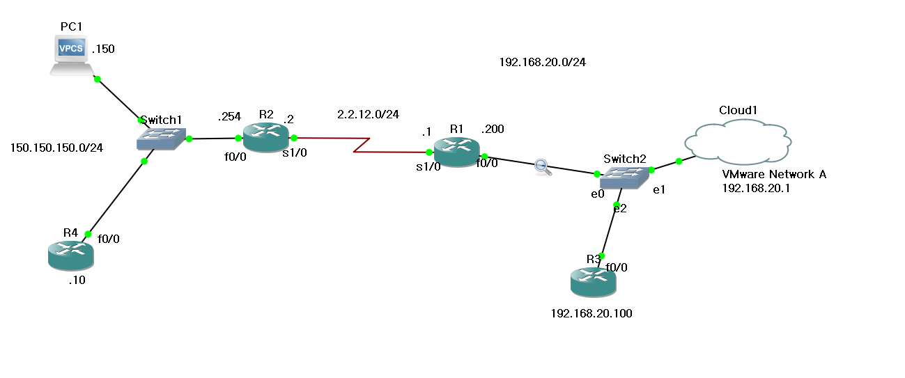

**NAT(Network Address Translation)** 은 RFC 1631에 정의된 기술로, IP Header의 주소를 다른 주소로 바꾸는 기술이다.  
주로 사설 IP를 가진 호스트들이 인터넷(Internet)을 이용할 수 있도록 설정해준다.  
꼭 Private-IP <-> Public-IP 만 바꾸는 것이 아닌, 여러 IP주소들의 변환 체인으로 이루어져 있는 경우가 많다.  
번외로, PAT(Port Address Translation) 역시 존재한다.


- 정적 NAT는 외부 주소로 들어온 요청을 내부 서버로 전달될 수 있도록 목적지 주소로 변환하는 기능이다.  
이 방법으로 사설망 서버를 구현하고, 외부 주소로 들어오는 연결을 내부 서버로 전달할 수 있다.
- 동적 NAT는 호스트가 요구하는 Traffic을 받으면 IP 주소내에서 사설 IP를 라우터에 설정된 주소 Pool에 있는 공인 IP로 변환한 후, 외부로 전달한다.  
외부에서 응답 신호가 라우터로 돌아오면, NAT 라우터는 NAT Table에 있는 이전 정보로 목적지로 돌아온 주소를 사설 IP로 변환해서 내부망으로 전달한다.  

예제들은 다음의 토폴로지를 가정할 것이다.


## Static NAT 설정
NAT설정을 해준다
```shell
Router(config)#ip nat inside source static local-ip global-ip
```


각 인터페이스에서 내부와 외부를 각각 설정한다.
```shell
Router(config-if)#ip nat inside
Router(config-if)#ip nat outside
```

### 예제
위 그림에서의 토폴로지에서 VMware 가상 브릿지로 연결된 윈도우PC(192.168.20.1)에서 PC1(150.150.150.150)으로 보낼 것이다.
```shell
ip nat inside source static 192.168.20.1 2.2.12.1

int f0/0
ip nat inside

int s1/0
ip nat outside
```

이후, Windows에서 관리자모드로 다음의 명령을 실행해서 Static Route를 설정하자.
```powershell
route delete 150.150.150.0 mask 255.255.255.0 192.168.20.1
route add 150.150.150.0 mask 255.255.255.0 192.168.20.1
```

그 뒤, ping을 보내면 성공적으로 전송됨을 알 수 있다.

### 포트포워딩
특정 서비스만이 NAT되도록 할 수 있다.  
이는 2.2.12.3:[23, 80]이 192.168.20.100:[23, 80] 으로 전송되도록 한다.  
현재 R3(192.168.20.100)은 `no ip routing`을 통해서 라우팅을 못하도록 했고, `ip default gateway 192.168.20.200`으로 R1에 연결해줬다.  
`linet vty 0 4`를 통해서 telnet을 허용한 상태이다. `ip http server`로 http서버로 활성화되어있다.

```shell
R1#conf t
R1(config)#ip nat inside source static tcp 192.168.20.100 23 2.2.12.3 23
R1(config)#ip nat inside source static tcp 192.168.20.100 80 2.2.12.3 80
```


## 동적 NAT 설정
내부 네트워크의 다수 호스트가 1개 이상의 공인주소로 바뀌게 할 수 있다.  
이전 정적 NAT와는 다르게, 1:1이 아닌, M:N의 변환을 제공할 수 있다.

바꿔야할 IP주소를 ACL 표시한다. 즉, ACL로 NAT가 되어야 할 트래픽을 분류한다.

### 예제
192.168.20.0/24대역에서 150.150.150.0/24로 통신시키려고 한다.

R4는 현재 라우팅을 끄고, http서비스를 켜서 마치 엔드 디바이스처럼 존재한다. R4(150.150.150.10)에 연결시켜보자.

```shell
access-list 1 permit 192.168.20.0 0.0.0.255

```

공인IP주소 풀을 생성한다.
```shell
ip nat pool TestPool 2.2.12.9 2.2.12.10 netmask 255.255.255.0
```

NAT문을 작성한다.
```shell
ip nat inside source list 1 interface s1/0 #특정 인터페이스
ip nat inside source list 1 pool TestPool overload #Pool을 써서 PAT를 이용한 Dynamic NAT
```

인터페이스에 적용한다.
```shell
   int f0/0

   ip nat inside


   int s1/0

   ip nat outside
```
