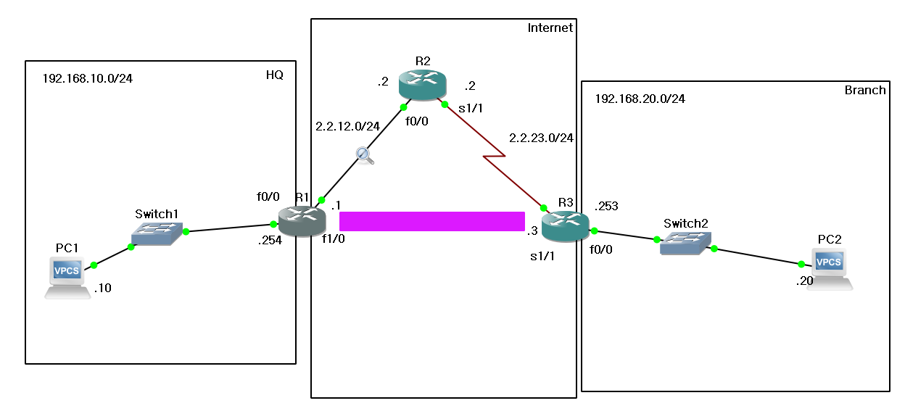
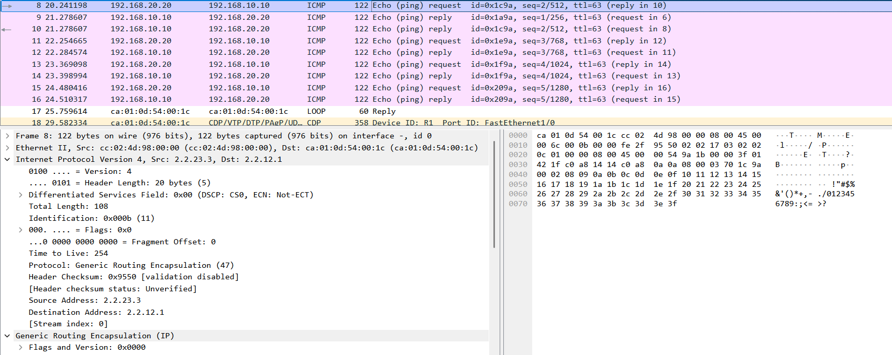
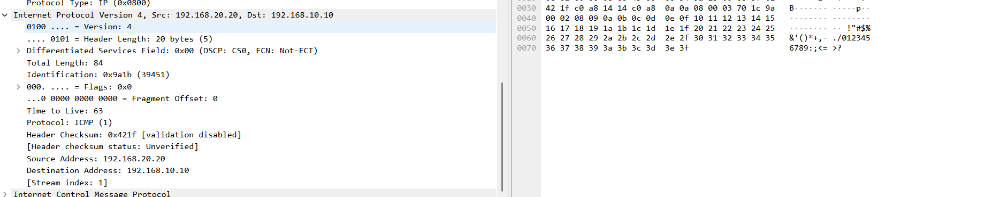
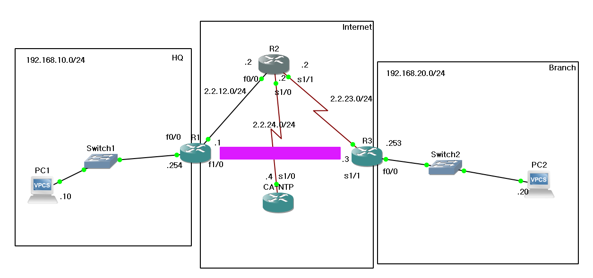
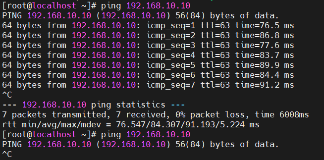

## VPN이란

**VPN(Vitrual Private Network)**은 원격에 떨어진 사설망 간에 통신이 가능하게 하는 기술로, X.25, Frame-Relay, ATM과 같은 2계층 프로토콜을 이용한 스위칭방식을 이용하거나, 터널링 기술을 이용하여 공중망을 통과하게 하는 기술이다.

현재는 터널링이 사용되고 있다.

VPN은 기본적으로 기밀성을 보장하지 않는다.

따라서 암호화를 통해서 데이터를 보호할 필요가 있다.

**IPSec, SSL/TLS**등과 같은 보안 프로토콜을 이용해서 공중망으로 전송되는 트래픽을 보호할 수 있다.

### VPN의 장점 및 단점

장점

- 데이터 암호화를 통한 보안
- 공용 네트워크에서 안전한 연결 제공
- 원격 근무 및 비즈니스 연속성 지원
- 지리적 차단 우회 가능

단점

- 속도 저하(암호화 오버헤드)
- VPN Provider에 대한 신뢰 필요
- 일부 국가 제한

VPN을 통해서 재택근무 및 출장 등에서 기업 네트워크에 접속할 수 있도록 돕고, 지역 차단 서비스 우회, 정부 감시 등의 이점이 있다.

## 터널링(Tunneling)

원본 L3헤더에 새로운 L3 헤더를 추가해서 통과할 수 없는 네트워크구간을 지날 수 있도록 하게 하는 기술이다.

대표적인 기술로 GRE(Generic Routing Encapsulation)터널이 있다.

터널 인터페이스를 생성 후, 해당 터널 인터페이스를 이용할 때 새로운 헤더를 추가하는 방식이다.

단, 암호화가 없으니 스니핑 시 데이터가 노출된다.

### 동작 방식

1. GRE 헤더 추가
2. IP 네트워크를 통한 전송
3. 수신측에서 역캡슐화

```plaintext
| New IP Header | GRE Header | Original Packet |
```

- New IP Header에는 터널의 출발지 및 목적지가 정의되어있다.
- GRE Header에는 캡슐화된 패킷의 프로토콜 유형 등이 포함되어있다.
- Original Packet에는 원래 전송하고자 했던 데이터 등이 포함되어있다.


### 터널링 VPN 예제

PC1과 PC2는 서로 각각의 Private Network에 있지만, 서로 통신하고 싶어한다.

아래는 네트워크 토폴로지 구성이다:

```shell
PC1)
ip 192.168.10.10 192.168.10.254

R1)
conf t
int f0/0
ip add 192.168.10.254 255.255.255.0
no sh

int f1/0
ip add 2.2.12.1 255.255.255.0
no sh

R2)
conf t
int f0/0
ip add 2.2.12.2 255.255.255.0
no sh

int s1/1
ip add 2.2.23.2 255.255.255.0
no sh

R3)
conf t
int s1/1
ip add 2.2.23.3 255.255.255.0
no sh

int f0/0
ip add 192.168.20.253 255.255.255.0
no sh

PC2)
ip 192.168.20.20 192.168.20.253

## - 기본경로(default route) 설정
R1)
conf t
ip route 0.0.0.0 0.0.0.0 2.2.12.2

R3)
conf t
ip route 0.0.0.0 0.0.0.0 2.2.23.2
```

아래와 같이 터널링을 설정해 줄 수 있다:
```shell
R1)
conf t
int tunnel 1
ip unnumbered f0/0
tunnel source f1/0
tunnel destination 2.2.23.3

ip route 192.168.20.0 255.255.255.0 tunnel 1

R3)
conf t
int tunnel 3
ip unnumbered f0/0
tunnel source s1/1
tunnel destination 2.2.12.1

ip route 192.168.10.0 255.255.255.0 tunnel 3
```

Ping을 PC2(192.168.20.20)에서 PC1(192.168.10.10)으로 보내 보자.



Wireshark 캡처를 보면, 캡슐화가 잘 되어있는 것을 볼 수 있다.

New IP Header로 src `2.2.23.3`, dst `2.2.12.1`로 되어있는 것을 볼 수 있다.

안쪽 IP Header에는 src `192.168.20.20`, dst `192.168.10.10`으로 되어있는 것을 볼 수 있다.

## VPN의 종류 및 프로토콜

- **Site-to-Site VPN**: 두 원격 네트워크 간의 통신을 보호한다.
- **Remote VPN**: 클라이언트 시스템과 원격지 네트워크 트래픽 보호한다.

VPN을 위한 보안 프로토콜들은 다음과 같다:

- **IPSec**: 네트워크 계층에서 동작
- **SSL/TLS**: TCP위에서 동작하며, 보안채널 형성을 위한 보안 프로토콜

## IPSec

**IPSec(Internet Protocol Security)**는 IP계층에서의 보안을 제공하는 프로토콜 스위트이다.
- 무결성(Integrity): 데이터가 변경되지 않았음을 검증(SHA, MD5)
- 기밀성(Confidentially): 데이터를 악의적인 사용자가 알 수 없도록 함(DES, 3DES, AES)
- 인증: 통신하는 장치 간 신뢰성 확보(Pre-shared Key, RSA, X.509)
- 재전송 방지: 패킷 재전송 공격 방어(일련번호 기반)
의 기능을 제공하고, 주로 VPN, 사이트 간 통신, 원격 접속 보안에 사용된다.

## IPSec의 주요 구성요소
### 보안 프로토콜
IPSec은 두 가지 주요 프로토콜을 사용한다: 
1. AH(Authentication Header)
- 데이터 무결성과 인증 제공(기밀성 X)
- IP protocol Number `51` 사용

2. ESP(Encapsulating Security Payload)
- 데이터 암호화 + 무결성 + 인증 제공
- IP protocol Number `50` 사용
- 일반적으로 많이 사용됨

### IPSec의 동작 모드
IPSec은 트래픽 보호 범위에 따라 전송 모드와 터널 모드로 나뉜다.
| 모드 | 설명 | 사용 예시 |
| --------------- | --------------- | --------------- |
| 전송 모드 | 원본 IP 헤더 유지, Payload 보호 | TCP/UDP 데이터 |
| 터널 모드 | 전체 IP패킷을 캡슐화하여 새 IP헤더 추가 | VPN, 사이트 간 통신 |


전송 모드 예시
```plaintext
[원본 패킷]  | IP 헤더 | TCP/UDP 데이터 |
[AH 적용]    | IP 헤더 | AH | TCP/UDP 데이터 |
[ESP 적용]   | IP 헤더 | ESP Header | 암호화된 데이터 | ESP Trailer |

```
터널 모드 예시
```plaintext
[원본 패킷]  | 원본 IP 헤더 | TCP/UDP 데이터 |
[터널 모드]  | 새 IP 헤더 | ESP Header | 암호화된 원본 패킷 | ESP Trailer |

```

## IPSec의 작동 과정
IPSec은 두 장치 간의 보안 협상을 위해 SA(Security Association)을 생성한다.

### IKE(Internet Key Exchange)
IKE(Internet Ket Exchange)는 암호화 키와 보안 매개변수를 설정하는 역할을 한다.
IKE는 두 개의 phase로 나뉜다.
1. IKE Phase 1(ISAKMP SA 설정)
- 장치간 보안 채널
- 메시지 인증 및 키 교환
- 세션 연결: 메인 모드(Main Mode), 공격 대응용 빠른 모드(Aggressive Mode)

2. IKE Phase 2(IPsec SA 설정)
- 실제 IPSec트래픽을 보호할 보안 연결(SA)설정
- ESP 또는 AH 사용
- 세션연결: 빠른 모드(Quick Mode)

### SA(Security Association)
- IPsec SA: 두 장비 간 보안 정책을 설정하고 유지하는 데이터베이스이다.
- SA는 단방향으로 설정된다.
- SA는 SPI(Security Parameter Index)값을 통해 구분된다.

```shell
show crypto ipsec sa  # SA 상태 확인 명령어
```

## 암호화 및 인증 알고리즘
IPsec은 다양한 암호화 및 인증 알고리즘을 지원한다.


### 암호화 알고리즘
| 알고리즘 | 키 길이  | 보안성 | 비고 |
| --------------- | --------------- | --------------- | --------------- |
| DES | 56 bit | 낮음 | 사용 지양 |
| 3DES | 168 bit | 중간 | 성능저하 가능 |
| AES | 128/192/256 bit | 높음 | 강력한 보안 |


### 무결성 알고리즘
| 알고리즘 | 해시크기 | 보안성 |
| --------------- | --------------- | --------------- |
| MD5 | 128 bit | 낮음 |
| SHA-1 | 160 bit | 중간 |
| SHA-256 | 256 bit | 높음 |
| SHA-512 | 521 bit | 매우 높음 |


### Pre-share를 이용한 site-to-site VPN
다음의 네트워크 토폴로지를 고려하자.
- **본사 라우터 (R1)**: 192.168.10.0/24
- **지사 라우터 (R3)**: 192.168.20.0/24
- **양쪽 공인 IP**
    - R1 WAN: **2.2.13.1**
    - R3 WAN: 2.2.23.3
- **IPSec VPN 터널을 통해 본사와 지사를 연결**

1. ISAKMP(IKE Phase 1) 설정
```shell
R1(config)# crypto isakmp policy 10   ! ISAKMP 정책 생성
R1(config-isakmp)# encryption aes     ! AES  암호화 사용
R1(config-isakmp)# hash sha           ! SHA  해시 알고리즘 사용
R1(config-isakmp)# authentication pre-share  ! 사전 공유 키 사용
R1(config-isakmp)# group 2            ! Diffie-Hellman Group 2 사용
R1(config-isakmp)# lifetime 86400       ! 키 수명 설정 (초)
R1(config-isakmp)# exit
```

동일한 설정을 R3에서도 해줘야 한다.
```shell
R3(config)# crypto isakmp policy 10
R3(config-isakmp)# encryption aes
R3(config-isakmp)# hash sha
R3(config-isakmp)# authentication pre-share
R3(config-isakmp)# group 2
R3(config-isakmp)# lifetime 86400
R3(config-isakmp)# exit
```

2. 사전 공유 키를 설정한다
```shell
R1(config)# crypto isakmp key VPNKEY address 2.2.23.3

R3(config)# crypto isakmp key VPNKEY address 2.2.12.1
```

3. IPsec Transform Set(IKE Phase 2)를 설정한다.

```shell
R1(config)# crypto ipsec transform-set R1-TS esp-aes esp-md5-hmac
R1(config)# exit
```

```shell
R3(config)# crypto ipsec transform-set R3-TS esp-aes esp-md5-hmac
R3(config)# exit
```

4. ACL을 사용하여 트래픽을 정의한다.
```shell
R1(config)# ip access-list extended R1R3-VPN-TRAFFIC 
R1(config-ext-nacl)# permit ip 192.168.10.0 0.0.0.255 192.168.20.0 0.0.0.255
```

```shell
R3(config)# ip access-list extended R3R1-VPN-TRAFFIC 
R3(config-ext-nacl)# permit ip 192.168.20.0 0.0.0.255 192.168.10.0 0.0.0.255
```

5. Crypto Map을 설정한다.
```shell
R1(config)# crypto map R1-VPN-MAP 10 ipsec-isakmp
R1(config-crypto-map)# set peer 2.2.23.3
R1(config-crypto-map)# set transform-set R1-TS
R1(config-crypto-map)# match address R1R2-VPN-TRAFFIC
R1(config-crypto-map)# exit
```

```shell
R3(config)# crypto map R3-VPN-MAP 10 ipsec-isakmp
R3(config-crypto-map)# set peer 2.2.12.1
R3(config-crypto-map)# set transform-set R3-TS
R3(config-crypto-map)# match address R3R1-VPN-TRAFFIC
R3(config-crypto-map)# exit
```

6. Crypto Map을 인터페이스에 적용한다.
```shell
R1(config)# interface f1/0
R1(config-if)# crypto map R1-VPN-MAP
R1(config-if)# exit
```

```shell
R3(config)# interface Serial1/1
R3(config-if)# crypto map R2-VPN-MAP
R3(config-if)# exit
```

7. 필요 시, NAT예외를 설정한다.
```shell
R1(config)# ip access-list extended R1-NAT
R1(config-ext-nacl)# deny ip 192.168.10.0 0.0.0.255 192.168.20.0 0.0.0.255
R1(config-ext-nacl)# permit ip 192.168.10.0 0.0.0.255 any
R1(config-ext-nacl)# exit

R1(config)# ip nat inside source list R1-NAT interface Serial1/0 overload

```

8. VPN의 상태를 확인
IPsec SA(Security Association) 확인
```shell
R1# show crypto ipsec sa 
```

ISAKMP 상태 확인
```shell
R1# show crypto isakmp sa
```

VPN 터널 활성화 여부 확인
```shell
R1# show crypto session
```


### PKI를 이용한 site-to-site VPN

[SSL에 대해 더 읽어보면 좋을 자료](https://velog.io/@fudoge/HTTPS-적용하기with-Lets-Encrypt)
PKI(Public Key Infrastructure)는 디지털 인증서를 활용한 보안 인프라를 의미하며, 디지털 인증서의 생성, 관리, 배포 , 사용, 저장 및 해제 등을 포함하는 하드웨어, 소프트웨어, 정책 및 절차를 포함한다.
PSK방식은 키의 노출의 위험이 있다. 대신, 중간 기관을 통해 우리는 안전하게 전달 가능하다.
아래의 네트워크 토폴로지를 보자.

디지털 인증서는 인증기관(CA, Certificate Authority)이 사용자의 신원을 보증하고 공개키 정보를 포함하는 전자문서이다.  
CA는 사용자의 공개키 인증서를 전자서명함으로써, 해당 인증서의 신뢰성을 보증한다.

NTP를 활용하여 장비간 시간 동기화를 해보자.
```shell
CA-NTP# clock set 14:10:00 july 18 2018
CA-NTP# conf t
CA-NTP(config)# ntp master
```

R1, R3에서 NTP 서버를 지정한다.
```shell
ntp server 2.2.37.7
```

시간 동기화를 확인한다.
```shell
sh ntp status
```

이제, 디지털 인증서 서버를 설정하자.
CA를 인증서 서버로 동작하게 해보자.
```shell
ip http server

crypto pki server CA1
issuer-name CN=CertServer, L=Seoul, C=KR
grant auto
no sh
```

X.500의 포맷은 다음과 같다:
- C=country (국가)
- CN=common name (CA 이름)
- E=email (이메일)
- L=locality (CA 위치)
- O=organization (회사명)
- OU=organizational unit (부서명)
- ST=state (주/도 정보)


CA상태 및 인증서 정보를 확인해보자.
```shell
show crypto pki server
show crypto pki trustpoints status
show crypto pki certificates
```

공개 키 및 개인키를 생성하자.
```shell
ip domain-name gdn4.com
crypto key generate rsa general-keys modulus 1024
```


공개 키를 확인하자.
```
show crypto key mypubkey rsa
wr  # 설정 저장
```

R1에서 CA 설정 및 인증을 요청하자.
```shellcrypto pki trustpoint CA
enrollment url http://3.3.3.100
subject-name cn=R5, l=Daegu, c=KR
exit

crypto pki authenticate CA
crypto pki enroll CA1
```

인증서의 발급 과정은 다음과 같다:
1. R1에 CA 정보 등록
2. CA의 인증서를 요청하여 수신 (CA의 공개키 확보)
3. R1이 자신의 키 쌍(공개키/개인키)을 생성 후 공개키를 CA에 암호화하여 전송
4. CA는 R1이 보낸 공개키를 자신의 개인키로 복호화하여 확인
5. CA가 R1의 공개키를 포함하는 인증서를 생성하여 전송 (자신의 개인키로 서명)
6. R1은 수신된 인증서를 저장

인증서의 정보를 확인해보자.
```shell
show crypto pki certificates verbose
```

R3에서 동일하게 인증을 요청하자.
```shell
crypto pki trustpoint CA1
enrollment url http://1.1.34.3
subject-name cn=R6, l=Busan, c=KR
exit
```

이제, 양측에 인증서가 있으니, VPN 피어 인증을 수행할 수 있다.

IPSec VTI(Virtual Tunnel Interface)기반 터널을 구성한다.
R1:
```shell
crypto isakmp policy 10
authentication rsa-sig
encryption aes
exit

crypto ipsec transform-set ts esp-aes esp-sha-hmac
exit

crypto ipsec profile vti-profile
set transform-set ts
exit

int tunnel 26
ip add 10.1.26.2 255.255.255.0
tunnel source 1.1.24.2
tunnel destination 1.1.56.6
tunnel mode ipsec ipv4
tunnel protection ipsec profile vti-profile
exit

```

R3:
```shell
crypto isakmp policy 10
authentication rsa-sig
encryption aes
exit

crypto ipsec transform-set ts esp-aes esp-sha-hmac
exit

crypto ipsec profile vti-profile
set transform-set ts
exit

int tunnel 26
ip add 10.1.26.6 255.255.255.0
tunnel source 1.1.56.6
tunnel destination 1.1.24.2
tunnel mode ipsec ipv4
tunnel protection ipsec profile vti-profile
exit

```

VPN 설정을 확인하자.
```shell
sh crypto isakmp policy
sh crypto isakmp sa
sh crypto key pubkey-chain rsa  # 모든 공개키 확인

```



## IPSec의 장점과 단점
✅ **장점**

- **강력한 보안** (암호화 + 무결성 + 인증)
- **유연한 사용 가능** (VPN, 원격 접속 등)
- **공용 네트워크에서도 안전한 통신 가능**

❌ **단점**

- **설정이 복잡** (SA, 키 교환, 암호화 설정 필요)
- **암호화로 인한 네트워크 성능 저하 가능**
- **방화벽에서 ESP (IP 프로토콜 50) 및 AH (IP 프로토콜 51) 허용 필요**


## 결론 
- IPsec은 **VPN, 원격 보안 접속, 네트워크 보안**에 필수적인 프로토콜
- **ESP 모드**(암호화 포함)가 일반적으로 사용됨
- **터널 모드**는 VPN 연결에 최적, **전송 모드**는 호스트 간 보호에 적합
- **IKE를 통한 SA(Security Association) 설정이 중요**
